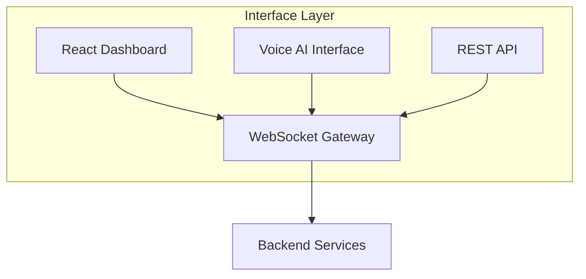
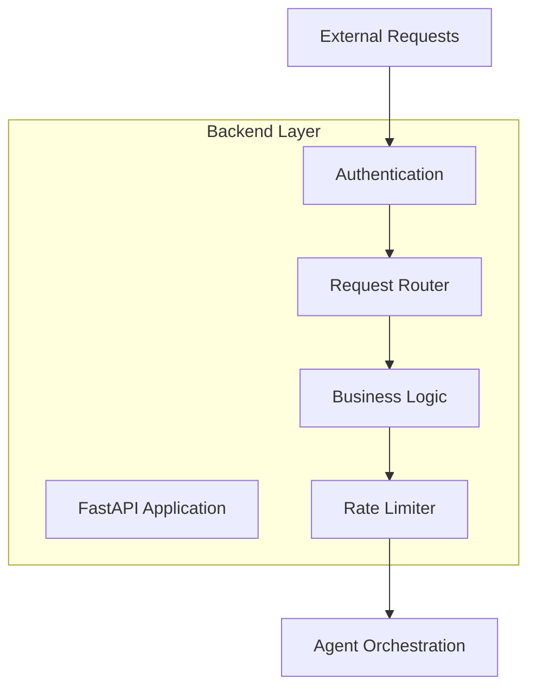
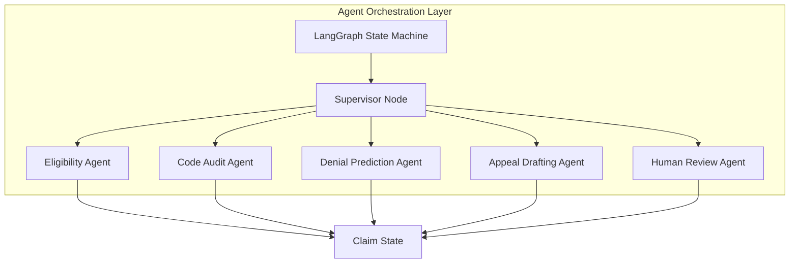
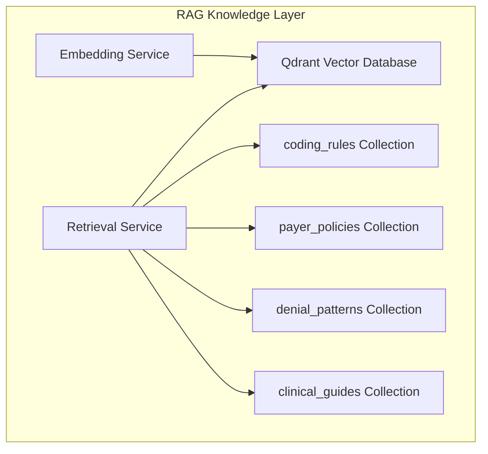
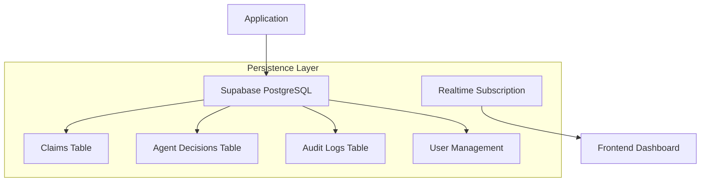
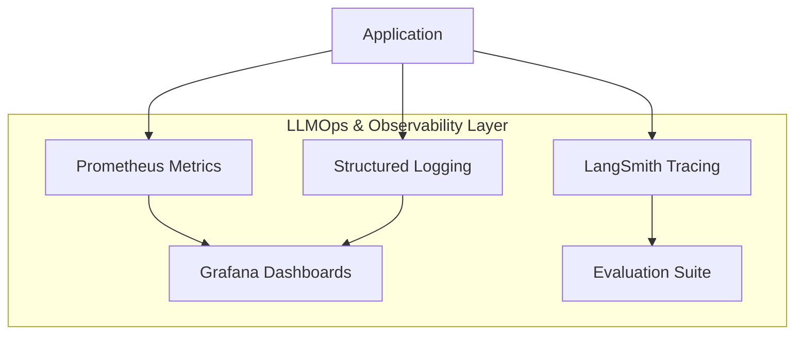
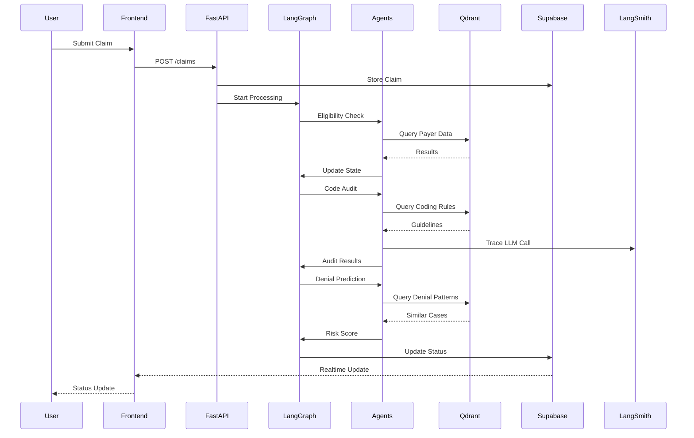
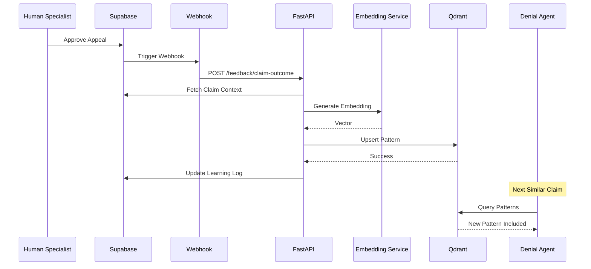
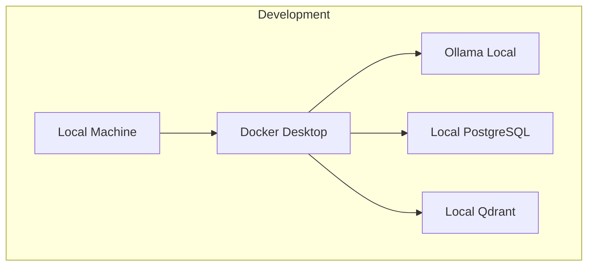
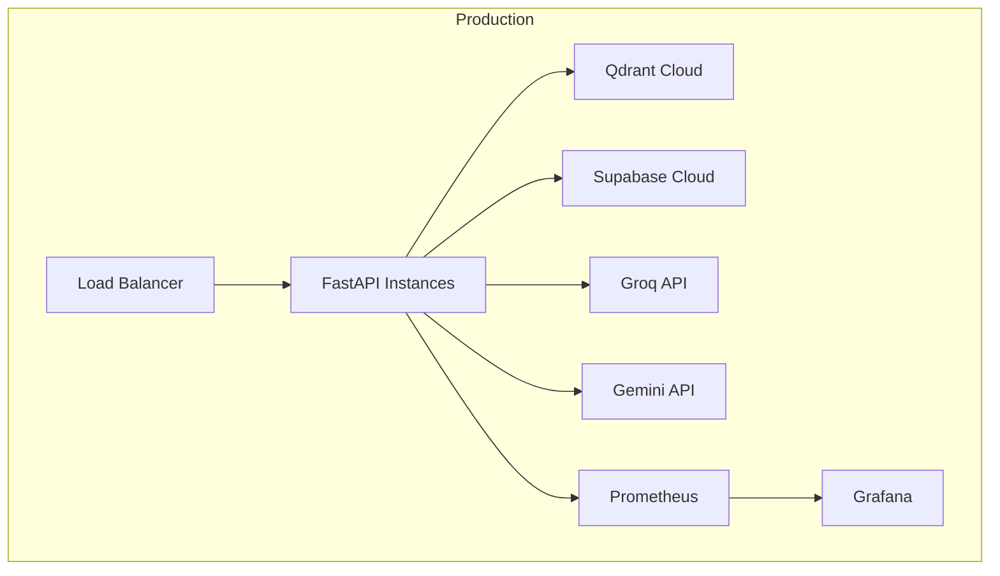

# MedClaim Architecture Documentation

## Table of Contents
- [System Overview](#system-overview)
- [Architecture Layers](#architecture-layers)
- [Component Interactions](#component-interactions)
- [Data Flow](#data-flow)
- [Technology Rationale](#technology-rationale)
- [Deployment Architecture](#deployment-architecture)

---

## System Overview

MedClaim is a distributed, event-driven system designed to autonomously process medical insurance claims through a multi-agent AI pipeline. The architecture follows a layered approach with clear separation of concerns, enabling scalability, maintainability, and independent component evolution.

### Core Design Principles

1. **Separation of Concerns**: Each layer has a specific responsibility with minimal coupling
2. **Event-Driven Communication**: Components communicate through events and webhooks
3. **State Management**: Centralized state management via LangGraph and Supabase
4. **Observability First**: Every component is instrumented for monitoring and tracing
5. **Fault Tolerance**: Circuit breakers, retries, and graceful degradation

---

## Architecture Layers

### 1. Interface Layer

The interface layer provides multiple entry points for users and external systems to interact with MedClaim.

#### Components

**React Dashboard (Vite + TailwindCSS + ShadCN)**
- **Purpose**: Primary user interface for billing specialists
- **Features**: Real-time claim monitoring, approval workflows, analytics
- **Technology**: React 18, Vite, TailwindCSS, ShadCN components
- **Communication**: WebSocket for real-time updates, REST API for actions

**Voice AI Interface (Whisper + Coqui XTTS-v2)**
- **Purpose**: Natural language interface for hands-free operation
- **Features**: Speech-to-text for queries, text-to-speech for responses
- **Technology**: OpenAI Whisper (STT), Coqui XTTS-v2 (TTS)
- **Communication**: REST API with audio streaming

**REST API (FastAPI)**
- **Purpose**: Programmatic access for external systems
- **Features**: CRUD operations, webhooks, batch processing
- **Technology**: FastAPI with async support
- **Authentication**: JWT tokens, API keys

### 2. Application Backend Layer

The backend layer provides business logic, request handling, and coordination between components.

#### Components

**FastAPI Application**
- **Purpose**: Async HTTP server and request orchestrator
- **Features**: Automatic validation, OpenAPI docs, background tasks
- **Middleware**: CORS, authentication, logging, error handling
- **Performance**: Async I/O, connection pooling, response caching

**Rate Limiter (Upstash Redis)**
- **Purpose**: Protect against API abuse and manage LLM rate limits
- **Algorithm**: Rolling window token tracking
- **Configuration**: 6,000 tokens/minute for Groq, per-user limits
- **Implementation**: Redis-based distributed counter

**Authentication Service**
- **Purpose**: Secure access control
- **Methods**: JWT tokens, API keys, OAuth2 (future)
- **Scope Management**: Role-based access control (RBAC)
- **Session Management**: Token refresh, revocation

### 3. Multi-Agent Orchestration Layer

The core intelligence layer where LangGraph orchestrates specialized agents through a deterministic state machine.

#### Components

**LangGraph State Machine**
- **Purpose**: Orchestrate agent execution with state persistence
- **Features**: Deterministic routing, state checkpointing, error recovery
- **State Management**: Shared ClaimState object across all agents
- **Execution Model**: Sequential execution with conditional branching

**Supervisor Node**
- **Purpose**: Route claims to appropriate agents based on business logic
- **Logic**: Python-based conditional routing (not LLM-based)
- **Decision Factors**: Claim status, audit results, risk scores
- **Routing Rules**: Configurable business rules engine

**Specialized Agents**
- **Eligibility Agent**: Insurance verification and provider network check
- **Code Audit Agent**: Medical coding validation with RAG
- **Denial Prediction Agent**: Risk assessment using historical patterns
- **Appeal Drafting Agent**: Legal document generation
- **Human Review Agent**: Escalation handling and specialist routing

### 4. RAG Knowledge Layer

The knowledge layer provides semantic search capabilities over medical guidelines, policies, and historical patterns.

#### Components

**Qdrant Vector Database**
- **Purpose**: High-performance semantic search over medical knowledge
- **Collections**: 4 specialized collections for different knowledge domains
- **Embedding Dimension**: 768 (nomic-embed-text)
- **Index Type**: HNSW (Hierarchical Navigable Small World) for fast approximate search

**Vector Collections**

1. **coding_rules**
   - **Content**: ICD-10-CM and CPT coding guidelines
   - **Size**: ~50,000 rules
   - **Metadata**: Code categories, severity levels, compliance flags
   - **Update Frequency**: Quarterly (official coding updates)

2. **payer_policies**
   - **Content**: Insurance payer policy documents
   - **Size**: ~10,000 policies across major payers
   - **Metadata**: Payer ID, policy type, effective dates
   - **Update Frequency**: Monthly (policy updates)

3. **denial_patterns**
   - **Content**: Historical denial reasons and successful appeals
   - **Size**: ~100,000 patterns (growing via continuous learning)
   - **Metadata**: Payer, denial reason, success rate
   - **Update Frequency**: Real-time (continuous learning)

4. **clinical_guides**
   - **Content**: Medical necessity guidelines and clinical criteria
   - **Size**: ~25,000 guidelines
   - **Metadata**: Specialty, procedure type, evidence level
   - **Update Frequency**: Monthly (clinical updates)

**Embedding Service (Ollama)**
- **Purpose**: Generate text embeddings for vector search
- **Model**: nomic-embed-text (768 dimensions)
- **Deployment**: Local Ollama instance for zero-cost operation
- **Performance**: ~100 embeddings/second on CPU

**Retrieval Service**
- **Purpose**: Execute semantic search with relevance scoring
- **Algorithm**: Hybrid search (dense + sparse if available)
- **Ranking**: Cosine similarity with re-ranking
- **Configuration**: Top-k retrieval (default k=5)

### 5. Persistence Layer

The persistence layer provides durable storage for claims, agent decisions, and system state.

#### Components

**Supabase PostgreSQL**
- **Purpose**: Primary relational database
- **Features**: ACID compliance, automatic backups, row-level security
- **Connection**: Pool-based connection management
- **Replication**: Read replicas for analytics (future)

**Database Schema**

1. **claims**
   - **Purpose**: Store claim metadata and status
   - **Columns**: id, patient_info, provider_info, codes, amounts, status
   - **Indexes**: patient_id, payer_id, status, date_of_service
   - **Constraints**: Foreign keys, check constraints

2. **agent_decisions**
   - **Purpose**: Track all agent decisions and reasoning
   - **Columns**: claim_id, agent_name, decision_type, reasoning, confidence
   - **Indexes**: claim_id, agent_name, timestamp
   - **Relationships**: One-to-many with claims

3. **audit_logs**
   - **Purpose**: Comprehensive audit trail for compliance
   - **Columns**: id, user_id, action, timestamp, changes
   - **Indexes**: user_id, timestamp, action_type
   - **Retention**: 7 years (HIPAA requirement)

**Realtime Subscription**
- **Purpose**: Push database changes to frontend in real-time
- **Technology**: Supabase Realtime (PostgreSQL logical replication)
- **Events**: INSERT, UPDATE, DELETE on claims table
- **Filtering**: Row-level security filters per user

### 6. LLMOps & Observability Layer

The observability layer provides comprehensive monitoring, tracing, and evaluation capabilities.

#### Components

**LangSmith Tracing**
- **Purpose**: Trace every LLM call and agent execution
- **Trace Data**: Input/output, latency, token usage, metadata
- **Visualization**: Call trees, timeline views, performance metrics
- **Evaluation**: Automated evaluation against test datasets

**Prometheus Metrics**
- **Purpose**: Collect time-series metrics for monitoring
- **Metrics**: HTTP latencies, LLM token usage, RAG similarity scores
- **Scraping**: 15-second interval from /metrics endpoint
- **Retention**: 15 days (default), configurable

**Grafana Dashboards**
- **Purpose**: Visualize metrics and traces in real-time
- **Dashboards**: System overview, agent performance, cost tracking
- **Alerts**: Threshold-based alerts for anomalies
- **Export**: PNG reports, scheduled email reports

**Structured Logging (Structlog)**
- **Purpose**: Machine-readable logs for debugging and analysis
- **Format**: JSON with consistent schema
- **Levels**: DEBUG, INFO, WARNING, ERROR, CRITICAL
- **Destinations**: Console (development), file (production), log aggregation (future)

**Evaluation Suite**
- **Purpose**: Automated testing of LLM outputs
- **Test Cases**: Synthetic claims with expected outputs
- **Evaluators**: Correctness, relevance, safety checks
- **Schedule**: Daily regression testing

---

## Component Interactions

### Claim Processing Flow

### Continuous Learning Flow

---

## Data Flow

### Request Flow

1. **User Action**: User submits claim via dashboard or API
2. **Validation**: Request validated against Pydantic models
3. **Persistence**: Claim stored in Supabase with initial status
4. **Orchestration**: LangGraph state machine invoked
5. **Agent Execution**: Sequential agent processing with state updates
6. **RAG Queries**: Agents query Qdrant for relevant knowledge
7. **LLM Calls**: LLMs invoked with RAG context
8. **Decision Making**: Agents update state with decisions
9. **Persistence**: Final state persisted to database
10. **Notification**: Realtime update pushed to frontend

### Error Handling Flow

1. **Detection**: Error caught at component boundary
2. **Logging**: Error logged with context and stack trace
3. **Classification**: Error classified (transient, permanent, business)
4. **Recovery**: Transient errors retried with exponential backoff
5. **Escalation**: Permanent errors trigger human review
6. **Notification**: Alerts sent via configured channels
7. **Tracking**: Error tracked in audit log for compliance

---

## Technology Rationale

### Why LangGraph?

**Deterministic State Management**: Unlike simple LLM chains, LangGraph provides:
- Persistent state across agent executions
- Checkpointing for recovery from failures
- Deterministic routing based on business logic
- Visualization of execution paths

**Multi-Agent Orchestration**: LangGraph enables:
- Clear separation of agent responsibilities
- Shared state management
- Complex conditional routing
- Parallel execution where appropriate

### Why Groq + Gemini?

**Groq (Llama 3.1 70B)**:
- **Speed**: 500+ tokens/second enables real-time processing
- **Cost**: Competitive pricing for high-volume usage
- **Quality**: Llama 3.1 provides strong reasoning capabilities
- **Use Case**: Primary LLM for most agent tasks

**Gemini 1.5 Flash**:
- **Context**: 1M+ token context window for large documents
- **Quality**: Strong performance on complex reasoning
- **Use Case**: Appeal drafting with full policy documents

### Why Qdrant?

**Performance**: HNSW indexing provides fast approximate search
**Flexibility**: Support for filtering, payload indexing, hybrid search
**Cost**: Open-source with generous free tier
**Features**: Built-in relevance scoring, filtering, updates

### Why Supabase?

**Features**: PostgreSQL + Auth + Realtime + Storage in one platform
**Ease of Use**: Simple API, automatic migrations, built-in dashboard
**Cost**: Generous free tier, transparent pricing
**Realtime**: Built-in WebSocket support for live updates

### Why FastAPI?

**Performance**: Async support for non-blocking I/O
**Developer Experience**: Automatic validation, docs, type hints
**Ecosystem**: Rich middleware and extension support
**Standards**: OpenAPI compliance, async/await support

---

## Deployment Architecture

### Development Environment

**Components**:
- All services run locally via Docker Compose
- Ollama runs locally for embeddings
- Local databases for development
- Hot reload for rapid development

### Production Environment

**Components**:
- Load balancer for API instances
- Managed services for databases (Qdrant, Supabase)
- External APIs for LLMs (Groq, Gemini)
- Dedicated monitoring stack (Prometheus, Grafana)

### Scalability Considerations

**Horizontal Scaling**:
- FastAPI instances can be scaled horizontally
- State stored externally (Supabase, Qdrant)
- Rate limiting prevents API abuse

**Vertical Scaling**:
- Qdrant can be scaled for larger vector collections
- Supabase can handle increased query load
- LLM APIs have built-in scaling

**Caching Strategy**:
- Embedding cache for repeated queries
- Response cache for idempotent operations
- CDN for static assets

---

## Security Architecture

### Authentication & Authorization

**Authentication Methods**:
- JWT tokens for user sessions
- API keys for service-to-service communication
- OAuth2 for third-party integrations (future)

**Authorization Model**:
- Role-based access control (RBAC)
- Row-level security in Supabase
- API endpoint scoping

### Data Protection

**Encryption**:
- TLS 1.3 for all communications
- Encryption at rest (Supabase managed)
- API key encryption in environment variables

**HIPAA Compliance**:
- Audit logging for all data access
- Data retention policies
- Business associate agreements with cloud providers

### Rate Limiting

**Implementation**:
- Redis-based distributed rate limiting
- Per-user and per-endpoint limits
- Token-based limiting for LLM APIs

**Configuration**:
- 100 requests/minute per user
- 6,000 tokens/minute for Groq
- Automatic circuit breaker on violations

---

## Monitoring & Alerting

### Key Metrics

**System Metrics**:
- CPU, memory, disk usage
- Network latency and throughput
- Database connection pool usage

**Application Metrics**:
- Request latency (p50, p95, p99)
- Error rates by endpoint
- Agent execution times

**Business Metrics**:
- Claims processed per hour
- Denial prediction accuracy
- Appeal success rate

### Alerting Rules

**Critical Alerts**:
- API error rate > 5%
- Database connection failures
- LLM API rate limits exceeded

**Warning Alerts**:
- High latency (> 5s p95)
- Low agent success rates
- Unusual claim patterns

### Dashboards

**System Overview**:
- Health status of all components
- Real-time request rates
- Resource utilization

**Agent Performance**:
- Per-agent execution times
- Success rates by agent
- RAG retrieval effectiveness

**Cost Tracking**:
- LLM token usage and costs
- API call costs
- Cloud service costs

---

## Disaster Recovery

### Backup Strategy

**Database Backups**:
- Daily automated backups (Supabase managed)
- Point-in-time recovery (7 days)
- Cross-region replication (future)

**Vector Database Backups**:
- Weekly snapshots of Qdrant collections
- Incremental backups of new vectors
- Backup restoration testing

### Failover Strategy

**High Availability**:
- Multiple API instances behind load balancer
- Database failover to read replica
- LLM API fallback (Groq → Gemini)

**Graceful Degradation**:
- Queue processing during outages
- Cached responses for common queries
- Manual processing fallback

---

## Future Architecture Enhancements

### Planned Improvements

**Microservices Migration**:
- Split monolithic backend into specialized services
- Service mesh for inter-service communication
- Independent scaling per service

**Event-Driven Architecture**:
- Message queue for asynchronous processing
- Event sourcing for audit trail
- CQRS for read/write separation

**Advanced AI Features**:
- Fine-tuned models for specific tasks
- Multi-modal AI (image + text)
- Reinforcement learning from human feedback

**Integration Enhancements**:
- HL7 FHIR integration with real EHR systems
- EDI X12 support for claim submission
- API marketplace for third-party integrations

---

## Conclusion

The MedClaim architecture represents a modern, production-ready approach to building AI-powered healthcare systems. By combining cutting-edge AI technologies with robust engineering practices, the system achieves both high performance and reliability while maintaining compliance with healthcare regulations.

The layered architecture ensures clear separation of concerns, making the system maintainable and evolvable. Comprehensive observability and monitoring enable proactive issue detection and resolution. The continuous learning loop ensures the system improves over time based on real-world outcomes.

This architecture serves as a blueprint for building enterprise-grade AI systems in regulated industries.
