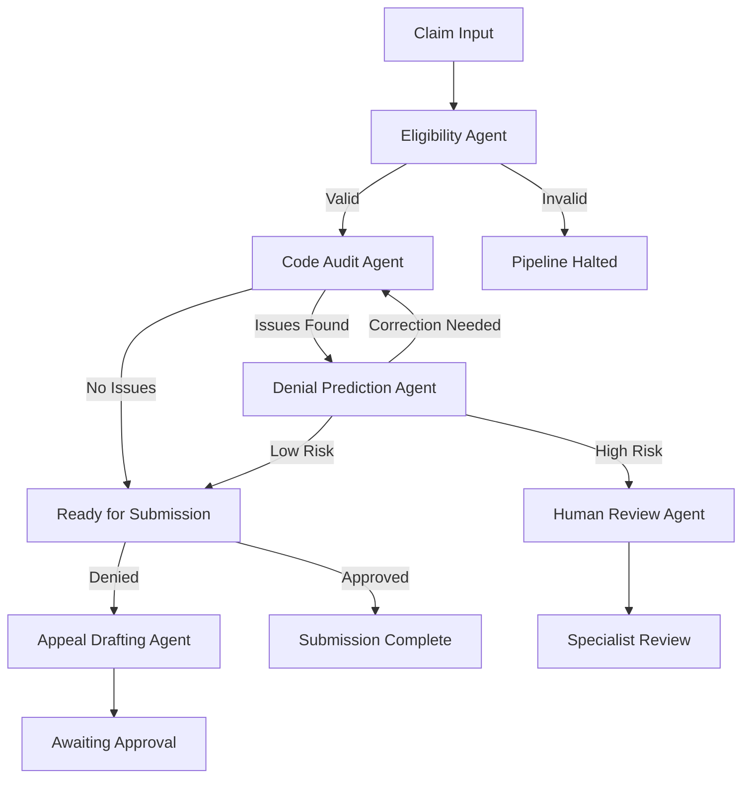
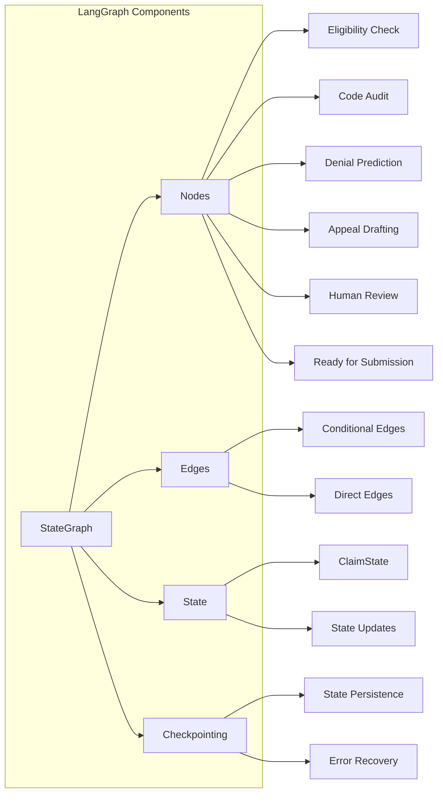
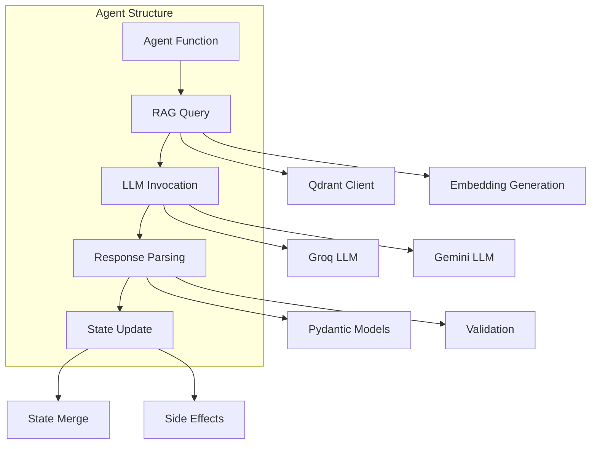
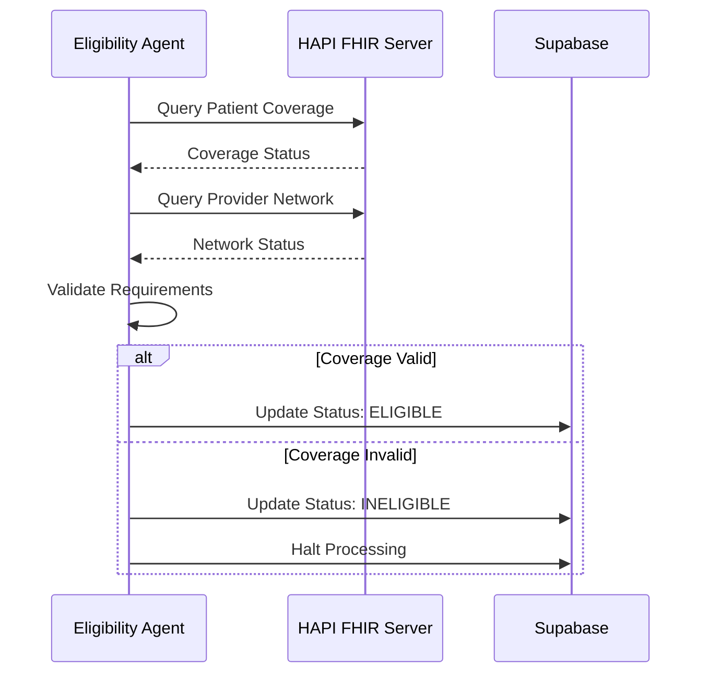
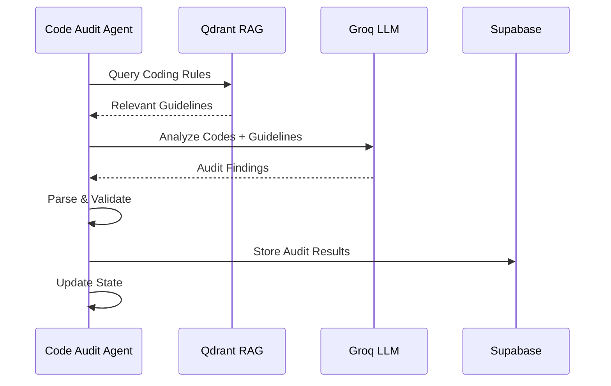
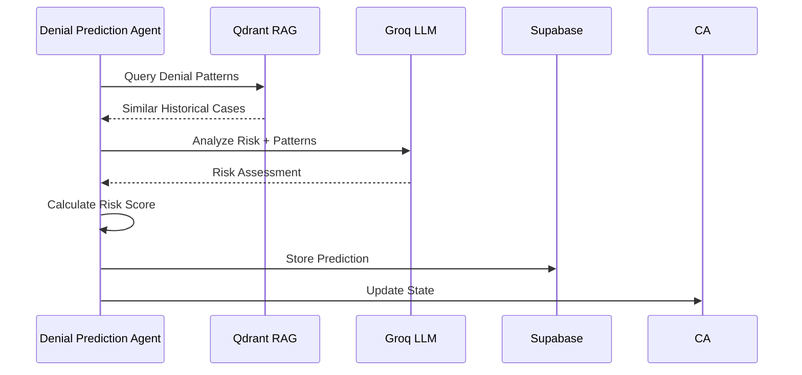
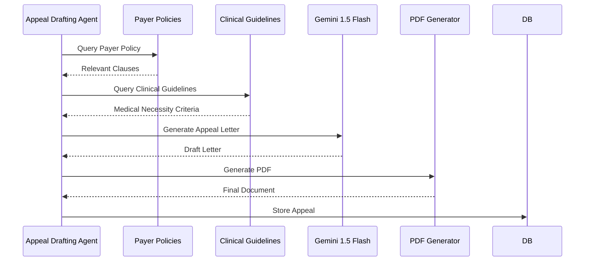
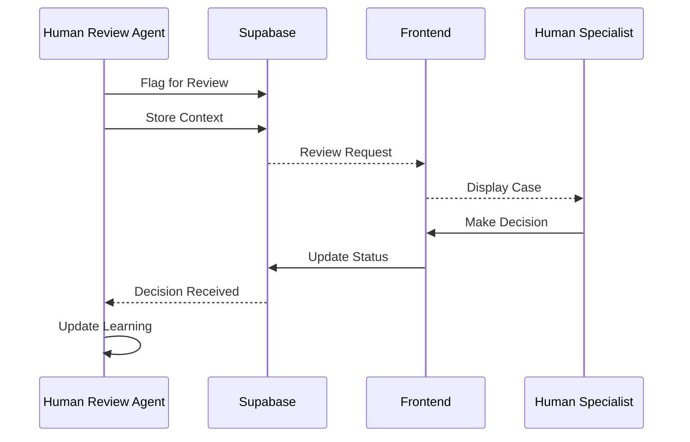
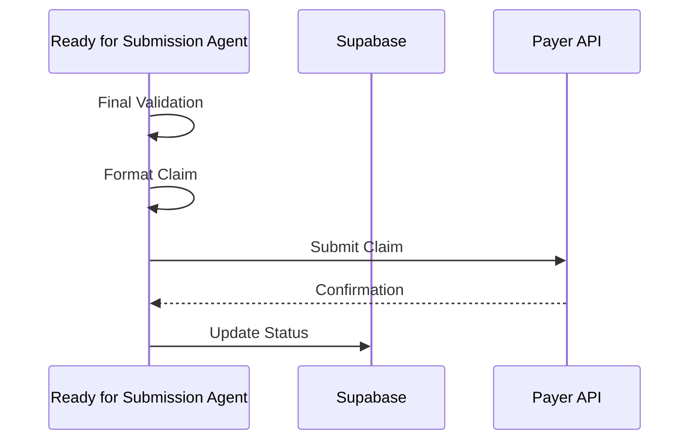
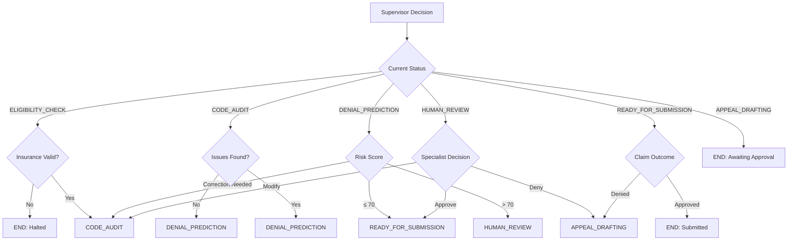

# MedClaim Agent System Documentation

## Table of Contents
- [Agent System Overview](#agent-system-overview)
- [LangGraph State Machine](#langgraph-state-machine)
- [Agent Architecture](#agent-architecture)
- [Individual Agent Details](#individual-agent-details)
- [State Management](#state-management)
- [Supervisor Routing Logic](#supervisor-routing-logic)
- [Error Handling & Recovery](#error-handling--recovery)
- [Performance Optimization](#performance-optimization)

---

## Agent System Overview

MedClaim employs a multi-agent architecture powered by LangGraph, where specialized agents collaborate to process insurance claims through a deterministic state machine. Each agent has a specific responsibility and shares a common state object that gets updated as the claim progresses through the pipeline.

### Core Principles

1. **Specialization**: Each agent focuses on a specific domain (eligibility, coding, denial prediction, appeals)
2. **Deterministic Routing**: Business logic (not LLM) determines agent transitions
3. **State Persistence**: Shared state maintained across all agent executions
4. **Observability**: Every agent decision is traced and logged
5. **Human-in-the-Loop**: Critical decisions require human approval

### Agent Responsibilities



---

## LangGraph State Machine

### State Machine Architecture

The LangGraph State Machine is the orchestration backbone that coordinates agent execution, manages state transitions, and ensures deterministic processing.



### State Machine Benefits

**Deterministic Execution**: Unlike probabilistic LLM chains, LangGraph ensures:
- Predictable execution paths
- Reproducible results
- Easy debugging and testing

**State Persistence**: 
- Intermediate states saved for recovery
- Audit trail of all state changes
- Ability to resume from any checkpoint

**Complex Routing**:
- Multi-branch decision trees
- Loop-back capabilities for corrections
- Parallel execution support (future)

---

## Agent Architecture

### Agent Interface Contract

All agents implement a consistent interface:

```python
async def agent_function(state: ClaimState) -> dict[str, Any]:
    """
    Agent function signature.
    
    Args:
        state: Current claim state with all context
        
    Returns:
        Dictionary of state updates to merge into ClaimState
    """
    # Agent logic here
    return {
        "status": "NEW_STATUS",
        "agent_decisions": [...],
        "processing_errors": [...]
    }
```

### Agent Components



### Agent Lifecycle

1. **Initialization**: Agent receives current ClaimState
2. **Context Gathering**: Agent queries RAG for relevant information
3. **LLM Processing**: Agent invokes appropriate LLM with context
4. **Response Parsing**: Agent parses and validates LLM response
5. **State Update**: Agent updates ClaimState with results
6. **Side Effects**: Agent triggers necessary side effects (logging, notifications)
7. **Return**: Agent returns state updates to LangGraph

---

## Individual Agent Details

### 1. Eligibility Agent

**Purpose**: Verify insurance coverage and provider network status before processing.

**Responsibilities**:
- Validate patient insurance coverage on date of service
- Check if provider is in-network for the payer
- Verify claim meets basic submission requirements
- Halt processing if eligibility fails (cost optimization)

**Input State**:
```python
{
    "patient_name": "John Doe",
    "patient_dob": "1980-01-15",
    "payer_name": "Blue Cross",
    "payer_id": "BCBS-001",
    "date_of_service": "2024-01-15",
    "facility_type": "outpatient_hospital",
    "status": "RECEIVED"
}
```

**Processing Flow**:



**RAG Queries**:
- None (uses direct FHIR API calls)

**LLM Usage**:
- **Primary**: None (rule-based validation)
- **Fallback**: Groq for complex eligibility scenarios

**Output State**:
```python
{
    "status": "ELIGIBLE" | "INELIGIBLE",
    "eligibility_details": {
        "coverage_active": true,
        "in_network": true,
        "requirements_met": true,
        "denial_reason": null
    }
}
```

**Error Handling**:
- FHIR server unavailability: Queue for retry
- Missing patient data: Request human review
- Network timeout: Use cached eligibility data (if recent)

---

### 2. Code Audit Agent

**Purpose**: Perform comprehensive medical coding audit using RAG-enhanced LLM analysis.

**Responsibilities**:
- Validate ICD-10-CM diagnosis codes against clinical guidelines
- Verify CPT procedure codes for appropriateness and bundling
- Check for common coding errors (upcoding, unbundling, missing modifiers)
- Provide confidence scores for each finding
- Suggest corrections with rationale

**Input State**:
```python
{
    "diagnosis_codes": [
        {"code": "J01.90", "description": "Acute sinusitis, unspecified"}
    ],
    "procedure_codes": [
        {"code": "99214", "description": "Office visit, level 4"}
    ],
    "billed_amount": 150.00,
    "facility_type": "physician_office"
}
```

**Processing Flow**:



**RAG Queries**:
- **Collection**: `coding_rules`
- **Query**: Embedding of diagnosis + procedure codes
- **Filters**: Facility type, specialty, payer
- **Top-K**: 5 most relevant coding guidelines
- **Similarity Threshold**: 0.75

**LLM Usage**:
- **Primary**: Groq Llama 3.1 70B (speed)
- **Temperature**: 0.1 (deterministic)
- **Max Tokens**: 2000
- **Response Format**: Structured JSON via Pydantic

**Prompt Strategy**:
```python
system_prompt = """
You are a medical coding expert. Analyze the provided claim codes against 
the official coding guidelines. Identify:
1. Upcoding (codes higher than justified)
2. Unbundling (separate codes that should be bundled)
3. Missing modifiers (required modifiers absent)
4. Clinical mismatch (codes don't match documentation)

Provide confidence scores (0-100) for each finding.
"""

user_prompt = f"""
Diagnosis Codes: {diagnosis_codes}
Procedure Codes: {procedure_codes}
Facility Type: {facility_type}
Billed Amount: {billed_amount}

Coding Guidelines:
{rag_results}

Analyze and return findings in JSON format.
"""
```

**Output State**:
```python
{
    "audit_findings": [
        {
            "finding_type": "UPCODED",
            "description": "Level 4 visit not justified for sinusitis",
            "confidence": 0.92,
            "suggested_correction": "99213",
            "rationale": "Sinusitis typically requires level 3 visit"
        }
    ],
    "total_issues": 1,
    "audit_confidence": 0.92
}
```

**Error Handling**:
- RAG failure: Proceed with LLM general knowledge
- LLM parsing error: Retry with simpler prompt
- Low confidence: Flag for human review

---

### 3. Denial Prediction Agent

**Purpose**: Predict claim denial probability using historical patterns and current claim context.

**Responsibilities**:
- Query historical denial patterns similar to current claim
- Calculate denial risk score (0-100)
- Identify specific denial reasons
- Provide actionable recommendations to reduce risk
- Learn from successful appeals (continuous learning)

**Input State**:
```python
{
    "audit_findings": [...],
    "payer_name": "Blue Cross",
    "procedure_codes": [...],
    "diagnosis_codes": [...],
    "billed_amount": 150.00
}
```

**Processing Flow**:



**RAG Queries**:
- **Collection**: `denial_patterns`
- **Query**: Embedding of claim context (codes, payer, amount)
- **Filters**: Payer, procedure codes, time window
- **Top-K**: 10 most similar historical cases
- **Similarity Threshold**: 0.70

**LLM Usage**:
- **Primary**: Groq Llama 3.1 70B
- **Temperature**: 0.2 (slightly creative for pattern matching)
- **Max Tokens**: 1500
- **Response Format**: Structured JSON

**Risk Calculation Algorithm**:
```python
def calculate_risk_score(
    historical_similarities: list[float],
    audit_severity: float,
    payer_strictness: float,
    amount_deviation: float
) -> float:
    """
    Calculate denial risk score (0-100).
    
    Factors:
    - Historical similarity weighted by denial rate
    - Audit finding severity
    - Payer historical strictness
    - Amount deviation from typical
    """
    base_risk = np.mean([s * denial_rate for s, denial_rate in historical_similarities])
    audit_factor = audit_severity * 0.3
    payer_factor = payer_strictness * 0.2
    amount_factor = min(amount_deviation / 1000, 1.0) * 0.1
    
    total_risk = (base_risk * 0.4 + audit_factor + payer_factor + amount_factor) * 100
    return min(max(total_risk, 0), 100)
```

**Output State**:
```python
{
    "denial_risk_score": 75,
    "denial_reasons": [
        "Medical necessity not established",
        "Documentation insufficient for level of service"
    ],
    "recommendations": [
        "Add clinical documentation to support level of service",
        "Include prior authorization number if applicable"
    ],
    "similar_cases": [
        {
            "case_id": "HIST-001",
            "similarity": 0.85,
            "outcome": "DENIED",
            "reason": "Medical necessity"
        }
    ]
}
```

**Continuous Learning**:
When appeals are approved, the claim context is embedded and added to `denial_patterns` collection, improving future predictions.

---

### 4. Appeal Drafting Agent

**Purpose**: Generate legally sound appeal letters when claims are denied.

**Responsibilities**:
- Query payer policies for specific denial clauses
- Retrieve clinical guidelines supporting medical necessity
- Generate formal appeal letter with legal citations
- Include supporting documentation references
- Format for submission (PDF/HTML)

**Input State**:
```python
{
    "denial_reason": "Medical necessity not established",
    "payer_name": "Blue Cross",
    "procedure_codes": [...],
    "diagnosis_codes": [...],
    "clinical_documentation": "..."
}
```

**Processing Flow**:



**RAG Queries**:
- **Collection 1**: `payer_policies`
  - Query: Denial reason + payer name
  - Top-K: 3 most relevant policy sections
  
- **Collection 2**: `clinical_guidelines`
  - Query: Diagnosis + procedure codes
  - Top-K: 5 supporting guidelines

**LLM Usage**:
- **Primary**: Gemini 1.5 Flash (large context)
- **Temperature**: 0.3 (professional tone)
- **Max Tokens**: 4000
- **Context**: Full policy documents + clinical guidelines

**Prompt Strategy**:
```python
system_prompt = """
You are a healthcare legal expert specializing in insurance appeals.
Write a formal appeal letter that:
1. References specific payer policy clauses
2. Cites clinical guidelines supporting medical necessity
3. Uses professional, legally sound language
4. Includes all required appeal elements
5. Maintains respectful but firm tone
"""

user_prompt = f"""
Denial Reason: {denial_reason}
Payer: {payer_name}

Relevant Policy Clauses:
{payer_policy_results}

Supporting Clinical Guidelines:
{clinical_guideline_results}

Claim Documentation:
{clinical_documentation}

Generate a complete appeal letter in HTML format.
"""
```

**Output State**:
```python
{
    "appeal_letter": "<html>...</html>",
    "appeal_pdf": "base64_encoded_pdf",
    "citations": [
        {
            "source": "Blue Cross Policy Manual, Section 12.3",
            "relevance": "Directly addresses denial reason"
        }
    ],
    "status": "APPEAL_DRAFTED"
}
```

**Quality Assurance**:
- Legal citation validation
- Clinical guideline verification
- Tone and style consistency
- Required element checklist

---

### 5. Human Review Agent

**Purpose**: Handle cases requiring human specialist intervention.

**Responsibilities**:
- Identify claims needing human expertise
- Provide context and recommendations to specialists
- Track specialist decisions
- Feed decisions back into continuous learning

**Input State**:
```python
{
    "denial_risk_score": 85,
    "audit_confidence": 0.65,
    "complexity": "high",
    "human_review_flag": true
}
```

**Processing Flow**:



**Triggers for Human Review**:
- High denial risk (> 70%)
- Low audit confidence (< 0.7)
- Complex medical scenarios
- Missing critical information
- Payer-specific requirements

**Specialist Interface**:
- Complete claim context display
- Agent recommendations highlighted
- Relevant documentation attached
- Decision options with explanations
- Feedback collection for learning

**Output State**:
```python
{
    "status": "HUMAN_REVIEW_COMPLETED",
    "specialist_decision": "APPROVED_WITH_MODIFICATIONS",
    "specialist_notes": "Added supporting documentation",
    "human_review_reason": "Complex clinical scenario"
}
```

---

### 6. Ready for Submission Agent

**Purpose**: Final validation and preparation for claim submission.

**Responsibilities**:
- Final quality checks
- Format claim for submission
- Generate submission confirmation
- Update claim status to submitted

**Input State**:
```python
{
    "status": "READY_FOR_SUBMISSION",
    "audit_findings": [],
    "denial_risk_score": 25,
    "all_corrections_applied": true
}
```

**Processing Flow**:



**Final Checks**:
- All required fields present
- Valid code combinations
- Supporting documentation attached
- Payer-specific requirements met
- Submission format correct

**Output State**:
```python
{
    "status": "SUBMITTED",
    "submission_id": "SUB-2024-001234",
    "submission_timestamp": "2024-01-15T10:30:00Z",
    "confirmation": "Claim received by payer"
}
```

---

## State Management

### ClaimState Structure

The ClaimState is a TypedDict that maintains all claim information throughout processing:

```python
class ClaimState(TypedDict):
    # Claim Identification
    claim_id: str
    patient_name: str
    patient_dob: str
    payer_name: str
    payer_id: str
    date_of_service: str
    
    # Clinical Information
    facility_type: str
    diagnosis_codes: list[dict]
    procedure_codes: list[dict]
    billed_amount: float
    
    # Processing State
    status: str  # RECEIVED, ELIGIBLE, AUDITED, PREDICTED, SUBMITTED, etc.
    current_agent: str
    previous_agent: str
    retry_count: int
    
    # Agent Outputs
    audit_findings: list[dict]
    denial_risk_score: int
    denial_reasons: list[str]
    appeal_letter: str | None
    
    # Human Review
    human_review_flag: bool
    human_review_reason: str
    
    # Error Handling
    processing_errors: list[str]
    
    # Performance Metrics
    total_prompt_tokens: int
    total_completion_tokens: int
    total_latency_ms: int
    llm_calls: list[dict]
    
    # Context
    market: str  # US or INDIA
```

### State Updates

Agents return dictionaries that are merged into ClaimState:

```python
# Agent return format
return {
    "status": "AUDITED",
    "audit_findings": [...],
    "total_prompt_tokens": current_state["total_prompt_tokens"] + 500,
    "llm_calls": current_state["llm_calls"] + [new_call]
}
```

### State Persistence

LangGraph automatically persists state at checkpoints:
- After each agent completion
- Before conditional routing decisions
- On error for recovery
- Final state for audit trail

---

## Supervisor Routing Logic

The Supervisor is not an LLM-based agent but a deterministic Python function that routes claims based on business rules.

### Routing Decision Tree



### Routing Implementation

```python
def route_claim(state: ClaimState) -> str:
    """
    Determine next agent based on current state and business rules.
    
    Returns:
        Next agent name or "__end__" to terminate
    """
    current_agent = state["current_agent"]
    status = state["status"]
    
    if current_agent == "eligibility_check":
        if status == "INELIGIBLE":
            return "__end__"
        return "code_audit"
    
    elif current_agent == "code_audit":
        if state.get("human_review_flag"):
            return "human_review"
        return "denial_prediction"
    
    elif current_agent == "denial_prediction":
        risk_score = state.get("denial_risk_score", 0)
        
        if risk_score > 70:
            return "human_review"
        elif state.get("needs_correction"):
            return "code_audit"  # Loop back for correction
        else:
            return "ready_for_submission"
    
    elif current_agent == "human_review":
        decision = state.get("specialist_decision")
        if decision == "modify":
            return "code_audit"
        elif decision == "deny":
            return "appeal_drafting"
        else:
            return "ready_for_submission"
    
    elif current_agent == "ready_for_submission":
        if status == "DENIED":
            return "appeal_drafting"
        return "__end__"
    
    elif current_agent == "appeal_drafting":
        return "__end__"
    
    return "__end__"
```

---

## Error Handling & Recovery

### Error Categories

**Transient Errors** (retryable):
- Network timeouts
- Rate limit exceeded
- Temporary service unavailability

**Permanent Errors** (non-retryable):
- Invalid data format
- Missing required fields
- Authentication failures

**Business Errors** (escalation):
- Low confidence results
- Ambiguous situations
- Policy violations

### Retry Strategy

```python
async def execute_with_retry(
    agent_func: Callable,
    state: ClaimState,
    max_retries: int = 3,
    base_delay: float = 1.0
) -> dict:
    """
    Execute agent with exponential backoff retry.
    """
    for attempt in range(max_retries):
        try:
            return await agent_func(state)
        except TransientError as e:
            if attempt == max_retries - 1:
                raise
            delay = base_delay * (2 ** attempt)
            await asyncio.sleep(delay)
        except PermanentError:
            raise
```

### Error Recovery

**Checkpoint Recovery**:
- LangGraph checkpoints enable recovery from any state
- Failed agents can be retrued from last checkpoint
- Manual intervention possible at any checkpoint

**Fallback Strategies**:
- RAG failure → Use LLM general knowledge
- Primary LLM failure → Fallback to secondary LLM
- Service unavailability → Queue for later processing

---

## Performance Optimization

### Parallel Processing Opportunities

**Independent Operations**:
- Multiple RAG queries can run in parallel
- Eligibility checks can run while data loads
- Document generation can be asynchronous

**Future Enhancements**:
- Parallel agent execution where independent
- Batch processing for multiple claims
- Pre-computed embeddings for common codes

### Caching Strategy

**RAG Results Cache**:
- Cache frequent coding rule queries
- TTL: 24 hours (rules change quarterly)
- Cache key: Embedding hash + filters

**LLM Response Cache**:
- Cache identical prompts
- TTL: 1 hour (LLM behavior stable)
- Cache key: Prompt hash + temperature

### Resource Optimization

**Connection Pooling**:
- Database connection pooling
- HTTP client connection reuse
- Qdrant client connection management

**Memory Management**:
- Streaming large documents
- Lazy loading of RAG results
- Prompt size optimization

---

## Testing Strategy

### Unit Testing

Each agent tested independently:
- Mock RAG responses
- Mock LLM responses
- Validate state updates
- Test error handling

### Integration Testing

Agent pipeline tested end-to-end:
- Real RAG queries
- Real LLM calls (or high-quality mocks)
- Full state transitions
- Error recovery scenarios

### Evaluation Testing

LLM outputs evaluated against ground truth:
- Synthetic test cases
- Expected outputs defined
- Automated scoring
- Regression detection

---

## Monitoring & Observability

### Agent Metrics

**Per-Agent Metrics**:
- Execution time (p50, p95, p99)
- Success rate
- Error rate by type
- LLM token usage

**Business Metrics**:
- Claims processed per hour
- Denial prediction accuracy
- Appeal success rate
- Human review rate

### Tracing

Every agent execution traced with:
- Input state
- RAG queries and results
- LLM prompts and responses
- Output state
- Performance metrics

### Logging

Structured logs include:
- Agent name and version
- Claim ID
- Execution timestamp
- Key decisions and reasoning
- Errors with stack traces

---

## Conclusion

The MedClaim agent system represents a sophisticated implementation of multi-agent AI for healthcare automation. By combining LangGraph's deterministic state management with specialized agents and RAG-enhanced LLMs, the system achieves high accuracy while maintaining explainability and compliance.

The architecture ensures:
- Clear separation of concerns
- Deterministic and reproducible execution
- Comprehensive observability
- Human oversight where needed
- Continuous learning and improvement

This agent system serves as a blueprint for building reliable, production-grade AI systems in regulated industries.
