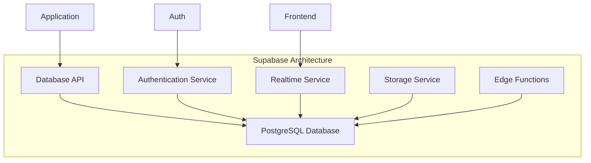
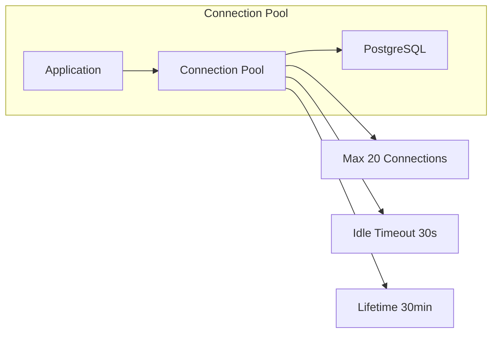
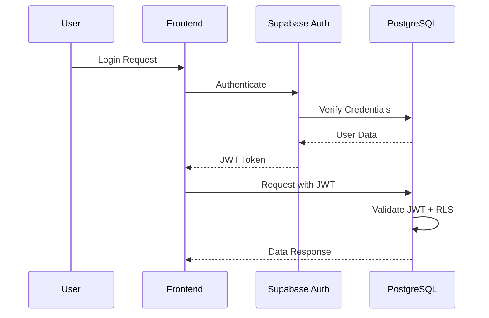
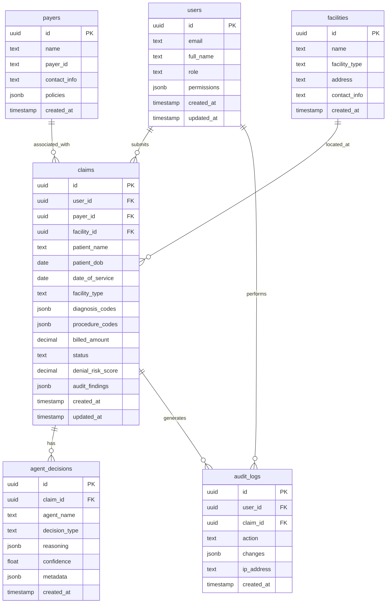
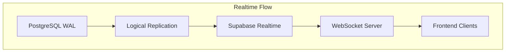

# MedClaim Database Documentation

## Table of Contents
- [Database Overview](#database-overview)
- [Supabase Architecture](#supabase-architecture)
- [Schema Design](#schema-design)
- [Table Details](#table-details)
- [Relationships](#relationships)
- [Indexing Strategy](#indexing-strategy)
- [Data Access Layer](#data-access-layer)
- [Realtime Subscriptions](#realtime-subscriptions)
- [Backup & Recovery](#backup--recovery)
- [Security & Compliance](#security--compliance)

---

## Database Overview

MedClaim uses Supabase (PostgreSQL) as its primary database for persistent storage of claims, agent decisions, audit logs, and user management. Supabase provides a managed PostgreSQL solution with built-in authentication, real-time subscriptions, and automatic backups.

### Database Architecture



### Key Features

**Managed PostgreSQL**:
- Automatic backups and point-in-time recovery
- Built-in connection pooling
- Automatic scaling and high availability

**Authentication**:
- JWT-based authentication
- Row-level security (RLS)
- Social login support (future)

**Realtime**:
- PostgreSQL logical replication
- WebSocket subscriptions
- Real-time data synchronization

**Storage**:
- File upload and management
- Image transformation
- CDN delivery

---

## Supabase Architecture

### Connection Management



**Connection Configuration**:
```python
# Supabase client configuration
supabase_client = create_client(
    supabase_url=os.getenv("SUPABASE_URL"),
    supabase_key=os.getenv("SUPABASE_ANON_KEY"),
    options={
        "timeout": 30,  # Request timeout in seconds
        "max_retries": 3,  # Retry attempts
    }
)
```

### Authentication Flow



---

## Schema Design

### ER Diagram



### Design Principles

**Normalization**: Third normal form (3NF) to minimize redundancy
**Denormalization**: Strategic denormalization for performance (e.g., claim status)
**Indexing**: Comprehensive indexing for query performance
**Constraints**: Foreign keys, check constraints, and unique constraints
**Timestamps**: Created_at and updated_at on all tables

---

## Table Details

### 1. claims Table

**Purpose**: Store claim metadata and processing status

**Schema**:
```sql
CREATE TABLE claims (
    id UUID PRIMARY KEY DEFAULT gen_random_uuid(),
    user_id UUID REFERENCES users(id) ON DELETE SET NULL,
    payer_id UUID REFERENCES payers(id) ON DELETE RESTRICT,
    facility_id UUID REFERENCES facilities(id) ON DELETE SET NULL,
    
    -- Patient Information
    patient_name TEXT NOT NULL,
    patient_dob DATE NOT NULL,
    patient_id TEXT,
    
    -- Provider Information
    provider_name TEXT NOT NULL,
    provider_npi TEXT,
    provider_tax_id TEXT,
    
    -- Service Information
    date_of_service DATE NOT NULL,
    facility_type TEXT NOT NULL,  -- 'hospital', 'clinic', 'physician_office'
    
    -- Clinical Information
    diagnosis_codes JSONB NOT NULL,  -- [{'code': 'J01.90', 'description': '...'}]
    procedure_codes JSONB NOT NULL,  -- [{'code': '99214', 'description': '...'}]
    
    -- Financial Information
    billed_amount DECIMAL(10,2) NOT NULL,
    allowed_amount DECIMAL(10,2),
    paid_amount DECIMAL(10,2),
    
    -- Processing Status
    status TEXT NOT NULL DEFAULT 'RECEIVED',
    -- 'RECEIVED', 'ELIGIBLE', 'INELIGIBLE', 'AUDITED', 'PREDICTED', 
    -- 'READY_FOR_SUBMISSION', 'SUBMITTED', 'DENIED', 'APPROVED', 
    -- 'APPEAL_DRAFTED', 'APPEAL_SUBMITTED', 'APPROVED_ON_APPEAL', 'HUMAN_REVIEW_REQUIRED'
    
    -- Agent Outputs
    denial_risk_score INTEGER CHECK (denial_risk_score BETWEEN 0 AND 100),
    denial_reasons JSONB,
    audit_findings JSONB,
    appeal_letter TEXT,
    
    -- Human Review
    human_review_flag BOOLEAN DEFAULT FALSE,
    human_review_reason TEXT,
    specialist_decision TEXT,
    specialist_notes TEXT,
    
    -- Metadata
    market TEXT DEFAULT 'US',  -- 'US' or 'INDIA'
    processing_errors JSONB DEFAULT '[]',
    total_prompt_tokens INTEGER DEFAULT 0,
    total_completion_tokens INTEGER DEFAULT 0,
    total_latency_ms INTEGER DEFAULT 0,
    
    -- Timestamps
    created_at TIMESTAMP WITH TIME ZONE DEFAULT NOW(),
    updated_at TIMESTAMP WITH TIME ZONE DEFAULT NOW()
);

-- Indexes
CREATE INDEX idx_claims_user_id ON claims(user_id);
CREATE INDEX idx_claims_payer_id ON claims(payer_id);
CREATE INDEX idx_claims_status ON claims(status);
CREATE INDEX idx_claims_date_of_service ON claims(date_of_service);
CREATE INDEX idx_claims_created_at ON claims(created_at DESC);
CREATE INDEX idx_claims_denial_risk_score ON claims(denial_risk_score);

-- Trigger for updated_at
CREATE TRIGGER update_claims_updated_at
    BEFORE UPDATE ON claims
    FOR EACH ROW
    EXECUTE FUNCTION update_updated_at_column();
```

**Key Fields**:
- **id**: Unique identifier for the claim
- **status**: Current processing status
- **denial_risk_score**: Predicted denial probability (0-100)
- **audit_findings**: JSON array of coding audit results
- **diagnosis_codes/procedure_codes**: JSON arrays of medical codes

### 2. agent_decisions Table

**Purpose**: Track all agent decisions and reasoning

**Schema**:
```sql
CREATE TABLE agent_decisions (
    id UUID PRIMARY KEY DEFAULT gen_random_uuid(),
    claim_id UUID NOT NULL REFERENCES claims(id) ON DELETE CASCADE,
    
    -- Agent Information
    agent_name TEXT NOT NULL,  -- 'eligibility', 'code_audit', 'denial_prediction', etc.
    decision_type TEXT NOT NULL,  -- 'APPROVE', 'DENY', 'FLAG', 'CORRECT'
    
    -- Decision Details
    reasoning JSONB NOT NULL,
    confidence FLOAT CHECK (confidence BETWEEN 0 AND 1),
    metadata JSONB DEFAULT '{}',
    
    -- Performance Metrics
    prompt_tokens INTEGER DEFAULT 0,
    completion_tokens INTEGER DEFAULT 0,
    latency_ms INTEGER DEFAULT 0,
    
    -- Timestamps
    created_at TIMESTAMP WITH TIME ZONE DEFAULT NOW()
);

-- Indexes
CREATE INDEX idx_agent_decisions_claim_id ON agent_decisions(claim_id);
CREATE INDEX idx_agent_decisions_agent_name ON agent_decisions(agent_name);
CREATE INDEX idx_agent_decisions_created_at ON agent_decisions(created_at DESC);
```

**Key Fields**:
- **agent_name**: Which agent made the decision
- **decision_type**: Type of decision made
- **reasoning**: Detailed reasoning for the decision
- **confidence**: Agent's confidence in the decision (0-1)

### 3. audit_logs Table

**Purpose**: Comprehensive audit trail for compliance

**Schema**:
```sql
CREATE TABLE audit_logs (
    id UUID PRIMARY KEY DEFAULT gen_random_uuid(),
    user_id UUID REFERENCES users(id) ON DELETE SET NULL,
    claim_id UUID REFERENCES claims(id) ON DELETE SET NULL,
    
    -- Action Details
    action TEXT NOT NULL,  -- 'CREATE', 'UPDATE', 'DELETE', 'STATUS_CHANGE'
    entity_type TEXT NOT NULL,  -- 'claim', 'user', 'agent_decision'
    entity_id UUID NOT NULL,
    
    -- Change Details
    changes JSONB,  -- Before/after values
    ip_address INET,
    user_agent TEXT,
    
    -- Timestamps
    created_at TIMESTAMP WITH TIME ZONE DEFAULT NOW()
);

-- Indexes
CREATE INDEX idx_audit_logs_user_id ON audit_logs(user_id);
CREATE INDEX idx_audit_logs_claim_id ON audit_logs(claim_id);
CREATE INDEX idx_audit_logs_action ON audit_logs(action);
CREATE INDEX idx_audit_logs_created_at ON audit_logs(created_at DESC);

-- Partitioning by month for large datasets (optional)
-- CREATE TABLE audit_logs_y2024m01 PARTITION OF audit_logs
--     FOR VALUES FROM ('2024-01-01') TO ('2024-02-01');
```

**Key Fields**:
- **action**: Type of action performed
- **changes**: JSON object with before/after values
- **ip_address**: IP address of the user
- **created_at**: When the action occurred

### 4. users Table

**Purpose**: User management and authentication

**Schema**:
```sql
CREATE TABLE users (
    id UUID PRIMARY KEY DEFAULT gen_random_uuid(),
    
    -- Authentication
    email TEXT UNIQUE NOT NULL,
    password_hash TEXT,  -- Managed by Supabase Auth
    auth_provider TEXT DEFAULT 'email',
    
    -- Profile
    full_name TEXT NOT NULL,
    role TEXT NOT NULL DEFAULT 'billing_specialist',
    -- 'admin', 'billing_specialist', 'manager', 'specialist'
    
    -- Permissions
    permissions JSONB DEFAULT '{}',
    
    -- Status
    is_active BOOLEAN DEFAULT TRUE,
    last_login_at TIMESTAMP WITH TIME ZONE,
    
    -- Timestamps
    created_at TIMESTAMP WITH TIME ZONE DEFAULT NOW(),
    updated_at TIMESTAMP WITH TIME ZONE DEFAULT NOW()
);

-- Indexes
CREATE INDEX idx_users_email ON users(email);
CREATE INDEX idx_users_role ON users(role);
CREATE INDEX idx_users_is_active ON users(is_active);
```

**Key Fields**:
- **email**: User's email address (unique)
- **role**: User's role in the system
- **permissions**: JSON object with granular permissions
- **is_active**: Whether the user account is active

### 5. payers Table

**Purpose**: Insurance payer information

**Schema**:
```sql
CREATE TABLE payers (
    id UUID PRIMARY KEY DEFAULT gen_random_uuid(),
    
    -- Payer Information
    name TEXT NOT NULL,
    payer_id TEXT UNIQUE NOT NULL,  -- External payer ID
    payer_type TEXT NOT NULL,  -- 'commercial', 'medicare', 'medicaid'
    
    -- Contact Information
    contact_email TEXT,
    contact_phone TEXT,
    address JSONB,
    
    -- Policies
    policies JSONB DEFAULT '{}',
    
    -- Metadata
    is_active BOOLEAN DEFAULT TRUE,
    
    -- Timestamps
    created_at TIMESTAMP WITH TIME ZONE DEFAULT NOW(),
    updated_at TIMESTAMP WITH TIME ZONE DEFAULT NOW()
);

-- Indexes
CREATE INDEX idx_payers_payer_id ON payers(payer_id);
CREATE INDEX idx_payers_name ON payers(name);
CREATE INDEX idx_payers_is_active ON payers(is_active);
```

### 6. facilities Table

**Purpose**: Healthcare facility information

**Schema**:
```sql
CREATE TABLE facilities (
    id UUID PRIMARY KEY DEFAULT gen_random_uuid(),
    
    -- Facility Information
    name TEXT NOT NULL,
    facility_type TEXT NOT NULL,  -- 'hospital', 'clinic', 'physician_office'
    npi TEXT UNIQUE,  -- National Provider Identifier
    
    -- Location
    address JSONB,
    city TEXT,
    state TEXT,
    zip_code TEXT,
    
    -- Contact
    contact_email TEXT,
    contact_phone TEXT,
    
    -- Metadata
    is_active BOOLEAN DEFAULT TRUE,
    
    -- Timestamps
    created_at TIMESTAMP WITH TIME ZONE DEFAULT NOW(),
    updated_at TIMESTAMP WITH TIME ZONE DEFAULT NOW()
);

-- Indexes
CREATE INDEX idx_facilities_npi ON facilities(npi);
CREATE INDEX idx_facilities_facility_type ON facilities(facility_type);
CREATE INDEX idx_facilities_is_active ON facilities(is_active);
```

---

## Relationships

### Relationship Types

**One-to-Many**:
- User → Claims (one user can submit multiple claims)
- Payer → Claims (one payer can have multiple claims)
- Facility → Claims (one facility can have multiple claims)
- Claim → Agent Decisions (one claim can have multiple agent decisions)

**Many-to-Many** (via junction tables - future):
- Claims ↔ Users (shared access)
- Users ↔ Permissions (role-based access)

### Foreign Key Constraints

```sql
-- Ensure referential integrity
ALTER TABLE claims 
    ADD CONSTRAINT fk_claims_user 
    FOREIGN KEY (user_id) REFERENCES users(id) 
    ON DELETE SET NULL;

ALTER TABLE claims 
    ADD CONSTRAINT fk_claims_payer 
    FOREIGN KEY (payer_id) REFERENCES payers(id) 
    ON DELETE RESTRICT;

ALTER TABLE claims 
    ADD CONSTRAINT fk_claims_facility 
    FOREIGN KEY (facility_id) REFERENCES facilities(id) 
    ON DELETE SET NULL;

ALTER TABLE agent_decisions 
    ADD CONSTRAINT fk_agent_decisions_claim 
    FOREIGN KEY (claim_id) REFERENCES claims(id) 
    ON DELETE CASCADE;
```

---

## Indexing Strategy

### Index Types

**B-Tree Indexes** (default):
- Equality and range queries
- Most common index type
- Good for high cardinality columns

**GIN Indexes**:
- JSONB data
- Array data
- Full-text search

**Partial Indexes**:
- Index only rows matching condition
- Reduces index size
- Improves performance for filtered queries

### Index Definitions

```sql
-- B-Tree indexes for common queries
CREATE INDEX idx_claims_status_date 
    ON claims(status, date_of_service DESC);

CREATE INDEX idx_claims_user_status 
    ON claims(user_id, status) 
    WHERE status IN ('SUBMITTED', 'DENIED');

-- GIN index for JSONB searches
CREATE INDEX idx_claims_audit_findings 
    ON claims USING GIN (audit_findings);

CREATE INDEX idx_claims_diagnosis_codes 
    ON claims USING GIN (diagnosis_codes);

-- Composite index for agent decisions
CREATE INDEX idx_agent_decisions_claim_agent 
    ON agent_decisions(claim_id, agent_name, created_at DESC);
```

### Index Maintenance

**Automatic Vacuum**:
- PostgreSQL automatically reclaims space
- Runs periodically based on configuration
- Can be tuned for workload

**Manual Reindex**:
```sql
-- Reindex specific table
REINDEX TABLE claims;

-- Reindex specific index
REINDEX INDEX idx_claims_status;
```

**Index Statistics**:
```sql
-- Update statistics
ANALYZE claims;

-- Check index usage
SELECT 
    schemaname,
    tablename,
    indexname,
    idx_scan as index_scans,
    idx_tup_read as tuples_read,
    idx_tup_fetch as tuples_fetched
FROM pg_stat_user_indexes
WHERE schemaname = 'public'
ORDER BY idx_scan DESC;
```

---

## Data Access Layer

### Supabase Client Configuration

```python
from supabase import create_client

# Initialize Supabase client
supabase = create_client(
    supabase_url=os.getenv("SUPABASE_URL"),
    supabase_key=os.getenv("SUPABASE_ANON_KEY")
)

# Service role client for admin operations
supabase_admin = create_client(
    supabase_url=os.getenv("SUPABASE_URL"),
    supabase_key=os.getenv("SUPABASE_SERVICE_ROLE_KEY")
)
```

### Database Client Wrapper

```python
class DatabaseClient:
    """Wrapper for Supabase database operations."""
    
    def __init__(self):
        self.client = create_client(
            supabase_url=os.getenv("SUPABASE_URL"),
            supabase_key=os.getenv("SUPABASE_ANON_KEY")
        )
    
    async def get_claim(self, claim_id: str) -> dict | None:
        """Retrieve a claim by ID."""
        response = self.client.table("claims").select("*").eq("id", claim_id).execute()
        return response.data[0] if response.data else None
    
    async def create_claim(self, claim_data: dict) -> dict:
        """Create a new claim."""
        response = self.client.table("claims").insert(claim_data).execute()
        return response.data[0]
    
    async def update_claim_status(
        self, 
        claim_id: str, 
        status: str,
        **updates
    ) -> dict:
        """Update claim status and metadata."""
        response = self.client.table("claims").update({
            "status": status,
            "updated_at": "NOW()",
            **updates
        }).eq("id", claim_id).execute()
        return response.data[0]
    
    async def log_agent_decision(
        self,
        claim_id: str,
        agent_name: str,
        decision_type: str,
        reasoning: dict,
        confidence: float
    ) -> dict:
        """Log an agent decision."""
        response = self.client.table("agent_decisions").insert({
            "claim_id": claim_id,
            "agent_name": agent_name,
            "decision_type": decision_type,
            "reasoning": reasoning,
            "confidence": confidence
        }).execute()
        return response.data[0]
    
    async def get_user_claims(
        self, 
        user_id: str, 
        status: str | None = None,
        limit: int = 50
    ) -> list[dict]:
        """Get claims for a user, optionally filtered by status."""
        query = self.client.table("claims").select("*").eq("user_id", user_id)
        
        if status:
            query = query.eq("status", status)
        
        response = query.order("created_at", desc=True).limit(limit).execute()
        return response.data
```

### Query Optimization

**Efficient Queries**:
```python
# Good: Uses index
async def get_recent_claims(limit: int = 100):
    return supabase.table("claims")\
        .select("*")\
        .order("created_at", desc=True)\
        .limit(limit)\
        .execute()

# Bad: Full table scan
async def search_claims_by_name(name: str):
    return supabase.table("claims")\
        .select("*")\
        .ilike("patient_name", f"%{name}%")\
        .execute()
```

**Batch Operations**:
```python
# Batch insert for performance
async def batch_insert_claims(claims_data: list[dict]):
    return supabase.table("claims").insert(claims_data).execute()

# Batch update
async def batch_update_status(claim_ids: list[str], status: str):
    return supabase.table("claims")\
        .update({"status": status})\
        .in_("id", claim_ids)\
        .execute()
```

---

## Realtime Subscriptions

### Realtime Architecture



### Subscription Setup

```python
# Frontend subscription example
import { createClient } from '@supabase/supabase-js'

const supabase = createClient(
  process.env.NEXT_PUBLIC_SUPABASE_URL,
  process.env.NEXT_PUBLIC_SUPABASE_ANON_KEY
)

// Subscribe to claim status changes
const subscription = supabase
  .channel('claim-updates')
  .on(
    'postgres_changes',
    {
      event: 'UPDATE',
      schema: 'public',
      table: 'claims',
      filter: 'user_id=eq.{user_id}'
    },
    (payload) => {
      console.log('Claim updated:', payload.new)
      // Update UI with new status
    }
  )
  .subscribe()
```

### Subscription Types

**INSERT**: New rows added
**UPDATE**: Existing rows modified
**DELETE**: Rows removed
**ALL**: All changes

### Filter Subscriptions

```python
# Filter by specific columns
.supabase.channel('filtered-updates')
  .on('postgres_changes', {
    event: 'UPDATE',
    schema: 'public',
    table: 'claims',
    filter: 'status=eq.SUBMITTED'  # Only submitted claims
  }, callback)
  .subscribe()
```

---

## Backup & Recovery

### Automatic Backups

**Supabase Managed**:
- Daily automatic backups
- 7-day retention (free tier)
- Point-in-time recovery (PITR)
- Physical backups

**Backup Configuration**:
```sql
-- Check backup status (via Supabase dashboard)
-- Backups are automatic and managed by Supabase
```

### Manual Backups

**Export Schema**:
```bash
# Export database schema
pg_dump -h db.xxx.supabase.co -U postgres -d postgres --schema-only > schema.sql
```

**Export Data**:
```bash
# Export specific table data
pg_dump -h db.xxx.supabase.co -U postgres -d postgres -t claims > claims_data.sql
```

### Recovery Procedures

**Point-in-Time Recovery**:
1. Identify recovery point timestamp
2. Contact Supabase support for PITR
3. Restore to specific point in time
4. Verify data integrity

**Full Restore**:
1. Create new database instance
2. Restore from latest backup
3. Run any pending migrations
4. Update application connection

---

## Security & Compliance

### Row-Level Security (RLS)

```sql
-- Enable RLS on claims table
ALTER TABLE claims ENABLE ROW LEVEL SECURITY;

-- Policy: Users can only see their own claims
CREATE POLICY "Users can view own claims"
    ON claims FOR SELECT
    USING (auth.uid() = user_id);

-- Policy: Users can insert their own claims
CREATE POLICY "Users can insert own claims"
    ON claims FOR INSERT
    WITH CHECK (auth.uid() = user_id);

-- Policy: Users can update their own claims
CREATE POLICY "Users can update own claims"
    ON claims FOR UPDATE
    USING (auth.uid() = user_id);

-- Admin policy (for service role)
CREATE POLICY "Admin can do anything"
    ON claims FOR ALL
    USING (auth.role() = 'service_role');
```

### Data Encryption

**At Rest**:
- Supabase encrypts all data at rest
- AES-256 encryption
- Managed encryption keys

**In Transit**:
- TLS 1.3 for all connections
- Certificate pinning (optional)
- Secure WebSocket connections

### HIPAA Compliance

**Audit Logging**:
- All data access logged
- User actions tracked
- IP addresses recorded
- 7-year retention (HIPAA requirement)

**Access Control**:
- Role-based access control
- Minimum privilege principle
- Regular access reviews

**Data Retention**:
- Claims: 7 years (HIPAA)
- Audit logs: 7 years (HIPAA)
- Agent decisions: 7 years (HIPAA)

### Data Masking

```sql
-- Create view with masked data for non-admin users
CREATE VIEW claims_masked AS
SELECT 
    id,
    user_id,
    -- Mask patient name
    SUBSTRING(patient_name, 1, 1) || '****' as patient_name,
    -- Mask DOB
    DATE_TRUNC('year', patient_dob) as patient_dob_year,
    -- Keep other fields
    payer_id,
    status,
    denial_risk_score
FROM claims;

-- Grant access to view
GRANT SELECT ON claims_masked TO billing_specialist;
```

---

## Performance Monitoring

### Query Performance

**Slow Query Log**:
```sql
-- Enable slow query logging
ALTER DATABASE postgres SET log_min_duration_statement = 1000;  -- 1 second

-- Check slow queries
SELECT 
    query,
    calls,
    total_time,
    mean_time,
    max_time
FROM pg_stat_statements
WHERE mean_time > 100  -- queries taking > 100ms
ORDER BY mean_time DESC
LIMIT 10;
```

**Connection Pool Monitoring**:
```sql
-- Check connection pool status
SELECT 
    state,
    count(*) as connections
FROM pg_stat_activity
WHERE datname = current_database()
GROUP BY state;
```

### Database Metrics

**Key Metrics**:
- Connection pool utilization
- Query latency (p50, p95, p99)
- Transaction throughput
- Cache hit ratio
- Disk I/O
- CPU usage

**Monitoring Tools**:
- Supabase dashboard
- Prometheus exporter
- Custom Grafana dashboards

---

## Maintenance Tasks

### Regular Maintenance

**Weekly**:
- Analyze table statistics
- Reindex fragmented indexes
- Check disk space usage

**Monthly**:
- Review slow query logs
- Optimize frequently used queries
- Update statistics on large tables

**Quarterly**:
- Review index usage
- Remove unused indexes
- Archive old data

### Data Archival

**Archive Strategy**:
```sql
-- Archive claims older than 7 years
CREATE TABLE claims_archive AS
SELECT * FROM claims
WHERE created_at < NOW() - INTERVAL '7 years';

-- Delete from main table
DELETE FROM claims
WHERE created_at < NOW() - INTERVAL '7 years';
```

---

## Troubleshooting

### Common Issues

**Connection Pool Exhaustion**:
- **Symptom**: Connection timeout errors
- **Solution**: Increase pool size, optimize query performance

**Slow Queries**:
- **Symptom**: High latency on specific queries
- **Solution**: Add indexes, optimize queries, denormalize if needed

**Lock Contention**:
- **Symptom**: Transactions waiting on locks
- **Solution**: Reduce transaction duration, optimize locking strategy

**Disk Space**:
- **Symptom**: Disk space warnings
- **Solution**: Archive old data, clean up unused data

---

## Future Enhancements

### Planned Improvements

**Performance**:
- Read replicas for analytics
- Connection pooling optimization
- Query result caching

**Features**:
- Full-text search integration
- Advanced analytics queries
- Materialized views for complex queries

**Security**:
- Enhanced RLS policies
- Data classification
- Automated compliance reporting

**Scalability**:
- Horizontal scaling (sharding)
- Multi-region deployment
- Disaster recovery improvements

---

## Conclusion

The MedClaim database architecture provides a robust, scalable foundation for persistent storage and data management. By leveraging Supabase's managed PostgreSQL solution, the system achieves high availability, automatic backups, and built-in security features while maintaining flexibility for future enhancements.

The architecture ensures:
- Data integrity through proper constraints and relationships
- Performance through strategic indexing and query optimization
- Security through RLS, encryption, and access controls
- Compliance through audit logging and data retention policies
- Scalability through connection pooling and efficient design

This database design serves as a critical component in MedClaim's overall architecture, enabling reliable data persistence for the AI-powered claim processing pipeline.
