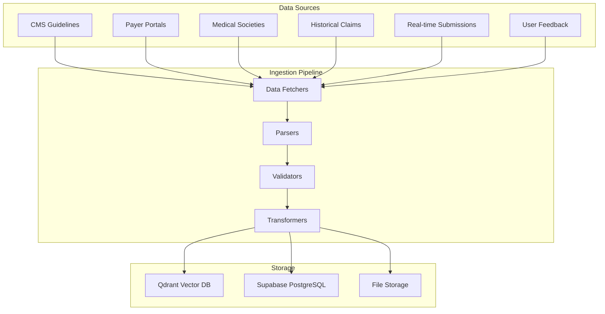
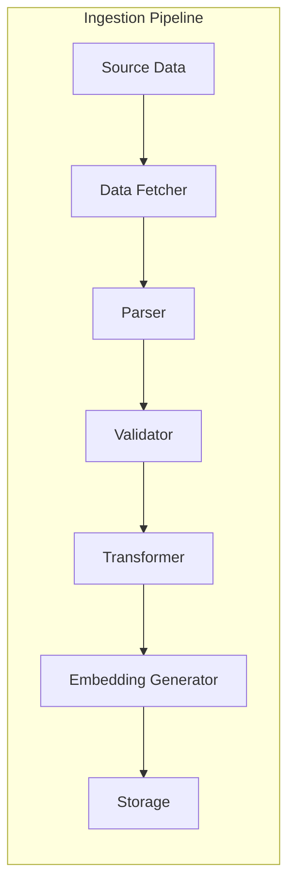
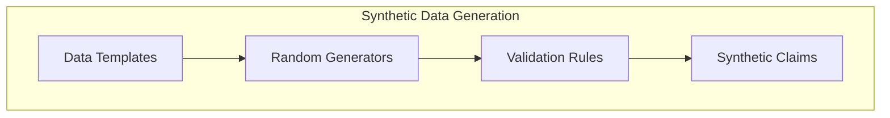
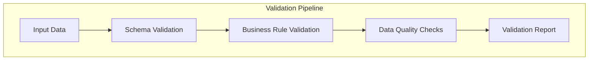
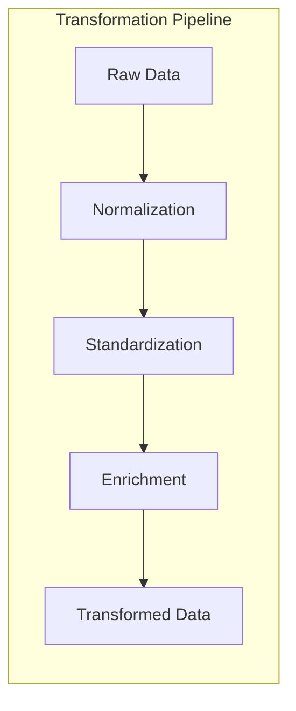
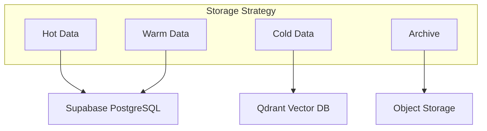
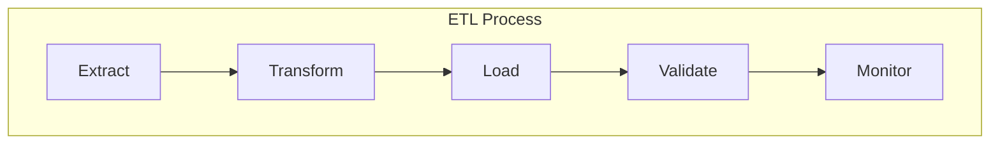

# MedClaim Data Handling Documentation

## Table of Contents
- [Data Handling Overview](#data-handling-overview)
- [Data Sources](#data-sources)
- [Data Ingestion Pipeline](#data-ingestion-pipeline)
- [Synthetic Data Generation](#synthetic-data-generation)
- [Data Validation](#data-validation)
- [Data Transformation](#data-transformation)
- [Data Storage Strategy](#data-storage-strategy)
- [Data Quality Management](#data-quality-management)
- [ETL Processes](#etl-processes)

---

## Data Handling Overview

MedClaim handles multiple types of data from various sources, including medical coding guidelines, insurance payer policies, clinical practice guidelines, historical claim data, and real-time claim submissions. The data handling pipeline ensures data quality, consistency, and availability across all system components.

### Data Architecture



### Data Types

**Structured Data**:
- Claim records (JSON, database rows)
- User information (database tables)
- Agent decisions (structured JSON)

**Semi-Structured Data**:
- Medical codes (JSON arrays)
- Audit findings (JSON objects)
- Policy documents (structured text)

**Unstructured Data**:
- PDF documents (payer policies, guidelines)
- Clinical notes (free text)
- Appeal letters (formatted text)

**Vector Data**:
- Text embeddings (768-dimensional vectors)
- Similarity scores (scalar values)

---

## Data Sources

### 1. Official Coding Guidelines

**Source**: Centers for Medicare & Medicaid Services (CMS)
**Format**: PDF, HTML, XML
**Update Frequency**: Quarterly
**Volume**: ~50,000 rules

**Data Structure**:
```python
CodingGuideline = {
    "code": "J01.90",
    "code_type": "ICD-10-CM",
    "description": "Acute sinusitis, unspecified",
    "category": "Respiratory",
    "guidelines": "Detailed coding instructions...",
    "severity": "medium",
    "effective_date": "2024-01-01",
    "expiration_date": "2024-12-31"
}
```

### 2. Payer Policy Documents

**Source**: Insurance payer portals (Blue Cross, Aetna, UnitedHealth, etc.)
**Format**: PDF, HTML
**Update Frequency**: Monthly
**Volume**: ~10,000 policies

**Data Structure**:
```python
PayerPolicy = {
    "payer_id": "BCBS-001",
    "payer_name": "Blue Cross Blue Shield",
    "policy_type": "medical",
    "policy_number": "MED-2024-001",
    "sections": [
        {
            "section_id": "12.3",
            "title": "Medical Necessity",
            "content": "Policy text...",
            "clauses": ["Clause 1", "Clause 2"]
        }
    ],
    "effective_date": "2024-01-01",
    "state": "CA"
}
```

### 3. Clinical Practice Guidelines

**Source**: Medical societies (AMA, AHA, etc.)
**Format**: PDF, HTML
**Update Frequency**: Monthly
**Volume**: ~25,000 guidelines

**Data Structure**:
```python
ClinicalGuideline = {
    "specialty": "Cardiology",
    "condition": "Acute Myocardial Infarction",
    "procedure_type": "diagnostic",
    "guideline_type": "treatment",
    "evidence_level": "A",
    "recommendation": "Recommendation text...",
    "publication_date": "2023-06-15",
    "source": "American Heart Association"
}
```

### 4. Historical Claim Data

**Source**: Internal database, external datasets
**Format**: Database rows, CSV, JSON
**Update Frequency**: Real-time (continuous)
**Volume**: ~100,000+ claims (growing)

**Data Structure**:
```python
HistoricalClaim = {
    "claim_id": "HIST-001",
    "diagnosis_codes": [{"code": "J01.90", ...}],
    "procedure_codes": [{"code": "99214", ...}],
    "payer": "Blue Cross",
    "denial_reason": "Medical necessity",
    "appeal_strategy": "Added clinical documentation",
    "outcome": "APPROVED_ON_APPEAL",
    "timestamp": "2024-01-15T10:30:00Z"
}
```

### 5. Real-time Claim Submissions

**Source**: User dashboard, API endpoints
**Format**: JSON payloads
**Update Frequency**: Real-time
**Volume**: Variable (based on usage)

**Data Structure**:
```python
ClaimSubmission = {
    "patient_name": "John Doe",
    "patient_dob": "1980-01-15",
    "payer_name": "Blue Cross",
    "date_of_service": "2024-01-15",
    "facility_type": "physician_office",
    "diagnosis_codes": [{"code": "J01.90", "description": "..."}],
    "procedure_codes": [{"code": "99214", "description": "..."}],
    "billed_amount": 150.00
}
```

---

## Data Ingestion Pipeline

### Ingestion Architecture



### Ingestion Workflows

#### 1. Coding Guidelines Ingestion

```python
async def ingest_coding_guidelines():
    """
    Ingest ICD-10-CM and CPT coding guidelines.
    """
    # 1. Fetch guidelines from CMS
    guidelines = await fetch_cms_guidelines()
    
    for guideline in guidelines:
        # 2. Parse document
        text = parse_cms_guideline(guideline)
        
        # 3. Validate structure
        if not validate_guideline_structure(guideline):
            log_error("Invalid guideline structure", guideline)
            continue
        
        # 4. Transform to standard format
        standardized = transform_guideline(guideline)
        
        # 5. Chunk text for embedding
        chunks = chunk_text(text, chunk_size=512, overlap=64)
        
        # 6. Generate embeddings
        embeddings = await generate_embeddings_batch(chunks)
        
        # 7. Store in Qdrant
        await upsert_to_qdrant(
            collection="coding_rules",
            chunks=chunks,
            embeddings=embeddings,
            metadata=standardized
        )
        
        # 8. Store metadata in Supabase
        await store_guideline_metadata(standardized)
```

#### 2. Payer Policy Ingestion

```python
async def ingest_payer_policies():
    """
    Ingest insurance payer policy documents.
    """
    # 1. Fetch policies from payer portals
    policies = await fetch_payer_policies()
    
    for policy in policies:
        # 2. Parse PDF document
        text = extract_pdf_text(policy.document)
        
        # 3. Extract structured information
        structured = extract_policy_structure(text, policy.metadata)
        
        # 4. Validate required fields
        if not validate_policy_structure(structured):
            log_error("Invalid policy structure", policy.id)
            continue
        
        # 5. Chunk by sections
        chunks = chunk_by_sections(text, structured.sections)
        
        # 6. Generate embeddings
        embeddings = await generate_embeddings_batch(chunks)
        
        # 7. Store in Qdrant
        await upsert_to_qdrant(
            collection="payer_policies",
            chunks=chunks,
            embeddings=embeddings,
            metadata=structured
        )
```

#### 3. Continuous Learning Ingestion

```python
async def ingest_successful_appeal(claim_id: str):
    """
    Ingest a successful appeal for continuous learning.
    """
    # 1. Fetch claim context
    claim = await get_claim(claim_id)
    
    # 2. Extract learning context
    context = extract_learning_context(claim)
    
    # 3. Format as denial pattern
    pattern = format_denial_pattern(context)
    
    # 4. Generate embedding
    embedding = await generate_embedding(pattern)
    
    # 5. Store in Qdrant
    await upsert_to_qdrant(
        collection="denial_patterns",
        chunks=[pattern],
        embeddings=[embedding],
        metadata={
            "payer_id": claim.payer_id,
            "denial_reason": claim.denial_reason,
            "success_rate": 1.0,
            "timestamp": datetime.now().isoformat()
        }
    )
    
    # 6. Update learning statistics
    await update_learning_statistics(claim.payer_id)
```

---

## Synthetic Data Generation

### Purpose

Synthetic data generation enables testing, development, and demonstration without using real patient data, ensuring HIPAA compliance and privacy protection.

### Generation Architecture



### Claim Generator

```python
class SyntheticClaimGenerator:
    """Generate synthetic medical insurance claims for testing."""
    
    def __init__(self):
        self.diagnoses = load_diagnosis_codes()
        self.procedures = load_procedure_codes()
        self.payers = load_payers()
        self.facilities = load_facilities()
    
    def generate_claim(self, market: str = "US") -> dict:
        """
        Generate a single synthetic claim.
        """
        # Generate patient information
        patient = self.generate_patient()
        
        # Select random payer
        payer = random.choice(self.payers)
        
        # Select random facility
        facility = random.choice(self.facilities)
        
        # Generate clinical codes
        diagnosis_codes = self.generate_diagnosis_codes(1, 3)
        procedure_codes = self.generate_procedure_codes(1, 5)
        
        # Calculate billed amount
        billed_amount = self.calculate_amount(procedure_codes)
        
        # Generate date of service
        date_of_service = self.generate_date_of_service()
        
        return {
            "patient_name": patient["name"],
            "patient_dob": patient["dob"],
            "payer_name": payer["name"],
            "payer_id": payer["id"],
            "date_of_service": date_of_service,
            "facility_type": facility["type"],
            "diagnosis_codes": diagnosis_codes,
            "procedure_codes": procedure_codes,
            "billed_amount": billed_amount,
            "market": market
        }
    
    def generate_patient(self) -> dict:
        """Generate synthetic patient information."""
        first_names = ["John", "Jane", "Michael", "Sarah", "David", "Emily"]
        last_names = ["Smith", "Johnson", "Williams", "Brown", "Jones", "Garcia"]
        
        name = f"{random.choice(first_names)} {random.choice(last_names)}"
        
        # Generate DOB between 18 and 80 years ago
        age = random.randint(18, 80)
        dob = datetime.now() - timedelta(days=age * 365)
        
        return {
            "name": name,
            "dob": dob.strftime("%Y-%m-%d")
        }
    
    def generate_diagnosis_codes(self, min_count: int, max_count: int) -> list[dict]:
        """Generate random diagnosis codes."""
        count = random.randint(min_count, max_count)
        selected = random.sample(self.diagnoses, count)
        
        return [
            {
                "code": code["code"],
                "description": code["description"]
            }
            for code in selected
        ]
    
    def generate_procedure_codes(self, min_count: int, max_count: int) -> list[dict]:
        """Generate random procedure codes."""
        count = random.randint(min_count, max_count)
        selected = random.sample(self.procedures, count)
        
        return [
            {
                "code": code["code"],
                "description": code["description"]
            }
            for code in selected
        ]
    
    def calculate_amount(self, procedure_codes: list[dict]) -> float:
        """Calculate billed amount based on procedures."""
        base_amounts = {
            "99213": 100.00,
            "99214": 150.00,
            "99215": 200.00,
            "22551": 5000.00,
            "22845": 3000.00
        }
        
        total = 0.0
        for proc in procedure_codes:
            code = proc["code"]
            base = base_amounts.get(code, 100.00)
            # Add random variation ±20%
            variation = random.uniform(0.8, 1.2)
            total += base * variation
        
        return round(total, 2)
    
    def generate_date_of_service(self) -> str:
        """Generate random date of service within last 90 days."""
        days_ago = random.randint(0, 90)
        date = datetime.now() - timedelta(days=days_ago)
        return date.strftime("%Y-%m-%d")
    
    def generate_batch(self, count: int, market: str = "US") -> list[dict]:
        """Generate a batch of synthetic claims."""
        return [self.generate_claim(market) for _ in range(count)]
```

### Data Fixtures

**Payer Directory** (`data/payer_directory.yaml`):
```yaml
payers:
  - id: "BCBS-001"
    name: "Blue Cross Blue Shield"
    payer_type: "commercial"
    contact_email: "claims@bcbs.com"
    denial_rate: 0.15
    
  - id: "MEDICARE-001"
    name: "Medicare"
    payer_type: "government"
    contact_email: "claims@medicare.gov"
    denial_rate: 0.08
    
  - id: "AETNA-001"
    name: "Aetna"
    payer_type: "commercial"
    contact_email: "claims@aetna.com"
    denial_rate: 0.12
```

**Eligibility Fixtures** (`data/eligibility_fixtures.yaml`):
```yaml
scenarios:
  - patient_id: "PAT-001"
    insurance_active: true
    in_network: true
    coverage_type: "PPO"
    
  - patient_id: "PAT-002"
    insurance_active: false
    in_network: false
    coverage_type: null
```

---

## Data Validation

### Validation Framework



### Schema Validation

```python
from pydantic import BaseModel, validator
from typing import List
from datetime import date

class DiagnosisCode(BaseModel):
    code: str
    description: str
    
    @validator('code')
    def validate_code_format(cls, v):
        if not v or len(v) < 3:
            raise ValueError("Invalid code format")
        return v.upper()

class ProcedureCode(BaseModel):
    code: str
    description: str
    
    @validator('code')
    def validate_code_format(cls, v):
        if not v or not v.isdigit():
            raise ValueError("Procedure code must be numeric")
        return v

class ClaimSubmission(BaseModel):
    patient_name: str
    patient_dob: date
    payer_name: str
    date_of_service: date
    facility_type: str
    diagnosis_codes: List[DiagnosisCode]
    procedure_codes: List[ProcedureCode]
    billed_amount: float
    
    @validator('billed_amount')
    def validate_amount(cls, v):
        if v <= 0:
            raise ValueError("Billed amount must be positive")
        if v > 1000000:
            raise ValueError("Billed amount exceeds maximum")
        return v
    
    @validator('date_of_service')
    def validate_date_of_service(cls, v, values):
        if 'patient_dob' in values:
            dob = values['patient_dob']
            age = (v - dob).days / 365
            if age < 0 or age > 120:
                raise ValueError("Invalid date of service relative to DOB")
        return v
```

### Business Rule Validation

```python
class BusinessRuleValidator:
    """Validate business rules for claims."""
    
    def validate_claim(self, claim: dict) -> ValidationResult:
        """
        Validate claim against business rules.
        """
        errors = []
        warnings = []
        
        # Rule 1: Date of service must be within last 365 days
        if not self.validate_date_range(claim['date_of_service']):
            errors.append("Date of service must be within last 365 days")
        
        # Rule 2: At least one diagnosis code required
        if not claim['diagnosis_codes']:
            errors.append("At least one diagnosis code is required")
        
        # Rule 3: At least one procedure code required
        if not claim['procedure_codes']:
            errors.append("At least one procedure code is required")
        
        # Rule 4: Diagnosis codes must match procedure codes
        if not self.validate_code_compatibility(
            claim['diagnosis_codes'],
            claim['procedure_codes']
        ):
            warnings.append("Diagnosis and procedure codes may not be compatible")
        
        # Rule 5: Billed amount reasonable for procedures
        if not self.validate_amount_reasonableness(
            claim['procedure_codes'],
            claim['billed_amount']
        ):
            warnings.append("Billed amount may be unreasonable for procedures")
        
        return ValidationResult(
            is_valid=len(errors) == 0,
            errors=errors,
            warnings=warnings
        )
    
    def validate_date_range(self, date_of_service: str) -> bool:
        """Validate date of service is within acceptable range."""
        dos = datetime.strptime(date_of_service, "%Y-%m-%d").date()
        max_date = date.today()
        min_date = max_date - timedelta(days=365)
        return min_date <= dos <= max_date
    
    def validate_code_compatibility(
        self,
        diagnosis_codes: list,
        procedure_codes: list
    ) -> bool:
        """Validate diagnosis and procedure codes are compatible."""
        # Simplified check - in production, use comprehensive compatibility matrix
        return True  # Placeholder for actual logic
    
    def validate_amount_reasonableness(
        self,
        procedure_codes: list,
        billed_amount: float
    ) -> bool:
        """Validate billed amount is reasonable for procedures."""
        # Calculate expected range
        expected_min = sum(self.get_procedure_base_cost(p['code']) for p in procedure_codes) * 0.5
        expected_max = sum(self.get_procedure_base_cost(p['code']) for p in procedure_codes) * 2.0
        
        return expected_min <= billed_amount <= expected_max
```

### Data Quality Checks

```python
class DataQualityChecker:
    """Check data quality metrics."""
    
    def check_completeness(self, data: dict, required_fields: list) -> float:
        """Calculate completeness percentage."""
        present = sum(1 for field in required_fields if data.get(field))
        return (present / len(required_fields)) * 100
    
    def check_accuracy(self, data: dict) -> dict:
        """Check data accuracy against reference data."""
        issues = []
        
        # Check code validity
        for code in data.get('diagnosis_codes', []):
            if not self.is_valid_diagnosis_code(code['code']):
                issues.append(f"Invalid diagnosis code: {code['code']}")
        
        for code in data.get('procedure_codes', []):
            if not self.is_valid_procedure_code(code['code']):
                issues.append(f"Invalid procedure code: {code['code']}")
        
        return {
            "is_accurate": len(issues) == 0,
            "issues": issues
        }
    
    def check_consistency(self, data: dict) -> dict:
        """Check internal consistency of data."""
        issues = []
        
        # Check date consistency
        if data.get('patient_dob') and data.get('date_of_service'):
            dob = datetime.strptime(data['patient_dob'], "%Y-%m-%d")
            dos = datetime.strptime(data['date_of_service'], "%Y-%m-%d")
            if dos < dob:
                issues.append("Date of service before patient DOB")
        
        # Check amount consistency
        if data.get('billed_amount'):
            if data['billed_amount'] <= 0:
                issues.append("Billed amount must be positive")
        
        return {
            "is_consistent": len(issues) == 0,
            "issues": issues
        }
```

---

## Data Transformation

### Transformation Pipeline



### Normalization

```python
def normalize_claim_data(raw_claim: dict) -> dict:
    """
    Normalize claim data to standard format.
    """
    # Normalize text fields
    normalized = {
        "patient_name": raw_claim.get("patient_name", "").strip().title(),
        "payer_name": raw_claim.get("payer_name", "").strip().upper(),
        "facility_type": raw_claim.get("facility_type", "").strip().lower()
    }
    
    # Normalize codes
    diagnosis_codes = [
        {
            "code": code["code"].strip().upper(),
            "description": code["description"].strip()
        }
        for code in raw_claim.get("diagnosis_codes", [])
    ]
    
    procedure_codes = [
        {
            "code": code["code"].strip(),
            "description": code["description"].strip()
        }
        for code in raw_claim.get("procedure_codes", [])
    ]
    
    # Normalize dates
    date_fields = ["patient_dob", "date_of_service"]
    for field in date_fields:
        if field in raw_claim:
            normalized[field] = normalize_date(raw_claim[field])
    
    # Normalize amounts
    if "billed_amount" in raw_claim:
        normalized["billed_amount"] = round(float(raw_claim["billed_amount"]), 2)
    
    return normalized
```

### Standardization

```python
def standardize_codes(codes: list, code_type: str) -> list:
    """
    Standardize medical codes to official format.
    """
    standardized = []
    
    for code in codes:
        # Remove dots and spaces
        clean_code = code.replace(".", "").replace(" ", "")
        
        # Pad with leading zeros if needed
        if code_type == "ICD-10":
            clean_code = clean_code.zfill(3)
        elif code_type == "CPT":
            clean_code = clean_code.zfill(5)
        
        standardized.append({
            "code": clean_code,
            "description": code.get("description", "")
        })
    
    return standardized
```

### Enrichment

```python
async def enrich_claim_data(claim: dict) -> dict:
    """
    Enrich claim data with additional information.
    """
    enriched = claim.copy()
    
    # Add payer information
    payer_info = await get_payer_info(claim["payer_name"])
    enriched["payer_id"] = payer_info["id"]
    enriched["payer_type"] = payer_info["type"]
    
    # Add facility information
    facility_info = await get_facility_info(claim["facility_type"])
    enriched["facility_id"] = facility_info["id"]
    
    # Add market information
    enriched["market"] = determine_market(claim)
    
    # Add metadata
    enriched["created_at"] = datetime.now().isoformat()
    enriched["updated_at"] = datetime.now().isoformat()
    
    return enriched
```

---

## Data Storage Strategy

### Storage Architecture



### Data Classification

**Hot Data** (frequently accessed):
- Active claims (last 30 days)
- User sessions
- Real-time agent decisions
- **Storage**: Supabase PostgreSQL with SSD

**Warm Data** (occasionally accessed):
- Historical claims (30-365 days)
- Agent decision history
- Audit logs
- **Storage**: Supabase PostgreSQL with HDD

**Cold Data** (rarely accessed):
- Claims older than 1 year
- Historical denial patterns
- Archived audit logs
- **Storage**: Qdrant Vector DB, Object Storage

**Archive Data** (compliance only):
- Claims older than 7 years
- Historical backups
- **Storage**: Cold object storage with retention policies

### Retention Policies

```python
RETENTION_POLICIES = {
    "claims": {
        "hot": 30,      # days
        "warm": 335,     # days (total 365)
        "cold": 2555,    # days (total 7 years)
        "archive": 2555  # days (total 7 years)
    },
    "agent_decisions": {
        "hot": 30,
        "warm": 335,
        "cold": 2555
    },
    "audit_logs": {
        "hot": 90,
        "warm": 275,
        "cold": 2555
    },
    "denial_patterns": {
        "hot": 365,
        "warm": 1825,    # 5 years
        "cold": 2555     # 7 years
    }
}
```

---

## Data Quality Management

### Quality Metrics

```python
class DataQualityMetrics:
    """Track and report data quality metrics."""
    
    def calculate_metrics(self, dataset: list[dict]) -> dict:
        """
        Calculate quality metrics for a dataset.
        """
        total_records = len(dataset)
        
        # Completeness
        completeness = self.calculate_completeness(dataset)
        
        # Accuracy
        accuracy = self.calculate_accuracy(dataset)
        
        # Consistency
        consistency = self.calculate_consistency(dataset)
        
        # Timeliness
        timeliness = self.calculate_timeliness(dataset)
        
        # Uniqueness
        uniqueness = self.calculate_uniqueness(dataset)
        
        return {
            "total_records": total_records,
            "completeness": completeness,
            "accuracy": accuracy,
            "consistency": consistency,
            "timeliness": timeliness,
            "uniqueness": uniqueness,
            "overall_score": self.calculate_overall_score(
                completeness, accuracy, consistency, timeliness, uniqueness
            )
        }
    
    def calculate_completeness(self, dataset: list[dict]) -> float:
        """Calculate percentage of complete records."""
        required_fields = ["patient_name", "payer_name", "diagnosis_codes", "procedure_codes"]
        complete = sum(
            1 for record in dataset
            if all(record.get(field) for field in required_fields)
        )
        return (complete / len(dataset)) * 100 if dataset else 0
```

### Quality Monitoring

```python
class DataQualityMonitor:
    """Monitor data quality over time."""
    
    def __init__(self):
        self.metrics_history = []
    
    def record_metrics(self, metrics: dict):
        """Record quality metrics at a point in time."""
        self.metrics_history.append({
            "timestamp": datetime.now().isoformat(),
            "metrics": metrics
        })
    
    def detect_degradation(self, threshold: float = 5.0) -> list[dict]:
        """
        Detect significant quality degradation.
        """
        if len(self.metrics_history) < 2:
            return []
        
        current = self.metrics_history[-1]["metrics"]
        previous = self.metrics_history[-2]["metrics"]
        
        degradations = []
        
        for metric in current:
            if metric in previous:
                change = current[metric] - previous[metric]
                if abs(change) > threshold:
                    degradations.append({
                        "metric": metric,
                        "change": change,
                        "previous": previous[metric],
                        "current": current[metric]
                    })
        
        return degradations
```

---

## ETL Processes

### ETL Architecture



### Extract

```python
class DataExtractor:
    """Extract data from various sources."""
    
    async def extract_from_api(self, source: str, params: dict) -> list[dict]:
        """Extract data from API endpoint."""
        response = await http_client.get(source, params=params)
        return response.json()
    
    async def extract_from_database(self, query: str) -> list[dict]:
        """Extract data from database."""
        results = await database.execute(query)
        return results
    
    async def extract_from_file(self, file_path: str) -> list[dict]:
        """Extract data from file."""
        with open(file_path, 'r') as f:
            if file_path.endswith('.json'):
                return json.load(f)
            elif file_path.endswith('.yaml'):
                return yaml.safe_load(f)
            elif file_path.endswith('.csv'):
                return list(csv.DictReader(f))
```

### Transform

```python
class DataTransformer:
    """Transform data to target format."""
    
    def transform_claims(self, raw_claims: list[dict]) -> list[dict]:
        """Transform raw claims to standard format."""
        transformed = []
        
        for claim in raw_claims:
            # Normalize
            normalized = normalize_claim_data(claim)
            
            # Standardize codes
            normalized["diagnosis_codes"] = standardize_codes(
                normalized["diagnosis_codes"], "ICD-10"
            )
            normalized["procedure_codes"] = standardize_codes(
                normalized["procedure_codes"], "CPT"
            )
            
            # Enrich
            enriched = enrich_claim_data(normalized)
            
            transformed.append(enriched)
        
        return transformed
```

### Load

```python
class DataLoader:
    """Load data into storage systems."""
    
    async def load_to_database(self, data: list[dict], table: str):
        """Load data into database."""
        for record in data:
            await database.insert(table, record)
    
    async def load_to_vector_db(self, data: list[dict], collection: str):
        """Load data into vector database."""
        for record in data:
            embedding = await generate_embedding(record["text"])
            await qdrant.upsert(
                collection_name=collection,
                points=[{
                    "id": record["id"],
                    "vector": embedding,
                    "payload": record
                }]
            )
    
    async def load_to_file(self, data: list[dict], file_path: str):
        """Load data to file."""
        with open(file_path, 'w') as f:
            json.dump(data, f, indent=2)
```

### ETL Orchestration

```python
class ETLOrchestrator:
    """Orchestrate ETL processes."""
    
    async def run_etl_pipeline(
        self,
        source: str,
        destination: str,
        transform_func: callable
    ):
        """
        Run complete ETL pipeline.
        """
        # Extract
        logger.info(f"Extracting data from {source}")
        raw_data = await self.extractor.extract_from_api(source)
        
        # Transform
        logger.info(f"Transforming {len(raw_data)} records")
        transformed_data = transform_func(raw_data)
        
        # Validate
        logger.info("Validating transformed data")
        validation_result = await self.validator.validate_batch(transformed_data)
        
        if not validation_result.is_valid:
            logger.error(f"Validation failed: {validation_result.errors}")
            raise ValueError("Data validation failed")
        
        # Load
        logger.info(f"Loading {len(transformed_data)} records to {destination}")
        await self.loader.load_to_database(transformed_data, destination)
        
        logger.info("ETL pipeline completed successfully")
        
        return {
            "records_processed": len(transformed_data),
            "validation_result": validation_result
        }
```

---

## Data Lineage

### Lineage Tracking

```python
class DataLineageTracker:
    """Track data lineage and transformations."""
    
    def __init__(self):
        self.lineage_graph = {}
    
    def record_transformation(
        self,
        source_id: str,
        transformation: str,
        target_id: str,
        metadata: dict = None
    ):
        """Record a data transformation."""
        if source_id not in self.lineage_graph:
            self.lineage_graph[source_id] = []
        
        self.lineage_graph[source_id].append({
            "transformation": transformation,
            "target": target_id,
            "metadata": metadata or {},
            "timestamp": datetime.now().isoformat()
        })
    
    def get_lineage(self, data_id: str) -> list[dict]:
        """Get lineage for a specific data item."""
        lineage = []
        
        def trace(current_id, path):
            if current_id in self.lineage_graph:
                for transformation in self.lineage_graph[current_id]:
                    new_path = path + [transformation]
                    lineage.append(new_path)
                    trace(transformation["target"], new_path)
        
        trace(data_id, [])
        return lineage
```

---

## Conclusion

The MedClaim data handling system provides a comprehensive framework for managing diverse data types from multiple sources. Through robust ingestion pipelines, validation frameworks, transformation processes, and quality management, the system ensures data integrity, consistency, and availability across all components.

The architecture ensures:
- Reliable data ingestion from multiple sources
- Comprehensive validation and quality checks
- Efficient transformation and standardization
- Appropriate storage strategies based on access patterns
- Continuous quality monitoring and improvement
- Complete data lineage tracking for compliance

This data handling infrastructure serves as a critical foundation for MedClaim's AI-powered claim processing, enabling agents to access high-quality, up-to-date information for accurate decision-making.
