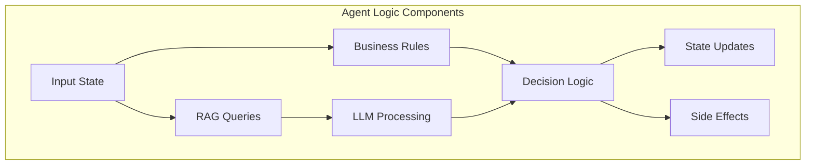
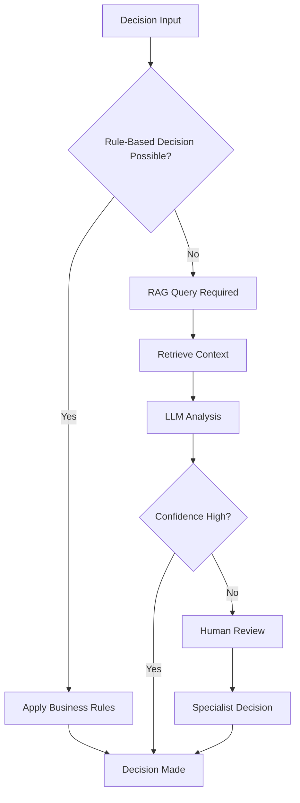
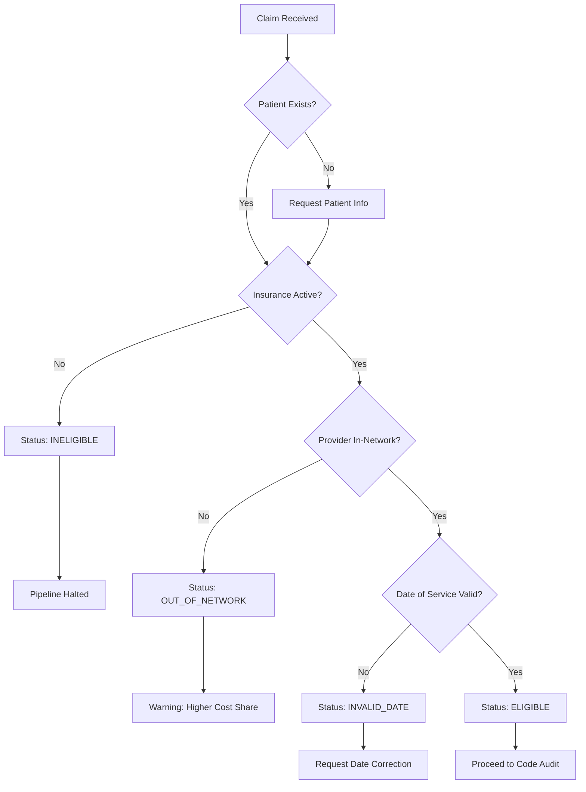
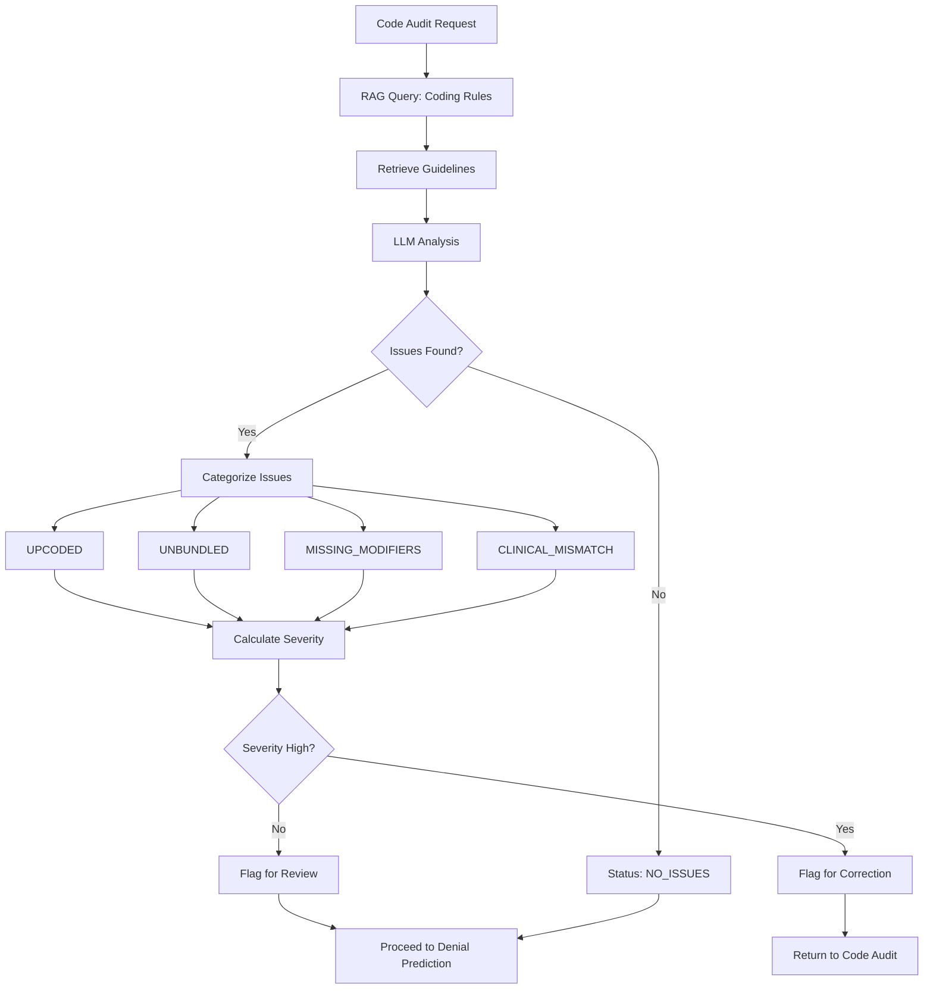
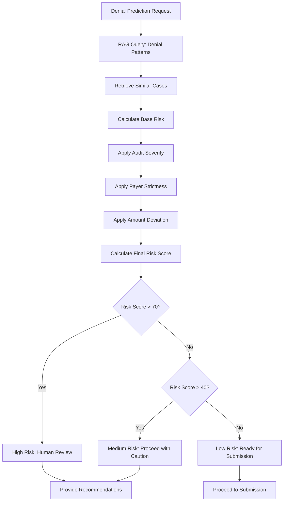
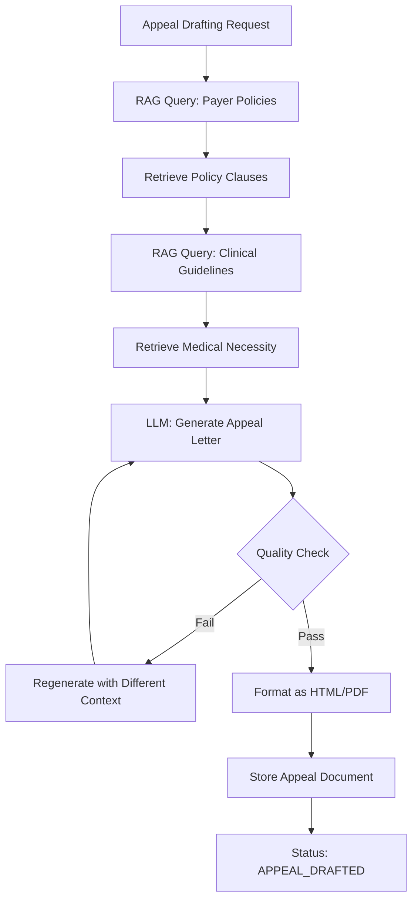
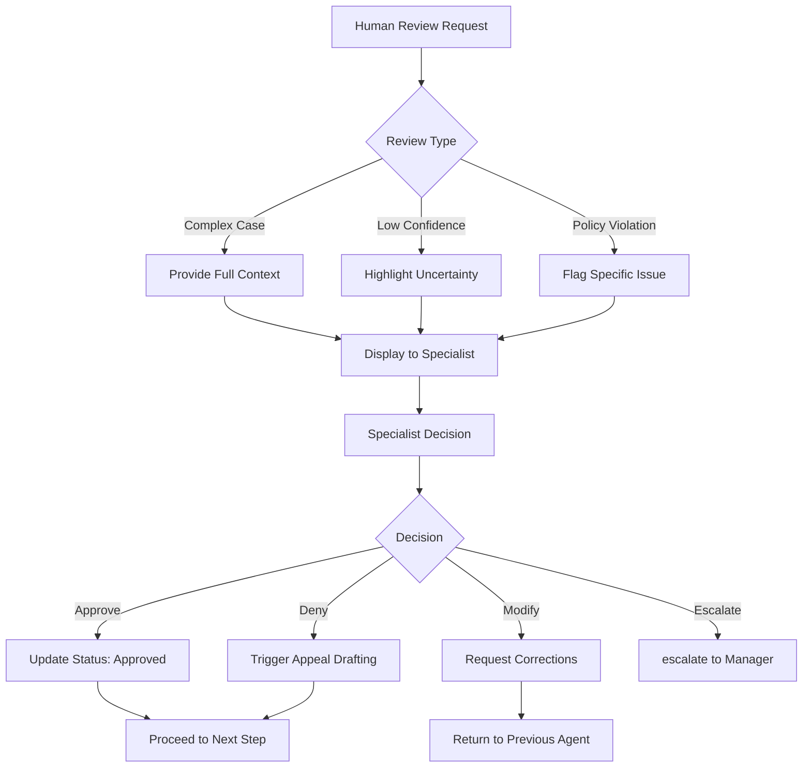
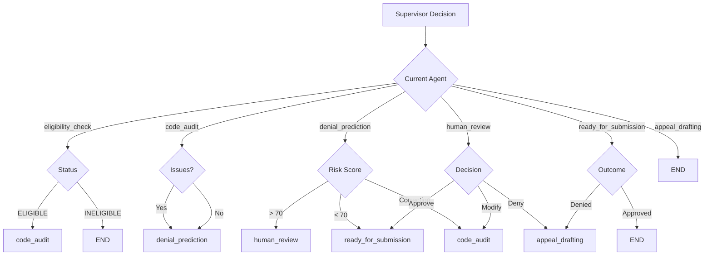

# MedClaim Agent Logic Documentation

## Table of Contents
- [Agent Logic Overview](#agent-logic-overview)
- [Decision Making Framework](#decision-making-framework)
- [Eligibility Logic](#eligibility-logic)
- [Code Audit Logic](#code-audit-logic)
- [Denial Prediction Logic](#denial-prediction-logic)
- [Appeal Drafting Logic](#appeal-drafting-logic)
- [Human Review Logic](#human-review-logic)
- [Supervisor Routing Logic](#supervisor-routing-logic)
- [Error Handling Logic](#error-handling-logic)

---

## Agent Logic Overview

MedClaim agents use a combination of deterministic business logic, RAG-enhanced LLM analysis, and rule-based decision making to process insurance claims. Each agent has specific logic tailored to its domain expertise while following consistent patterns for state management, error handling, and observability.

### Logic Architecture



### Logic Patterns

**Rule-Based Logic**: Deterministic if-else conditions for clear-cut decisions
**RAG-Enhanced Logic**: Semantic search + LLM analysis for complex decisions
**Hybrid Logic**: Combination of rules and LLM for balanced approach
**Fallback Logic**: Degradation strategies when primary logic fails

---

## Decision Making Framework

### Decision Hierarchy



### Confidence Scoring

```python
def calculate_confidence(
    rule_confidence: float,
    rag_confidence: float,
    llm_confidence: float
) -> float:
    """
    Calculate overall confidence score.
    
    Weights:
    - Rule-based: 0.4 (most reliable)
    - RAG retrieval: 0.3 (context quality)
    - LLM analysis: 0.3 (interpretation quality)
    """
    return (
        rule_confidence * 0.4 +
        rag_confidence * 0.3 +
        llm_confidence * 0.3
    )
```

### Decision Thresholds

```python
DECISION_THRESHOLDS = {
    "high_confidence": 0.85,  # Auto-decision
    "medium_confidence": 0.70,  # Proceed with caution
    "low_confidence": 0.50,  # Human review required
    "very_low_confidence": 0.30  # Escalate immediately
}
```

---

## Eligibility Logic

### Decision Flow



### Implementation

```python
async def eligibility_check(state: ClaimState) -> dict[str, Any]:
    """
    Perform eligibility check using business rules and FHIR API.
    """
    # Extract relevant information
    patient_id = state.get("patient_id")
    payer_id = state.get("payer_id")
    date_of_service = state.get("date_of_service")
    
    # Rule 1: Check if patient exists
    if not patient_id:
        return {
            "status": "INELIGIBLE",
            "eligibility_details": {
                "coverage_active": False,
                "reason": "Patient ID not provided"
            },
            "human_review_flag": True,
            "human_review_reason": "Missing patient information"
        }
    
    # Rule 2: Check insurance coverage via FHIR
    try:
        coverage = await fhir_client.check_coverage(
            patient_id=patient_id,
            payer_id=payer_id,
            date_of_service=date_of_service
        )
        
        if not coverage.get("active", False):
            return {
                "status": "INELIGIBLE",
                "eligibility_details": {
                    "coverage_active": False,
                    "reason": coverage.get("reason", "Insurance inactive")
                },
                "processing_errors": ["Insurance coverage inactive on date of service"]
            }
    except Exception as e:
        logger.error("eligibility.fhir_check_failed", error=str(e))
        return {
            "status": "HUMAN_REVIEW_REQUIRED",
            "eligibility_details": {
                "coverage_active": None,
                "reason": "FHIR service unavailable"
            },
            "human_review_flag": True,
            "human_review_reason": "Unable to verify eligibility"
        }
    
    # Rule 3: Check provider network status
    try:
        provider = await fhir_client.check_provider_network(
            provider_id=state.get("provider_id"),
            payer_id=payer_id
        )
        
        in_network = provider.get("in_network", False)
        
        if not in_network:
            logger.warning("eligibility.out_of_network", provider_id=state.get("provider_id"))
            # Continue but flag for higher cost share
    except Exception as e:
        logger.error("eligibility.network_check_failed", error=str(e))
        in_network = None  # Unknown, proceed with caution
    
    # Rule 4: Validate date of service
    try:
        dos_date = datetime.strptime(date_of_service, "%Y-%m-%d").date()
        today = date.today()
        
        if dos_date > today:
            return {
                "status": "INELIGIBLE",
                "eligibility_details": {
                    "coverage_active": True,
                    "in_network": in_network,
                    "date_valid": False,
                    "reason": "Date of service in future"
                },
                "human_review_flag": True,
                "human_review_reason": "Invalid date of service"
            }
        
        # Check if date is too old (beyond filing limit)
        filing_limit = today - timedelta(days=365)
        if dos_date < filing_limit:
            return {
                "status": "INELIGIBLE",
                "eligibility_details": {
                    "coverage_active": True,
                    "in_network": in_network,
                    "date_valid": False,
                    "reason": "Date of service beyond filing limit"
                },
                "processing_errors": ["Date of service beyond filing limit"]
            }
            
    except ValueError as e:
        return {
            "status": "INELIGIBLE",
            "eligibility_details": {
                "coverage_active": True,
                "date_valid": False,
                "reason": "Invalid date format"
            },
            "processing_errors": [f"Invalid date format: {date_of_service}"]
        }
    
    # All checks passed
    return {
        "status": "ELIGIBLE",
        "eligibility_details": {
            "coverage_active": True,
            "in_network": in_network,
            "date_valid": True
        },
        "current_agent": "code_audit"
    }
```

### Business Rules

**Rule 1**: Patient must exist in system
**Rule 2**: Insurance must be active on date of service
**Rule 3**: Provider must be in-network (warning if not)
**Rule 4**: Date of service must be valid and within filing limits
**Rule 5**: Required fields must be present

---

## Code Audit Logic

### Decision Flow



### Implementation

```python
async def code_audit(state: ClaimState) -> dict[str, Any]:
    """
    Perform code audit using RAG-enhanced LLM analysis.
    """
    # Extract codes
    diagnosis_codes = state.get("diagnosis_codes", [])
    procedure_codes = state.get("procedure_codes", [])
    facility_type = state.get("facility_type")
    
    # Rule 1: Validate code presence
    if not diagnosis_codes:
        return {
            "status": "HUMAN_REVIEW_REQUIRED",
            "audit_findings": [],
            "human_review_flag": True,
            "human_review_reason": "No diagnosis codes provided"
        }
    
    if not procedure_codes:
        return {
            "status": "HUMAN_REVIEW_REQUIRED",
            "audit_findings": [],
            "human_review_flag": True,
            "human_review_reason": "No procedure codes provided"
        }
    
    # RAG Query: Retrieve relevant coding guidelines
    try:
        query = format_codes_query(diagnosis_codes, procedure_codes, facility_type)
        rag_results = await rag_search(
            collection="coding_rules",
            query=query,
            top_k=5,
            filters={"facility_type": facility_type}
        )
        
        rag_confidence = min([r.score for r in rag_results]) if rag_results else 0.0
    except Exception as e:
        logger.error("code_audit.rag_failed", error=str(e))
        rag_results = []
        rag_confidence = 0.0
    
    # LLM Analysis
    try:
        prompt = build_code_audit_prompt(
            diagnosis_codes=diagnosis_codes,
            procedure_codes=procedure_codes,
            facility_type=facility_type,
            rag_results=rag_results
        )
        
        llm_response = await query_llm(
            prompt=prompt,
            system_prompt=CODE_AUDIT_SYSTEM_PROMPT,
            temperature=0.1,
            json_mode=True
        )
        
        # Parse response
        audit_findings = parse_audit_findings(llm_response["json"])
        llm_confidence = llm_response.get("confidence", 0.5)
        
    except Exception as e:
        logger.error("code_audit.llm_failed", error=str(e))
        audit_findings = []
        llm_confidence = 0.0
    
    # Rule 2: Validate findings structure
    validated_findings = []
    for finding in audit_findings:
        if validate_finding_structure(finding):
            validated_findings.append(finding)
    
    # Calculate overall confidence
    overall_confidence = calculate_confidence(
        rule_confidence=1.0,  # Rules are deterministic
        rag_confidence=rag_confidence,
        llm_confidence=llm_confidence
    )
    
    # Determine next action based on findings
    if not validated_findings:
        return {
            "status": "AUDITED_NO_ISSUES",
            "audit_findings": [],
            "audit_confidence": overall_confidence,
            "current_agent": "denial_prediction"
        }
    
    # Categorize findings by severity
    high_severity = [f for f in validated_findings if f.get("severity") == "high"]
    medium_severity = [f for f in validated_findings if f.get("severity") == "medium"]
    low_severity = [f for f in validated_findings if f.get("severity") == "low"]
    
    # Decision logic
    if high_severity:
        # High severity issues require correction
        return {
            "status": "AUDITED_ISSUES_FOUND",
            "audit_findings": validated_findings,
            "audit_confidence": overall_confidence,
            "needs_correction": True,
            "current_agent": "code_audit"  # Loop back for correction
        }
    elif medium_severity and overall_confidence < 0.7:
        # Medium severity with low confidence -> human review
        return {
            "status": "AUDITED_ISSUES_FOUND",
            "audit_findings": validated_findings,
            "audit_confidence": overall_confidence,
            "human_review_flag": True,
            "human_review_reason": "Medium severity issues with low confidence",
            "current_agent": "human_review"
        }
    else:
        # Low severity or high confidence -> proceed
        return {
            "status": "AUDITED_ISSUES_FOUND",
            "audit_findings": validated_findings,
            "audit_confidence": overall_confidence,
            "current_agent": "denial_prediction"
        }
```

### Finding Categories

**UPCODED**: Code higher than justified by documentation
**UNBUNDLED**: Codes that should be billed together
**MISSING_MODIFIERS**: Required modifiers absent
**CLINICAL_MISMATCH**: Codes don't match clinical documentation
**INVALID_COMBINATION**: Codes that shouldn't be used together

### Severity Classification

```python
def classify_finding_severity(finding: dict) -> str:
    """
    Classify finding severity based on impact.
    """
    finding_type = finding.get("finding_type")
    confidence = finding.get("confidence", 0.5)
    
    high_impact_types = ["UPCODED", "UNBUNDLED", "INVALID_COMBINATION"]
    medium_impact_types = ["MISSING_MODIFIERS"]
    low_impact_types = ["CLINICAL_MISMATCH"]
    
    if finding_type in high_impact_types and confidence > 0.7:
        return "high"
    elif finding_type in medium_impact_types or confidence > 0.5:
        return "medium"
    else:
        return "low"
```

---

## Denial Prediction Logic

### Decision Flow



### Implementation

```python
async def denial_prediction(state: ClaimState) -> dict[str, Any]:
    """
    Predict denial probability using historical patterns.
    """
    # Extract context
    audit_findings = state.get("audit_findings", [])
    payer_name = state.get("payer_name")
    procedure_codes = state.get("procedure_codes", [])
    diagnosis_codes = state.get("diagnosis_codes", [])
    billed_amount = state.get("billed_amount", 0.0)
    
    # RAG Query: Retrieve similar historical cases
    try:
        query = format_denial_query(
            payer_name=payer_name,
            procedure_codes=procedure_codes,
            diagnosis_codes=diagnosis_codes,
            audit_findings=audit_findings
        )
        
        similar_cases = await rag_search(
            collection="denial_patterns",
            query=query,
            top_k=10,
            filters={"payer_id": state.get("payer_id")}
        )
        
        rag_confidence = np.mean([c.score for c in similar_cases]) if similar_cases else 0.0
    except Exception as e:
        logger.error("denial_prediction.rag_failed", error=str(e))
        similar_cases = []
        rag_confidence = 0.0
    
    # Calculate base risk from similar cases
    if similar_cases:
        base_risk = calculate_base_risk(similar_cases)
    else:
        # Fallback: use payer historical denial rate
        base_risk = await get_payer_denial_rate(payer_name)
    
    # Apply audit severity factor
    audit_severity = calculate_audit_severity(audit_findings)
    audit_factor = audit_severity * 0.3
    
    # Apply payer strictness factor
    payer_strictness = await get_payer_strictness(payer_name)
    payer_factor = payer_strictness * 0.2
    
    # Apply amount deviation factor
    amount_deviation = calculate_amount_deviation(
        billed_amount,
        procedure_codes
    )
    amount_factor = min(amount_deviation / 1000, 1.0) * 0.1
    
    # Calculate final risk score
    final_risk = (base_risk * 0.4 + audit_factor + payer_factor + amount_factor) * 100
    final_risk = min(max(final_risk, 0), 100)
    
    # Generate denial reasons
    denial_reasons = generate_denial_reasons(
        similar_cases,
        audit_findings,
        payer_strictness
    )
    
    # Generate recommendations
    recommendations = generate_recommendations(
        denial_reasons,
        audit_findings
    )
    
    # Decision logic
    if final_risk > 70:
        return {
            "denial_risk_score": int(final_risk),
            "denial_reasons": denial_reasons,
            "recommendations": recommendations,
            "similar_cases": similar_cases[:5],
            "status": "HIGH_RISK",
            "human_review_flag": True,
            "human_review_reason": f"High denial risk ({int(final_risk)}%)",
            "current_agent": "human_review"
        }
    elif final_risk > 40:
        return {
            "denial_risk_score": int(final_risk),
            "denial_reasons": denial_reasons,
            "recommendations": recommendations,
            "similar_cases": similar_cases[:5],
            "status": "MEDIUM_RISK",
            "current_agent": "ready_for_submission"
        }
    else:
        return {
            "denial_risk_score": int(final_risk),
            "denial_reasons": denial_reasons,
            "recommendations": recommendations,
            "similar_cases": similar_cases[:5],
            "status": "LOW_RISK",
            "current_agent": "ready_for_submission"
        }
```

### Risk Calculation Algorithm

```python
def calculate_base_risk(similar_cases: list) -> float:
    """
    Calculate base risk from similar historical cases.
    """
    if not similar_cases:
        return 0.3  # Default baseline risk
    
    # Weight cases by similarity and outcome
    weighted_risks = []
    for case in similar_cases:
        similarity = case.score
        success_rate = case.payload.get("success_rate", 0.5)
        denial_rate = 1.0 - success_rate
        
        # Weight by similarity
        weighted_risk = denial_rate * similarity
        weighted_risks.append(weighted_risk)
    
    # Normalize by total similarity
    total_similarity = sum(c.score for c in similar_cases)
    if total_similarity > 0:
        return sum(weighted_risks) / total_similarity
    
    return 0.3
```

---

## Appeal Drafting Logic

### Decision Flow



### Implementation

```python
async def appeal_drafting(state: ClaimState) -> dict[str, Any]:
    """
    Generate appeal letter using RAG-enhanced LLM.
    """
    # Extract context
    denial_reason = state.get("denial_reasons", [""])[0]
    payer_name = state.get("payer_name")
    procedure_codes = state.get("procedure_codes", [])
    diagnosis_codes = state.get("diagnosis_codes", [])
    clinical_documentation = state.get("clinical_documentation", "")
    
    # RAG Query 1: Retrieve payer policy clauses
    try:
        policy_query = format_policy_query(payer_name, denial_reason)
        policy_results = await rag_search(
            collection="payer_policies",
            query=policy_query,
            top_k=3,
            filters={"payer_id": state.get("payer_id")}
        )
    except Exception as e:
        logger.error("appeal_drafting.policy_rag_failed", error=str(e))
        policy_results = []
    
    # RAG Query 2: Retrieve clinical guidelines
    try:
        clinical_query = format_clinical_query(diagnosis_codes, procedure_codes)
        clinical_results = await rag_search(
            collection="clinical_guides",
            query=clinical_query,
            top_k=5
        )
    except Exception as e:
        logger.error("appeal_drafting.clinical_rag_failed", error=str(e))
        clinical_results = []
    
    # LLM: Generate appeal letter
    try:
        prompt = build_appeal_prompt(
            denial_reason=denial_reason,
            policy_clauses=policy_results,
            clinical_guidelines=clinical_results,
            clinical_documentation=clinical_documentation
        )
        
        # Use Gemini for large context
        llm_response = await query_llm(
            prompt=prompt,
            system_prompt=APPEAL_DRAFTING_SYSTEM_PROMPT,
            temperature=0.3,
            preferred_provider="google",  # Gemini for large context
            json_mode=False  # Return HTML
        )
        
        appeal_letter = llm_response["content"]
        
    except Exception as e:
        logger.error("appeal_drafting.llm_failed", error=str(e))
        # Fallback to template
        appeal_letter = generate_appeal_template(state)
    
    # Quality check
    quality_score = assess_appeal_quality(appeal_letter)
    
    if quality_score < 0.7:
        # Regenerate with adjusted prompt
        logger.warning("appeal_drafting.low_quality", score=quality_score)
        appeal_letter = await regenerate_appeal(state, policy_results, clinical_results)
    
    # Generate PDF
    try:
        appeal_pdf = await generate_pdf(appeal_letter)
    except Exception as e:
        logger.error("appeal_drafting.pdf_generation_failed", error=str(e))
        appeal_pdf = None
    
    # Extract citations
    citations = extract_citations(policy_results, clinical_results)
    
    return {
        "status": "APPEAL_DRAFTED",
        "appeal_letter": appeal_letter,
        "appeal_pdf": appeal_pdf,
        "citations": citations,
        "quality_score": quality_score,
        "current_agent": None  # End of pipeline
    }
```

### Quality Assessment

```python
def assess_appeal_quality(appeal_letter: str) -> float:
    """
    Assess quality of generated appeal letter.
    """
    score = 1.0
    
    # Check for required sections
    required_sections = ["patient information", "claim details", "appeal argument", "supporting documentation"]
    for section in required_sections:
        if section.lower() not in appeal_letter.lower():
            score -= 0.2
    
    # Check length (should be substantial but not excessive)
    word_count = len(appeal_letter.split())
    if word_count < 200:
        score -= 0.2
    elif word_count > 2000:
        score -= 0.1
    
    # Check for professional tone
    unprofessional_phrases = ["i think", "maybe", "probably", "guess"]
    for phrase in unprofessional_phrases:
        if phrase in appeal_letter.lower():
            score -= 0.1
    
    return max(score, 0.0)
```

---

## Human Review Logic

### Decision Flow



### Implementation

```python
async def human_review(state: ClaimState) -> dict[str, Any]:
    """
    Handle human review process.
    """
    # Wait for specialist decision (simulated)
    # In production, this would be a webhook or polling mechanism
    
    # For now, simulate specialist decision
    specialist_decision = await get_specialist_decision(state)
    
    # Process decision
    if specialist_decision == "APPROVE":
        return {
            "status": "HUMAN_REVIEW_APPROVED",
            "specialist_decision": "APPROVE",
            "current_agent": "ready_for_submission"
        }
    elif specialist_decision == "MODIFY":
        # Request corrections and return to previous agent
        corrections = await get_corrections(state)
        return {
            "status": "HUMAN_REVIEW_MODIFIED",
            "specialist_decision": "MODIFY",
            "corrections": corrections,
            "needs_correction": True,
            "current_agent": "code_audit"  # Return to code audit
        }
    elif specialist_decision == "DENY":
        # Trigger appeal drafting
        return {
            "status": "HUMAN_REVIEW_DENIED",
            "specialist_decision": "DENY",
            "current_agent": "appeal_drafting"
        }
    else:
        # Escalate
        return {
            "status": "HUMAN_REVIEW_ESCALATED",
            "specialist_decision": "ESCALATE",
            "human_review_flag": True,
            "human_review_reason": "Escalated to manager",
            "current_agent": None
        }
```

---

## Supervisor Routing Logic

### Routing Decision Tree



### Implementation

```python
def route_claim(state: ClaimState) -> str:
    """
    Determine next agent based on current state and business rules.
    """
    current_agent = state.get("current_agent")
    status = state.get("status")
    
    # Route from eligibility_check
    if current_agent == "eligibility_check":
        if status == "INELIGIBLE":
            return "__end__"
        return "code_audit"
    
    # Route from code_audit
    elif current_agent == "code_audit":
        if status == "AUDITED_NO_ISSUES":
            return "denial_prediction"
        elif status == "AUDITED_ISSUES_FOUND":
            if state.get("needs_correction"):
                return "code_audit"  # Loop back
            elif state.get("human_review_flag"):
                return "human_review"
            else:
                return "denial_prediction"
        else:
            return "denial_prediction"
    
    # Route from denial_prediction
    elif current_agent == "denial_prediction":
        risk_score = state.get("denial_risk_score", 0)
        
        if risk_score > 70:
            return "human_review"
        elif state.get("needs_correction"):
            return "code_audit"
        else:
            return "ready_for_submission"
    
    # Route from human_review
    elif current_agent == "human_review":
        decision = state.get("specialist_decision")
        
        if decision == "MODIFY":
            return "code_audit"
        elif decision == "DENY":
            return "appeal_drafting"
        else:
            return "ready_for_submission"
    
    # Route from ready_for_submission
    elif current_agent == "ready_for_submission":
        if status == "DENIED":
            return "appeal_drafting"
        return "__end__"
    
    # Route from appeal_drafting
    elif current_agent == "appeal_drafting":
        return "__end__"
    
    # Default: end pipeline
    return "__end__"
```

---

## Error Handling Logic

### Error Categories

```python
class AgentError(Exception):
    """Base class for agent errors."""
    pass

class TransientError(AgentError):
    """Temporary errors that can be retried."""
    pass

class PermanentError(AgentError):
    """Permanent errors that require intervention."""
    pass

class BusinessError(AgentError):
    """Business logic errors that require escalation."""
    pass
```

### Error Handling Strategy

```python
async def execute_agent_with_error_handling(
    agent_func: callable,
    state: ClaimState,
    max_retries: int = 3
) -> dict[str, Any]:
    """
    Execute agent function with comprehensive error handling.
    """
    retry_count = 0
    
    while retry_count < max_retries:
        try:
            return await agent_func(state)
            
        except TransientError as e:
            retry_count += 1
            if retry_count >= max_retries:
                logger.error("agent.transient_error_max_retries", 
                           agent=agent_func.__name__, 
                           error=str(e))
                return handle_transient_error(state, e)
            
            # Exponential backoff
            delay = 2 ** retry_count
            await asyncio.sleep(delay)
            
        except PermanentError as e:
            logger.error("agent.permanent_error", 
                       agent=agent_func.__name__, 
                       error=str(e))
            return handle_permanent_error(state, e)
            
        except BusinessError as e:
            logger.warning("agent.business_error", 
                         agent=agent_func.__name__, 
                         error=str(e))
            return handle_business_error(state, e)
            
        except Exception as e:
            logger.error("agent.unexpected_error", 
                       agent=agent_func.__name__, 
                       error=str(e))
            return handle_unexpected_error(state, e)
    
    return handle_max_retries(state)
```

### Error Recovery

```python
def handle_transient_error(state: ClaimState, error: Exception) -> dict:
    """Handle transient errors with retry logic."""
    return {
        "status": "RETRY_REQUIRED",
        "processing_errors": [f"Transient error: {str(error)}"],
        "retry_count": state.get("retry_count", 0) + 1,
        "current_agent": state.get("current_agent")  # Retry same agent
    }

def handle_permanent_error(state: ClaimState, error: Exception) -> dict:
    """Handle permanent errors with escalation."""
    return {
        "status": "HUMAN_REVIEW_REQUIRED",
        "processing_errors": [f"Permanent error: {str(error)}"],
        "human_review_flag": True,
        "human_review_reason": f"System error: {str(error)}",
        "current_agent": "human_review"
    }

def handle_business_error(state: ClaimState, error: Exception) -> dict:
    """Handle business logic errors."""
    return {
        "status": "HUMAN_REVIEW_REQUIRED",
        "processing_errors": [f"Business error: {str(error)}"],
        "human_review_flag": True,
        "human_review_reason": str(error),
        "current_agent": "human_review"
    }

def handle_unexpected_error(state: ClaimState, error: Exception) -> dict:
    """Handle unexpected errors conservatively."""
    return {
        "status": "HUMAN_REVIEW_REQUIRED",
        "processing_errors": [f"Unexpected error: {str(error)}"],
        "human_review_flag": True,
        "human_review_reason": "Unexpected system error",
        "current_agent": "human_review"
    }
```

---

## Conclusion

The MedClaim agent logic system provides a robust, deterministic framework for processing insurance claims through specialized agents. By combining rule-based decision making with RAG-enhanced LLM analysis, the system achieves high accuracy while maintaining explainability and compliance.

The logic architecture ensures:
- Clear decision paths with fallback strategies
- Comprehensive error handling and recovery
- Confidence scoring for all decisions
- Human oversight for uncertain situations
- Continuous learning from outcomes

This agent logic system serves as the intelligence core of MedClaim, enabling autonomous claim processing while maintaining human control where needed.
