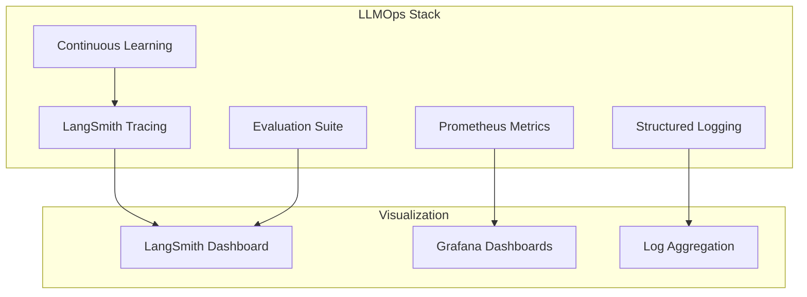
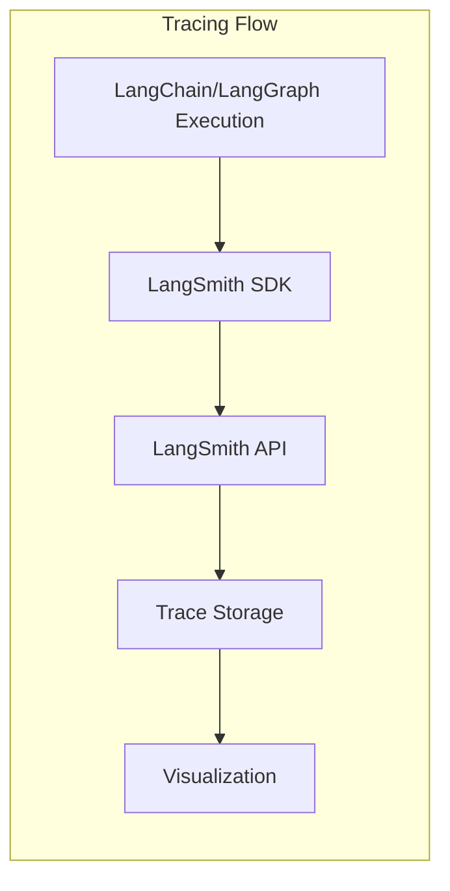
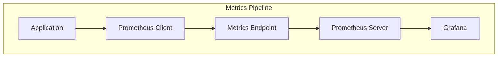
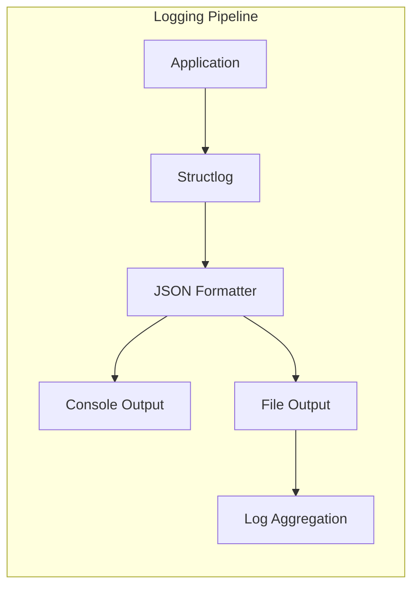
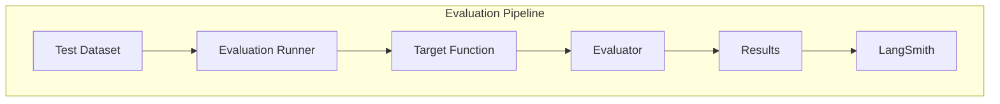
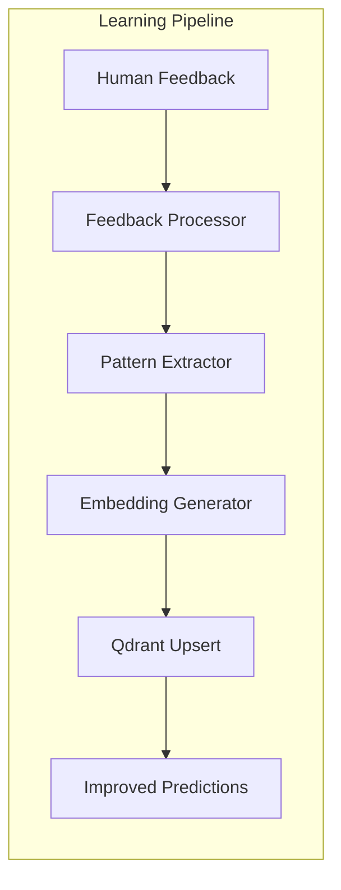
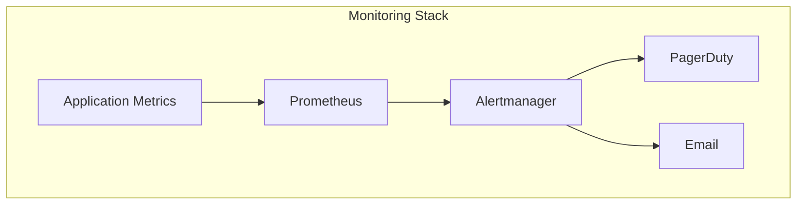

# MedClaim LLMOps & Observability Documentation

## Table of Contents
- [LLMOps Overview](#llmops-overview)
- [LangSmith Tracing](#langsmith-tracing)
- [Prometheus Metrics](#prometheus-metrics)
- [Structured Logging](#structured-logging)
- [Evaluation Suite](#evaluation-suite)
- [Continuous Learning](#continuous-learning)
- [Performance Monitoring](#performance-monitoring)
- [Alerting & Incident Response](#alerting--incident-response)

---

## LLMOps Overview

MedClaim implements a comprehensive LLMOps (Large Language Model Operations) stack to ensure reliability, observability, and continuous improvement of AI-powered components. The observability system provides deep insights into agent behavior, LLM performance, and system health.

### LLMOps Architecture



### Key Components

**Tracing**: Full visibility into LangChain/LangGraph executions
**Metrics**: Real-time performance and resource utilization metrics
**Logging**: Structured, machine-readable logs for debugging
**Evaluation**: Automated testing of LLM outputs against ground truth
**Learning**: Continuous improvement from human feedback

---

## LangSmith Tracing

### Tracing Architecture



### Configuration

```python
# Environment variables for LangSmith
LANGSMITH_API_KEY="your-api-key"
LANGSMITH_TRACING="true"
LANGSMITH_PROJECT="medclaim-dev"
LANGSMITH_ENDPOINT="https://api.smith.langchain.com"
```

### Tracing Implementation

```python
from langsmith import Client
from langchain_core.runnables import RunnableConfig

class LangSmithTracer:
    """Manages LangSmith tracing for MedClaim."""
    
    def __init__(self):
        self.client = Client(
            api_key=os.getenv("LANGSMITH_API_KEY"),
            api_url=os.getenv("LANGSMITH_ENDPOINT")
        )
        self.project_name = os.getenv("LANGSMITH_PROJECT", "medclaim-dev")
    
    def get_run_config(
        self,
        claim_id: str,
        agent_name: str,
        metadata: dict = None
    ) -> RunnableConfig:
        """
        Generate LangSmith run configuration.
        """
        return RunnableConfig(
            tags=[agent_name, "medclaim"],
            metadata={
                "claim_id": claim_id,
                "project": self.project_name,
                **(metadata or {})
            }
        )
    
    async def capture_feedback(
        self,
        run_id: str,
        key: str,
        score: float,
        comment: str = ""
    ):
        """
        Capture human feedback on a trace.
        """
        try:
            self.client.create_feedback(
                run_id=run_id,
                key=key,
                score=score,
                comment=comment
            )
            logger.info("langsmith.feedback.captured", run_id=run_id, key=key, score=score)
        except Exception as e:
            logger.error("langsmith.feedback.failed", error=str(e))
```

### Trace Data Captured

**Input/Output**: Full prompt and response data
**Latency**: Execution time for each operation
**Token Usage**: Prompt and completion token counts
**Metadata**: Claim ID, agent name, custom metadata
**Error Information**: Stack traces and error messages
**RAG Context**: Retrieved documents and similarity scores

### Trace Visualization

**Call Trees**: Hierarchical view of agent executions
**Timeline**: Temporal view of operations
**Token Usage**: Token consumption over time
**Cost Analysis**: Estimated costs per trace
**Performance**: Latency breakdown by component

---

## Prometheus Metrics

### Metrics Architecture



### Metric Categories

**System Metrics**:
- CPU, memory, disk usage
- Network I/O
- Connection pool utilization

**Application Metrics**:
- HTTP request latency (p50, p95, p99)
- Request rate by endpoint
- Error rate by endpoint
- Active connections

**LLM Metrics**:
- Token usage by model
- LLM call latency
- LLM call success rate
- Cost tracking

**Agent Metrics**:
- Agent execution time
- Agent success rate
- RAG retrieval latency
- RAG similarity scores

### Metric Definitions

```python
from prometheus_client import Counter, Histogram, Gauge, Summary

# HTTP Metrics
http_requests_total = Counter(
    'http_requests_total',
    'Total HTTP requests',
    ['method', 'endpoint', 'status']
)

http_request_duration = Histogram(
    'http_request_duration_seconds',
    'HTTP request latency',
    ['method', 'endpoint'],
    buckets=[0.1, 0.5, 1.0, 2.0, 5.0, 10.0]
)

# LLM Metrics
llm_tokens_total = Counter(
    'llm_tokens_total',
    'Total LLM tokens consumed',
    ['model', 'token_type']  # token_type: prompt, completion
)

llm_call_duration = Histogram(
    'llm_call_duration_seconds',
    'LLM call latency',
    ['model', 'provider'],
    buckets=[0.5, 1.0, 2.0, 5.0, 10.0, 30.0]
)

llm_calls_total = Counter(
    'llm_calls_total',
    'Total LLM calls',
    ['model', 'provider', 'status']
)

# Agent Metrics
agent_execution_duration = Histogram(
    'agent_execution_duration_seconds',
    'Agent execution latency',
    ['agent_name'],
    buckets=[1.0, 5.0, 10.0, 30.0, 60.0, 120.0]
)

agent_success_rate = Gauge(
    'agent_success_rate',
    'Agent success rate',
    ['agent_name']
)

# RAG Metrics
rag_retrieval_duration = Histogram(
    'rag_retrieval_duration_seconds',
    'RAG retrieval latency',
    ['collection'],
    buckets=[0.01, 0.05, 0.1, 0.5, 1.0]
)

rag_similarity_score = Histogram(
    'rag_similarity_score',
    'RAG retrieval similarity scores',
    ['collection'],
    buckets=[0.5, 0.6, 0.7, 0.8, 0.9, 0.95, 0.99]
)

# Business Metrics
claims_processed_total = Counter(
    'claims_processed_total',
    'Total claims processed',
    ['status']  # status: approved, denied, human_review
)

denial_prediction_accuracy = Gauge(
    'denial_prediction_accuracy',
    'Denial prediction accuracy'
)
```

### Metrics Middleware

```python
from prometheus_fastapi_instrumentator import Instrumentator

class MetricsMiddleware:
    """FastAPI middleware for Prometheus metrics."""
    
    def __init__(self, app):
        self.instrumentator = Instrumentator(
            should_group_status_codes=False,
            should_ignore_untemplated=True,
            should_instrument_requests_inprogress=True,
            excluded_handlers=["/metrics", "/health"],
        )
        self.instrumentator.instrument(app).expose(
            app,
            include_in_schema=False,
            tags=["Observability"]
        )
    
    def record_llm_call(self, model: str, provider: str, duration: float, tokens: dict):
        """Record LLM call metrics."""
        llm_calls_total.labels(
            model=model,
            provider=provider,
            status="success"
        ).inc()
        
        llm_call_duration.labels(
            model=model,
            provider=provider
        ).observe(duration)
        
        llm_tokens_total.labels(
            model=model,
            token_type="prompt"
        ).inc(tokens.get("prompt_tokens", 0))
        
        llm_tokens_total.labels(
            model=model,
            token_type="completion"
        ).inc(tokens.get("completion_tokens", 0))
```

### Grafana Dashboards

**System Overview Dashboard**:
- CPU, memory, disk usage
- Request rate and latency
- Error rate
- Active connections

**Agent Performance Dashboard**:
- Per-agent execution time
- Agent success rates
- RAG retrieval effectiveness
- LLM usage by agent

**Cost Tracking Dashboard**:
- Token usage by model
- Estimated costs per provider
- Cost per claim processed
- Cost trends over time

**Business Metrics Dashboard**:
- Claims processed per hour
- Denial prediction accuracy
- Appeal success rate
- Human review rate

---

## Structured Logging

### Logging Architecture



### Logging Configuration

```python
import structlog
from structlog.types import EventDict

def configure_logging():
    """Configure structured logging for MedClaim."""
    
    structlog.configure(
        processors=[
            # Add context
            structlog.contextvars.merge_contextvars,
            structlog.processors.TimeStamper(fmt="iso"),
            structlog.processors.StackInfoRenderer(),
            structlog.processors.format_exc_info,
            
            # Format as JSON
            structlog.processors.JSONRenderer()
        ],
        
        # Log to console
        wrapper_class=structlog.make_filtering_bound_logger(
            logging.INFO if os.getenv("APP_ENV") == "production" else logging.DEBUG
        ),
        
        # Context information
        context_class=dict,
        
        # Logger name
        logger_factory=structlog.PrintLoggerFactory(),
        
        # Cache logger on first use
        cache_logger_on_first_use=True,
    )
```

### Log Schema

```python
{
    "event": "agent.execution.completed",
    "timestamp": "2024-01-15T10:30:00.000Z",
    "level": "info",
    "logger": "medclaim.agents.code_audit",
    
    # Context
    "claim_id": "claim-123",
    "agent_name": "code_audit",
    "market": "US",
    
    # Performance
    "duration_ms": 1250,
    "prompt_tokens": 500,
    "completion_tokens": 300,
    
    # Results
    "status": "AUDITED_ISSUES_FOUND",
    "findings_count": 2,
    "confidence": 0.85,
    
    # Error information (if applicable)
    "error": null,
    "traceback": null
}
```

### Log Levels

**DEBUG**: Detailed diagnostic information
**INFO**: General informational messages
**WARNING**: Warning messages for potentially harmful situations
**ERROR**: Error events that might still allow the application to continue
**CRITICAL**: Critical events that require immediate attention

### Log Destinations

**Development**: Console output with color coding
**Production**: File output with rotation
**Future**: Log aggregation service (e.g., ELK, Datadog)

---

## Evaluation Suite

### Evaluation Architecture



### Evaluation Framework

```python
from langsmith import Client
from langsmith.evaluation import evaluate

class EvaluationSuite:
    """Automated evaluation suite for LLM outputs."""
    
    def __init__(self):
        self.client = Client(
            api_key=os.getenv("LANGSMITH_API_KEY")
        )
        self.dataset_name = "medclaim-code-audit-evals"
    
    async def run_evaluation(self):
        """
        Run automated evaluation suite.
        """
        # Prepare dataset
        await self.prepare_dataset()
        
        # Define target function
        async def target_function(inputs: dict) -> dict:
            state = ClaimState(**inputs)
            return await run_code_audit(state)
        
        # Define evaluator
        def finding_type_evaluator(run: Any, example: Any) -> dict:
            expected_type = example.outputs.get("expected_finding_type")
            actual_findings = run.outputs.get("audit_findings", [])
            actual_types = [f.get("finding_type") for f in actual_findings]
            
            score = 1.0 if expected_type in actual_types else 0.0
            
            return {
                "key": "finding_type_match",
                "score": score,
                "comment": f"Expected: {expected_type}, Got: {actual_types}"
            }
        
        # Run evaluation
        results = await evaluate(
            target_function,
            data=self.dataset_name,
            evaluators=[finding_type_evaluator],
            experiment_prefix="code-audit-eval",
            client=self.client
        )
        
        return results
    
    async def prepare_dataset(self):
        """Prepare or update evaluation dataset."""
        if not self.client.has_dataset(dataset_name=self.dataset_name):
            dataset = self.client.create_dataset(
                dataset_name=self.dataset_name,
                description="Evaluation dataset for Code Audit Agent"
            )
            
            # Add examples
            examples = self.get_evaluation_examples()
            for example in examples:
                self.client.create_example(
                    inputs=example["inputs"],
                    outputs=example["outputs"],
                    dataset_id=dataset.id
                )
    
    def get_evaluation_examples(self) -> list[dict]:
        """Get evaluation test cases."""
        return [
            {
                "inputs": {
                    "claim_id": "eval-001",
                    "market": "US",
                    "payer_name": "Medicare",
                    "facility_type": "physician_office",
                    "diagnosis_codes": [{"code": "J01.90", "description": "Acute sinusitis"}],
                    "procedure_codes": [{"code": "99214", "description": "Office visit level 4"}],
                    "billed_amount": 150.00
                },
                "outputs": {
                    "expected_finding_type": "UPCODED"
                }
            },
            # More examples...
        ]
```

### Evaluation Metrics

**Accuracy**: Percentage of correct predictions
**Precision**: True positive rate
**Recall**: True positive rate for positive cases
**F1 Score**: Harmonic mean of precision and recall
**Latency**: Evaluation execution time

### Regression Detection

```python
class RegressionDetector:
    """Detect performance regressions in LLM outputs."""
    
    def __init__(self):
        self.baseline_scores = self.load_baseline_scores()
    
    def detect_regression(self, current_scores: dict) -> dict:
        """
        Detect if current performance has regressed.
        """
        regressions = []
        
        for metric, current_value in current_scores.items():
            baseline_value = self.baseline_scores.get(metric, 0.0)
            
            # Check for significant degradation (> 5%)
            if current_value < baseline_value * 0.95:
                regressions.append({
                    "metric": metric,
                    "baseline": baseline_value,
                    "current": current_value,
                    "degradation": (baseline_value - current_value) / baseline_value
                })
        
        return {
            "has_regression": len(regressions) > 0,
            "regressions": regressions
        }
```

---

## Continuous Learning

### Learning Architecture



### Feedback Collection

```python
class FeedbackCollector:
    """Collect and process human feedback."""
    
    async def collect_feedback(self, claim_id: str, feedback: dict):
        """
        Collect human feedback on agent decisions.
        """
        # Validate feedback
        if not self.validate_feedback(feedback):
            logger.warning("feedback.invalid", claim_id=claim_id)
            return
        
        # Store feedback in database
        await self.store_feedback(claim_id, feedback)
        
        # Process for learning
        if feedback.get("outcome") == "APPROVED_ON_APPEAL":
            await self.process_for_learning(claim_id, feedback)
    
    def validate_feedback(self, feedback: dict) -> bool:
        """Validate feedback structure."""
        required_fields = ["outcome", "rating", "comments"]
        return all(field in feedback for field in required_fields)
```

### Pattern Extraction

```python
class PatternExtractor:
    """Extract learning patterns from successful appeals."""
    
    async def extract_pattern(self, claim_id: str) -> dict:
        """
        Extract denial pattern from approved appeal.
        """
        # Fetch claim context
        claim = await get_claim(claim_id)
        
        # Extract key features
        pattern = {
            "payer_id": claim.payer_id,
            "denial_reason": claim.denial_reason,
            "diagnosis_codes": claim.diagnosis_codes,
            "procedure_codes": claim.procedure_codes,
            "appeal_strategy": claim.appeal_strategy,
            "success_rate": 1.0,
            "timestamp": datetime.now().isoformat()
        }
        
        return pattern
```

### Learning Integration

```python
class ContinuousLearning:
    """Integrate continuous learning into denial prediction."""
    
    async def update_denial_patterns(self, pattern: dict):
        """
        Update denial patterns collection with new learning.
        """
        # Format as text
        text = format_pattern_as_text(pattern)
        
        # Generate embedding
        embedding = await generate_embedding(text)
        
        # Upsert to Qdrant
        await qdrant_client.upsert(
            collection_name="denial_patterns",
            points=[{
                "id": str(uuid.uuid4()),
                "vector": embedding,
                "payload": pattern
            }]
        )
        
        logger.info("learning.pattern_added", payer_id=pattern["payer_id"])
```

---

## Performance Monitoring

### Monitoring Architecture



### Key Performance Indicators

**System KPIs**:
- API availability (> 99.5%)
- Average response time (< 2s)
- Error rate (< 1%)

**Business KPIs**:
- Claims processed per hour (> 50)
- Denial prediction accuracy (> 80%)
- Appeal success rate (> 60%)
- Human review rate (< 20%)

**Cost KPIs**:
- Cost per claim processed (< $0.50)
- Token efficiency (cost per 1K tokens)
- LLM API budget utilization

### Performance Dashboards

**Real-Time Monitoring**:
- Current request rate
- Active claim processing
- System resource utilization
- Error rate (last 5 minutes)

**Historical Analysis**:
- Trends over time (24h, 7d, 30d)
- Comparison with baselines
- Anomaly detection
- Capacity planning

---

## Alerting & Incident Response

### Alerting Rules

```python
ALERT_RULES = {
    "high_error_rate": {
        "condition": "error_rate > 0.05",
        "severity": "critical",
        "duration": "5m"
    },
    "high_latency": {
        "condition": "p95_latency > 5s",
        "severity": "warning",
        "duration": "10m"
    },
    "llm_api_failure": {
        "condition": "llm_error_rate > 0.1",
        "severity": "critical",
        "duration": "2m"
    },
    "database_connection_failure": {
        "condition": "db_connection_errors > 0",
        "severity": "critical",
        "duration": "1m"
    },
    "cost_threshold": {
        "condition": "daily_cost > budget",
        "severity": "warning",
        "duration": "1h"
    }
}
```

### Incident Response

**Severity Levels**:
- **P1**: Critical - System down, data loss
- **P2**: High - Major functionality broken
- **P3**: Medium - Degraded performance
- **P4**: Low - Minor issues

**Response Times**:
- P1: 15 minutes
- P2: 1 hour
- P3: 4 hours
- P4: 24 hours

**Escalation Matrix**:
- P1: On-call engineer → Engineering manager → CTO
- P2: On-call engineer → Team lead
- P3: Team lead
- P4: Regular sprint backlog

---

## Conclusion

The MedClaim LLMOps and observability stack provides comprehensive visibility into AI-powered operations, enabling proactive issue detection, performance optimization, and continuous improvement. By combining LangSmith tracing, Prometheus metrics, structured logging, and automated evaluation, the system achieves production-grade reliability and maintainability.

The observability architecture ensures:
- Complete traceability of all AI operations
- Real-time performance monitoring
- Automated quality assurance
- Continuous learning from feedback
- Proactive incident response

This LLMOps infrastructure serves as the foundation for operating MedClaim in production, enabling confident deployment and continuous improvement of AI-powered claim processing.
