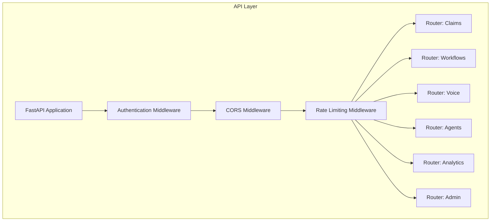
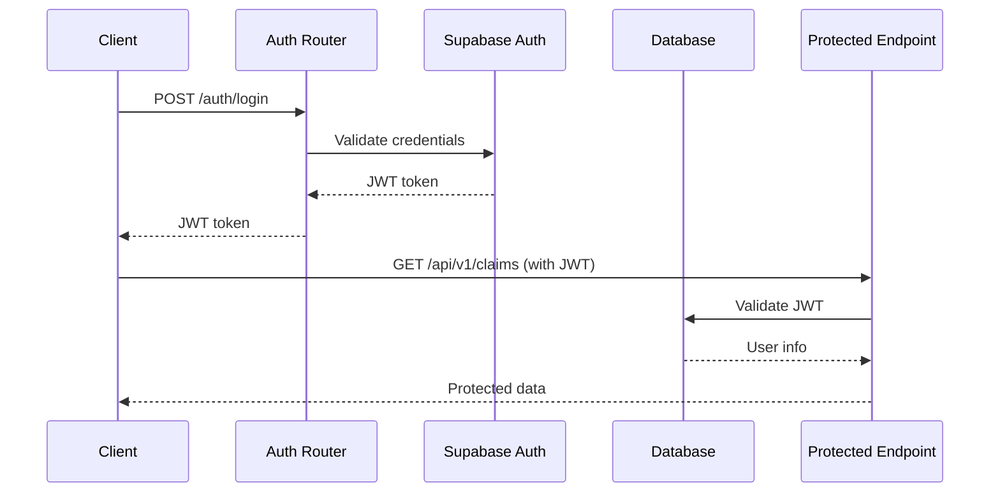

# MedClaim API Routers Documentation

## Table of Contents
- [API Architecture Overview](#api-architecture-overview)
- [Router Structure](#router-structure)
- [Authentication & Authorization](#authentication--authorization)
- [Router Details](#router-details)
- [Request/Response Models](#requestresponse-models)
- [Error Handling](#error-handling)

---

## API Architecture Overview

MedClaim provides a comprehensive REST API built with FastAPI, organized into modular routers for different functional areas. The API follows RESTful principles and provides endpoints for claim management, agent orchestration, approval workflows, voice AI, and administrative functions.

### API Layer Architecture



### API Design Principles

**RESTful Design**: Resource-based URLs with appropriate HTTP methods
**Versioning**: URL-based versioning (e.g., /api/v1/claims)
**Consistent Responses**: Standardized APIResponse wrapper
**Error Handling**: Comprehensive error responses with proper HTTP status codes
**Security**: JWT authentication, role-based access control
**Documentation**: Auto-generated OpenAPI/Swagger documentation

---

## Router Structure

### Router Organization

```text
backend/app/routers/
├── claims.py          # Claim CRUD and processing endpoints
├── workflows.py       # Approval workflow management
├── voice.py           # Voice AI query interface
├── agents.py          # Agent orchestration endpoints
├── analytics.py       # Analytics and reporting
├── auth.py            # Authentication and user management
├── admin.py           # Administrative functions
├── comments.py        # Comments and collaboration
├── feedback.py        # Feedback collection
├── public.py          # Public endpoints
└── __init__.py        # Router aggregation
```

### Router Registration

```python
from fastapi import FastAPI
from backend.app.routers import (
    claims,
    workflows,
    voice,
    agents,
    analytics,
    auth,
    admin,
    comments,
    feedback,
    public,
)

app = FastAPI(title="MedClaim API")

# Register routers
app.include_router(claims.router, prefix="/api/v1")
app.include_router(workflows.router, prefix="/api/v1")
app.include_router(voice.router, prefix="/api/v1")
app.include_router(agents.router, prefix="/api/v1")
app.include_router(analytics.router, prefix="/api/v1")
app.include_router(auth.router, prefix="/api/v1")
app.include_router(admin.router, prefix="/api/v1")
app.include_router(comments.router, prefix="/api/v1")
app.include_router(feedback.router, prefix="/api/v1")
app.include_router(public.router, prefix="/api/v1")
```

---

## Authentication & Authorization

### Authentication Flow



### Authentication Middleware

```python
from backend.app.middleware.auth import (
    require_auth,
    require_billing_specialist,
    require_admin,
    require_billing_specialist_or_admin
)

# Usage in routers
@router.get("/claims")
async def get_claims(
    current_user: dict = Depends(require_billing_specialist)
):
    """Endpoint requires billing specialist role."""
    pass

@router.delete("/claims/{claim_id}")
async def delete_claim(
    claim_id: str,
    current_user: dict = Depends(require_admin)
):
    """Endpoint requires admin role."""
    pass
```

### Role-Based Access Control

**Roles**:
- `admin`: Full system access
- `billing_specialist`: Standard claim processing access
- `manager`: Approval and oversight access
- `specialist`: Domain expert access

**Permissions**:
- Create claims: billing_specialist, admin
- Process claims: billing_specialist, admin
- Approve claims: manager, admin
- Manage users: admin
- Configure workflows: admin

---

## Router Details

### 1. Claims Router (`claims.py`)

**Purpose**: Manage claim lifecycle and processing

**Endpoints**:
- `GET /claims` - List claims with filtering
- `POST /claims` - Create new claim
- `GET /claims/{claim_id}` - Get claim details
- `PUT /claims/{claim_id}` - Update claim
- `DELETE /claims/{claim_id}` - Delete claim
- `POST /claims/{claim_id}/process` - Trigger agent processing
- `GET /claims/{claim_id}/status` - Get processing status

**Key Features**:
- Pagination and filtering
- Real-time status updates via WebSocket
- Agent orchestration integration
- Audit trail tracking

**Example Request**:
```python
POST /api/v1/claims
{
    "patient_name": "John Doe",
    "patient_dob": "1980-01-15",
    "payer_name": "Blue Cross",
    "date_of_service": "2024-01-15",
    "facility_type": "physician_office",
    "diagnosis_codes": [
        {"code": "J01.90", "description": "Acute sinusitis"}
    ],
    "procedure_codes": [
        {"code": "99214", "description": "Office visit level 4"}
    ],
    "billed_amount": 150.00
}
```

### 2. Workflows Router (`workflows.py`)

**Purpose**: Manage approval workflows and claim approvals

**Endpoints**:
- `GET /workflows` - List all workflows (admin)
- `POST /workflows` - Create new workflow (admin)
- `GET /workflows/{workflow_id}` - Get workflow details (admin)
- `PUT /workflows/{workflow_id}` - Update workflow (admin)
- `DELETE /workflows/{workflow_id}` - Delete workflow (admin)
- `POST /workflows/{workflow_id}/steps` - Add workflow step (admin)
- `PUT /workflows/steps/{step_id}` - Update workflow step (admin)
- `DELETE /workflows/steps/{step_id}` - Delete workflow step (admin)
- `POST /workflows/claims/{claim_id}/initiate` - Initiate approval workflow
- `POST /workflows/claims/{claim_id}/approve` - Process approval action
- `GET /workflows/claims/{claim_id}/status` - Get approval status

**Workflow Structure**:
```python
{
    "id": "workflow-uuid",
    "name": "Standard Claim Approval",
    "description": "Two-step approval for high-value claims",
    "is_active": true,
    "steps": [
        {
            "step_order": 1,
            "required_role": "billing_specialist",
            "timeout_hours": 24,
            "escalation_to_role": "manager"
        },
        {
            "step_order": 2,
            "required_role": "manager",
            "timeout_hours": 48,
            "escalation_to_role": null
        }
    ]
}
```

### 3. Voice Router (`voice.py`)

**Purpose**: Voice AI interface for natural language queries

**Endpoints**:
- `POST /voice/query` - Process voice query (audio upload)
- `POST /voice/text-query` - Process text query (skip STT)

**Voice Pipeline**:
1. **Speech-to-Text**: Transcribe audio using Groq Whisper API
2. **Intent Classification**: Classify query intent (claim status, coding question, etc.)
3. **Data Retrieval**: Execute query based on intent (RAG or database)
4. **Response Generation**: Generate conversational response
5. **Text-to-Speech**: Synthesize speech using gTTS

**Example Request**:
```python
POST /api/v1/voice/query
Content-Type: multipart/form-data

audio: <audio_file.wav>
```

**Example Response**:
```python
{
    "transcription": "What is the status of claim C-1042?",
    "intent": "CLAIM_STATUS",
    "response_text": "Claim C-1042 is currently in the code audit stage with a denial risk score of 25%.",
    "audio_base64": "data:audio/mp3;base64,...",
    "sources": ["Claim DB (C-1042)"]
}
```

### 4. Agents Router (`agents.py`)

**Purpose**: Direct agent orchestration and monitoring

**Endpoints**:
- `GET /agents/status` - Get agent system status
- `POST /agents/trigger` - Manually trigger agent execution
- `GET /agents/{agent_name}/metrics` - Get agent performance metrics
- `GET /agents/traces` - Get recent agent traces

**Agent Status Response**:
```python
{
    "agents": {
        "eligibility_check": {"status": "active", "last_run": "2024-01-15T10:30:00Z"},
        "code_audit": {"status": "active", "last_run": "2024-01-15T10:31:00Z"},
        "denial_prediction": {"status": "active", "last_run": "2024-01-15T10:32:00Z"}
    },
    "system_health": "healthy"
}
```

### 5. Analytics Router (`analytics.py`)

**Purpose**: Analytics and reporting endpoints

**Endpoints**:
- `GET /analytics/summary` - Get system summary statistics
- `GET /analytics/claims` - Get claims analytics
- `GET /analytics/denials` - Get denial analytics
- `GET /analytics/performance` - Get agent performance metrics
- `GET /analytics/costs` - Get cost analysis

**Analytics Response**:
```python
{
    "period": "last_30_days",
    "total_claims": 1250,
    "processed_claims": 1180,
    "denial_rate": 15.2,
    "average_processing_time": 85.5,
    "agent_success_rates": {
        "eligibility_check": 99.8,
        "code_audit": 95.2,
        "denial_prediction": 88.7
    }
}
```

### 6. Auth Router (`auth.py`)

**Purpose**: Authentication and user management

**Endpoints**:
- `POST /auth/login` - User login
- `POST /auth/logout` - User logout
- `POST /auth/register` - User registration
- `GET /auth/me` - Get current user info
- `PUT /auth/me` - Update user profile
- `POST /auth/refresh` - Refresh JWT token

### 7. Admin Router (`admin.py`)

**Purpose**: Administrative functions

**Endpoints**:
- `GET /admin/users` - List all users
- `POST /admin/users` - Create user
- `PUT /admin/users/{user_id}` - Update user
- `DELETE /admin/users/{user_id}` - Delete user
- `GET /admin/system` - Get system health
- `POST /admin/system/config` - Update system configuration

### 8. Comments Router (`comments.py`)

**Purpose**: Comments and collaboration on claims

**Endpoints**:
- `GET /comments/claim/{claim_id}` - Get claim comments
- `POST /comments/claim/{claim_id}` - Add comment to claim
- `PUT /comments/{comment_id}` - Update comment
- `DELETE /comments/{comment_id}` - Delete comment

### 9. Feedback Router (`feedback.py`)

**Purpose**: Collect feedback on agent decisions

**Endpoints**:
- `POST /feedback/agent-decision` - Submit feedback on agent decision
- `POST /feedback/claim-outcome` - Submit claim outcome for learning
- `GET /feedback/summary` - Get feedback summary

### 10. Public Router (`public.py`)

**Purpose**: Publicly accessible endpoints

**Endpoints**:
- `GET /public/health` - Health check
- `GET /public/version` - API version
- `GET /public/docs` - API documentation

---

## Request/Response Models

### Standard Response Format

All endpoints return responses wrapped in `APIResponse`:

```python
class APIResponse(BaseModel):
    success: bool
    data: Any = None
    message: str = ""
    errors: list[str] = []
```

**Success Response**:
```python
{
    "success": true,
    "data": {...},
    "message": "Operation completed successfully"
}
```

**Error Response**:
```python
{
    "success": false,
    "data": null,
    "message": "Validation error",
    "errors": ["Field 'patient_name' is required"]
}
```

### Common Request Models

**Pagination Request**:
```python
class PaginationRequest(BaseModel):
    page: int = 1
    page_size: int = 50
    sort_by: str = "created_at"
    sort_order: str = "desc"
```

**Filter Request**:
```python
class ClaimFilterRequest(BaseModel):
    status: str | None = None
    payer_name: str | None = None
    date_from: date | None = None
    date_to: date | None = None
    market: str | None = None
```

---

## Error Handling

### HTTP Status Codes

**Success Codes**:
- `200 OK` - Successful GET, PUT, DELETE
- `201 Created` - Successful POST
- `204 No Content` - Successful DELETE with no response body

**Client Error Codes**:
- `400 Bad Request` - Invalid request data
- `401 Unauthorized` - Missing or invalid authentication
- `403 Forbidden` - Insufficient permissions
- `404 Not Found` - Resource not found
- `409 Conflict` - Resource conflict
- `422 Unprocessable Entity` - Validation error
- `429 Too Many Requests` - Rate limit exceeded

**Server Error Codes**:
- `500 Internal Server Error` - Unexpected server error
- `503 Service Unavailable` - Service temporarily unavailable

### Error Response Format

```python
{
    "success": false,
    "data": null,
    "message": "Error description",
    "errors": ["Detailed error information"],
    "error_code": "VALIDATION_ERROR"
}
```

### Error Handling Middleware

```python
@app.exception_handler(HTTPException)
async def http_exception_handler(request: Request, exc: HTTPException):
    return JSONResponse(
        status_code=exc.status_code,
        content={
            "success": false,
            "message": exc.detail,
            "errors": []
        }
    )

@app.exception_handler(Exception)
async def general_exception_handler(request: Request, exc: Exception):
    logger.error("unhandled_exception", error=str(exc))
    return JSONResponse(
        status_code=500,
        content={
            "success": false,
            "message": "Internal server error",
            "errors": []
        }
    )
```

---

## Rate Limiting

### Rate Limiting Strategy

**Token-based Rate Limiting**:
- Uses Upstash Redis for distributed rate limiting
- Limits based on user ID and API key
- Configurable limits per endpoint

**Rate Limit Configuration**:
```python
RATE_LIMITS = {
    "default": {"requests": 100, "window": 60},  # 100 requests per minute
    "claims": {"requests": 50, "window": 60},    # 50 claims per minute
    "voice": {"requests": 20, "window": 60},      # 20 voice queries per minute
    "admin": {"requests": 200, "window": 60}      # 200 admin requests per minute
}
```

### Rate Limit Response

```python
{
    "success": false,
    "message": "Rate limit exceeded",
    "errors": [],
    "retry_after": 30
}
```

---

## API Documentation

### Swagger UI

**Access**: `http://localhost:8000/docs`
**Authentication**: Basic auth with SWAGGER_USERNAME and SWAGGER_PASSWORD

### OpenAPI Specification

Auto-generated OpenAPI 3.0 specification available at:
- `http://localhost:8000/openapi.json`

### API Versioning

**Current Version**: v1
**Versioning Strategy**: URL-based versioning
**Backward Compatibility**: Maintain backward compatibility within major versions

---

## Conclusion

The MedClaim API provides a comprehensive, well-organized interface for all system functionality. The modular router structure ensures clear separation of concerns, while consistent request/response patterns and error handling provide a predictable developer experience.

The API architecture ensures:
- Clear separation of functional areas
- Consistent authentication and authorization
- Comprehensive error handling
- Rate limiting for protection
- Auto-generated documentation
- RESTful design principles

This API layer serves as the primary interface for the frontend application, external integrations, and administrative operations.
