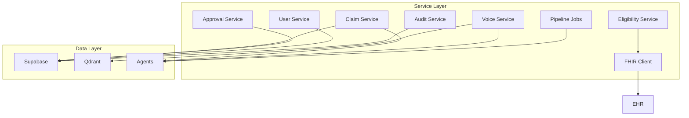

# MedClaim Services Documentation

## Table of Contents
- [Services Architecture Overview](#services-architecture-overview)
- [Service Layer Organization](#service-layer-organization)
- [Service Details](#service-details)
- [Service Integration Patterns](#service-integration-patterns)
- [Error Handling & Resilience](#error-handling--resilience)

---

## Services Architecture Overview

The services layer in MedClaim contains business logic that sits between the API routers and the lower-level components (agents, database, RAG, etc.). Services encapsulate complex operations, handle data transformations, and provide a clean interface for the routers.

### Service Layer Architecture



### Service Design Principles

**Single Responsibility**: Each service handles one domain of business logic
**Dependency Injection**: Services receive dependencies through constructors
**Async/Await**: All services use async I/O for non-blocking operations
**Error Handling**: Comprehensive error handling with proper exception types
**Logging**: Structured logging for observability and debugging

---

## Service Layer Organization

### Service Structure

```text
backend/app/services/
├── claim_service.py          # Claim CRUD and processing
├── approval_service.py       # Approval workflow logic
├── voice_service.py          # Voice AI pipeline
├── eligibility_service.py     # Eligibility verification
├── fhir_client.py           # HAPI FHIR integration
├── pipeline_jobs.py         # Background job management
├── user_service.py          # User management
├── audit_service.py         # Audit trail management
├── comment_service.py       # Comments and collaboration
├── blog_service.py          # Blog/content management
└── lead_service.py          # Lead generation
```

### Service Dependencies

```python
from backend.db.client import get_supabase_client
from backend.agents.graph import process_claim
from backend.rag.retrievers import retrieve_with_scores
from backend.app.config import settings
```

---

## Service Details

### 1. Claim Service (`claim_service.py`)

**Purpose**: Manage claim lifecycle and database operations

**Key Functions**:
- `get_claim(claim_id)` - Retrieve claim by ID
- `create_claim(claim_data)` - Create new claim
- `update_claim(claim_id, updates)` - Update claim
- `delete_claim(claim_id)` - Delete claim
- `list_claims(filters)` - List claims with filtering
- `save_audit_results(...)` - Save audit findings
- `save_denial_prediction(...)` - Save denial prediction
- `update_claim_status(...)` - Update claim status

**Implementation Pattern**:
```python
async def get_claim(claim_id: str) -> Claim | None:
    """Retrieve a claim by ID from Supabase."""
    db = get_supabase_client()
    response = db.table("claims").select("*").eq("id", claim_id).execute()
    
    if not response.data:
        return None
    
    claim_data = response.data[0]
    return Claim(**claim_data)

async def create_claim(claim_data: dict) -> Claim:
    """Create a new claim in Supabase."""
    db = get_supabase_client()
    response = db.table("claims").insert(claim_data).execute()
    return Claim(**response.data[0])
```

**Error Handling**:
- Database connection errors
- Constraint violations
- Not found errors
- Validation errors

### 2. Approval Service (`approval_service.py`)

**Purpose**: Manage approval workflows and claim approvals

**Key Functions**:
- `create_workflow(name, description)` - Create new workflow
- `get_workflow(workflow_id)` - Get workflow with steps
- `list_workflows(filters)` - List workflows
- `update_workflow(...)` - Update workflow
- `delete_workflow(workflow_id)` - Delete workflow
- `add_workflow_step(...)` - Add step to workflow
- `initiate_claim_approval(claim_id, workflow_id)` - Start approval process
- `process_approval_action(...)` - Process approval/rejection
- `get_claim_approval(claim_id)` - Get approval status

**Workflow Structure**:
```python
{
    "id": "workflow-uuid",
    "name": "Standard Claim Approval",
    "description": "Two-step approval for high-value claims",
    "is_active": true,
    "created_by": "user-uuid",
    "steps": [
        {
            "id": "step-uuid",
            "step_order": 1,
            "required_role": "billing_specialist",
            "timeout_hours": 24,
            "escalation_to_role": "manager"
        }
    ]
}
```

**Approval Process**:
```python
async def process_approval_action(
    claim_id: str,
    approver_id: str,
    action: str,  # "approve", "reject", "request_changes"
    notes: str = None
) -> dict:
    """Process an approval action for a claim."""
    # Get current approval state
    approval = await get_claim_approval(claim_id)
    
    # Validate approver can act on current step
    current_step = approval["current_step"]
    if not can_approve(approver_id, current_step):
        raise PermissionError("User not authorized for this step")
    
    # Process action
    if action == "approve":
        # Move to next step or complete
        next_step = get_next_step(approval["workflow_id"], current_step)
        if next_step:
            await update_approval_step(claim_id, next_step)
        else:
            await complete_approval(claim_id)
    elif action == "reject":
        await reject_claim(claim_id, notes)
    elif action == "request_changes":
        await request_changes(claim_id, notes)
    
    # Log action
    await log_approval_action(claim_id, approver_id, action, notes)
    
    return await get_claim_approval(claim_id)
```

### 3. Voice Service (`voice_service.py`)

**Purpose**: Complete Voice AI pipeline implementation

**Pipeline Stages**:
1. **Speech-to-Text**: Transcribe audio using Groq Whisper API
2. **Intent Classification**: Classify query intent using LLM
3. **Data Retrieval**: Execute query based on intent
4. **Response Generation**: Generate conversational response
5. **Text-to-Speech**: Synthesize speech using gTTS

**Key Functions**:
- `transcribe_audio(audio_bytes, filename)` - STT using Groq Whisper
- `classify_intent(transcription)` - Classify user intent
- `execute_query(intent, entities, transcription)` - Retrieve data
- `generate_response(transcription, context)` - Generate response
- `synthesize_speech(text)` - TTS using gTTS
- `process_voice_query(audio_bytes, text_query)` - Main pipeline

**Intent Types**:
- `CLAIM_STATUS`: Asking about specific claim
- `CODING_QUESTION`: Asking about CPT/ICD-10 codes
- `POLICY_QUESTION`: Asking about payer rules
- `ANALYTICS`: Asking about dashboard stats
- `GENERAL`: General queries

**Implementation**:
```python
async def process_voice_query(
    audio_bytes: bytes | None,
    filename: str = "audio.wav",
    text_query: str | None = None
) -> dict[str, Any]:
    """Main pipeline for voice queries."""
    # 1. STT (skip if text_query provided)
    if text_query:
        transcription = text_query
    elif audio_bytes:
        transcription = await transcribe_audio(audio_bytes, filename)
    else:
        raise ValueError("Must provide either audio_bytes or text_query")
    
    # 2. Intent Classification
    classification = await classify_intent(transcription)
    intent = classification["intent"]
    entities = classification["entities"]
    
    # 3. Data Retrieval
    context, sources = await execute_query(intent, entities, transcription)
    
    # 4. Response Generation
    response_text = await generate_response(transcription, context)
    
    # 5. TTS
    audio_data_uri = synthesize_speech(response_text)
    
    return {
        "transcription": transcription,
        "intent": intent,
        "response_text": response_text,
        "audio_base64": audio_data_uri,
        "sources": sources
    }
```

### 4. Eligibility Service (`eligibility_service.py`)

**Purpose**: Verify insurance eligibility and provider network status

**Key Functions**:
- `check_eligibility(patient_id, payer_id, date_of_service)` - Check coverage
- `check_provider_network(provider_id, payer_id)` - Check network status
- `verify_coverage_details(patient_id, payer_id)` - Get coverage details

**Implementation**:
```python
async def check_eligibility(
    patient_id: str,
    payer_id: str,
    date_of_service: date
) -> dict:
    """Check insurance eligibility via HAPI FHIR."""
    fhir_client = FHIRClient(settings.HAPI_FHIR_URL)
    
    # Query Coverage resource
    coverage = await fhir_client.get_coverage(
        patient_id=patient_id,
        payer_id=payer_id,
        date_of_service=date_of_service
    )
    
    return {
        "coverage_active": coverage.get("status") == "active",
        "in_network": coverage.get("network") == "in",
        "coverage_type": coverage.get("type"),
        "effective_date": coverage.get("period", {}).get("start"),
        "expiration_date": coverage.get("period", {}).get("end")
    }
```

### 5. FHIR Client (`fhir_client.py`)

**Purpose**: HAPI FHIR server integration for EHR data

**Key Functions**:
- `get_patient(patient_id)` - Get patient data
- `get_coverage(patient_id, payer_id)` - Get insurance coverage
- `get_provider(provider_id)` - Get provider information
- `get_encounter(encounter_id)` - Get encounter data

**FHIR Resources Used**:
- `Patient` - Patient demographics
- `Coverage` - Insurance coverage
- `Organization` - Provider/facility information
- `Encounter` - Visit/encounter data

### 6. Pipeline Jobs Service (`pipeline_jobs.py`)

**Purpose**: Manage background job processing

**Key Functions**:
- `enqueue_claim_processing(claim_id)` - Enqueue claim for processing
- `get_job_status(job_id)` - Get job status
- `retry_failed_job(job_id)` - Retry failed job
- `cancel_job(job_id)` - Cancel job

**Job Types**:
- `claim_processing` - Full agent pipeline execution
- `appeal_drafting` - Appeal letter generation
- `batch_processing` - Batch claim processing
- `report_generation` - Analytics report generation

### 7. User Service (`user_service.py`)

**Purpose**: User management and authentication

**Key Functions**:
- `create_user(user_data)` - Create new user
- `get_user(user_id)` - Get user by ID
- `update_user(user_id, updates)` - Update user
- `delete_user(user_id)` - Delete user
- `list_users(filters)` - List users
- `verify_credentials(email, password)` - Verify login credentials

### 8. Audit Service (`audit_service.py`)

**Purpose**: Audit trail and compliance logging

**Key Functions**:
- `log_action(user_id, action, entity_type, entity_id, changes)` - Log action
- `get_audit_log(filters)` - Get audit logs
- `get_user_activity(user_id)` - Get user activity
- `get_entity_history(entity_type, entity_id)` - Get entity change history

### 9. Comment Service (`comment_service.py`)

**Purpose**: Comments and collaboration on claims

**Key Functions**:
- `add_comment(claim_id, user_id, text)` - Add comment
- `get_comments(claim_id)` - Get claim comments
- `update_comment(comment_id, text)` - Update comment
- `delete_comment(comment_id)` - Delete comment

### 10. Blog Service (`blog_service.py`)

**Purpose**: Blog and content management

**Key Functions**:
- `create_post(post_data)` - Create blog post
- `get_post(post_id)` - Get post
- `list_posts(filters)` - List posts
- `update_post(post_id, updates)` - Update post
- `delete_post(post_id)` - Delete post

### 11. Lead Service (`lead_service.py`)

**Purpose**: Lead generation and management

**Key Functions**:
- `create_lead(lead_data)` - Create lead
- `get_lead(lead_id)` - Get lead
- `list_leads(filters)` - List leads
- `update_lead(lead_id, updates)` - Update lead
- `convert_lead(lead_id)` - Convert lead to opportunity

---

## Service Integration Patterns

### Database Access Pattern

All services use Supabase client for database access:

```python
from backend.db.client import get_supabase_client

async def some_service_function():
    db = get_supabase_client()
    response = db.table("table_name").select("*").execute()
    return response.data
```

### Agent Integration Pattern

Services integrate with agents for AI operations:

```python
from backend.agents.graph import process_claim

async def process_claim_service(claim_id: str):
    """Service wrapper for agent processing."""
    try:
        result = await process_claim(claim_id)
        return {
            "success": True,
            "final_status": result.get("status"),
            "denial_risk_score": result.get("denial_risk_score")
        }
    except Exception as e:
        logger.error("claim_processing_failed", claim_id=claim_id, error=str(e))
        raise
```

### RAG Integration Pattern

Services use RAG for knowledge retrieval:

```python
from backend.rag.retrievers import retrieve_with_scores

async def get_coding_guidelines(query: str):
    """Retrieve coding guidelines using RAG."""
    docs = retrieve_with_scores("coding_rules", query, top_k=5)
    return [
        {
            "content": doc.page_content,
            "score": score,
            "metadata": doc.metadata
        }
        for doc, score in docs
    ]
```

---

## Error Handling & Resilience

### Error Types

```python
class ServiceError(Exception):
    """Base class for service errors."""
    pass

class DatabaseError(ServiceError):
    """Database operation failed."""
    pass

class ValidationError(ServiceError):
    """Data validation failed."""
    pass

class NotFoundError(ServiceError):
    """Resource not found."""
    pass

class ExternalServiceError(ServiceError):
    """External service call failed."""
    pass
```

### Retry Pattern

```python
import asyncio
from tenacity import retry, stop_after_attempt, wait_exponential

@retry(
    stop=stop_after_attempt(3),
    wait=wait_exponential(multiplier=1, min=2, max=10)
)
async def external_service_call():
    """Retry external service calls with exponential backoff."""
    # Implementation
    pass
```

### Circuit Breaker Pattern

```python
class CircuitBreaker:
    """Circuit breaker for external service calls."""
    
    def __init__(self, failure_threshold=5, timeout=60):
        self.failure_threshold = failure_threshold
        self.timeout = timeout
        self.failure_count = 0
        self.last_failure_time = None
        self.state = "closed"  # closed, open, half-open
    
    async def call(self, func, *args, **kwargs):
        """Execute function with circuit breaker protection."""
        if self.state == "open":
            if time.time() - self.last_failure_time > self.timeout:
                self.state = "half-open"
            else:
                raise CircuitBreakerOpenError("Circuit breaker is open")
        
        try:
            result = await func(*args, **kwargs)
            if self.state == "half-open":
                self.state = "closed"
                self.failure_count = 0
            return result
        except Exception as e:
            self.failure_count += 1
            self.last_failure_time = time.time()
            
            if self.failure_count >= self.failure_threshold:
                self.state = "open"
            
            raise
```

### Logging Pattern

All services use structured logging:

```python
import structlog

logger = structlog.get_logger("medclaim.services.claim")

async def some_service_function():
    logger.info("service.function.start", param1="value1")
    
    try:
        result = await operation()
        logger.info("service.function.success", result_count=len(result))
        return result
    except Exception as e:
        logger.error("service.function.failed", error=str(e))
        raise
```

---

## Service Configuration

### Environment-Based Configuration

Services use settings from `backend/app/config.py`:

```python
from backend.app.config import settings

async def some_service_function():
    if settings.APP_ENV == "production":
        # Production-specific logic
        pass
    else:
        # Development-specific logic
        pass
```

### Service Initialization

Services are initialized as singletons where appropriate:

```python
_claim_service = None

def get_claim_service():
    """Get or create claim service singleton."""
    global _claim_service
    if _claim_service is None:
        _claim_service = ClaimService()
    return _claim_service
```

---

## Service Testing

### Unit Testing

```python
import pytest
from unittest.mock import AsyncMock, patch

@pytest.mark.asyncio
async def test_get_claim():
    """Test claim retrieval."""
    # Mock database client
    mock_db = AsyncMock()
    mock_db.table.return_value.select.return_value.eq.return_value.execute.return_value.data = [
        {"id": "claim-1", "patient_name": "John Doe"}
    ]
    
    with patch("backend.app.services.claim.get_supabase_client", return_value=mock_db):
        claim = await get_claim("claim-1")
        assert claim.patient_name == "John Doe"
```

### Integration Testing

```python
@pytest.mark.asyncio
async def test_claim_processing_integration():
    """Test full claim processing pipeline."""
    # Create test claim
    claim = await create_claim(test_claim_data)
    
    # Process claim
    result = await process_claim(claim.id)
    
    # Verify results
    assert result["status"] in ["AUDITED_NO_ISSUES", "AUDITED_ISSUES_FOUND"]
    assert "denial_risk_score" in result
```

---

## Performance Optimization

### Connection Pooling

Services use connection pooling for database access:

```python
from supabase import create_client

# Connection pooling is handled by Supabase client
supabase = create_client(
    supabase_url=settings.SUPABASE_URL,
    supabase_key=settings.SUPABASE_ANON_KEY
)
```

### Caching

Services implement caching where appropriate:

```python
from functools import lru_cache
from datetime import datetime, timedelta

@lru_cache(maxsize=100)
def get_payer_denial_rate(payer_id: str) -> float:
    """Get payer denial rate with caching."""
    # Implementation
    pass

# Clear cache periodically
def clear_cache():
    """Clear service caches."""
    get_payer_denial_rate.cache_clear()
```

### Batch Operations

Services support batch operations for efficiency:

```python
async def batch_create_claims(claims_data: list[dict]) -> list[Claim]:
    """Create multiple claims in a single transaction."""
    db = get_supabase_client()
    
    # Use Supabase batch insert
    response = db.table("claims").insert(claims_data).execute()
    
    return [Claim(**data) for data in response.data]
```

---

## Conclusion

The MedClaim services layer provides a clean, organized foundation for business logic. By separating concerns into dedicated services, the system achieves:

- Clear separation of business logic
- Reusable components across the application
- Consistent error handling and logging
- Easy testing and maintenance
- Scalable architecture

This service layer serves as the bridge between the API layer and the lower-level components, ensuring that business operations are implemented consistently and reliably throughout the system.
