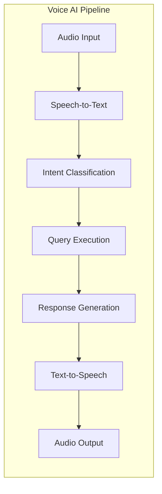

# MedClaim Voice AI Documentation

## Table of Contents
- [Voice AI Overview](#voice-ai-overview)
- [Architecture](#architecture)
- [Pipeline Components](#pipeline-components)
- [Speech-to-Text (STT)](#speech-to-text-stt)
- [Intent Classification](#intent-classification)
- [Query Execution](#query-execution)
- [Response Generation](#response-generation)
- [Text-to-Speech (TTS)](#text-to-speech-tts)
- [Integration](#integration)
- [Performance Optimization](#performance-optimization)

---

## Voice AI Overview

MedClaim Voice AI enables billing specialists to interact with the system using natural language voice commands. The system transcribes speech, classifies the user's intent, retrieves relevant data, generates a conversational response, and synthesizes speech for playback.

### Key Features

- **Natural Language Interaction**: Speak queries instead of typing
- **Intent Recognition**: Automatically classify query types
- **Multi-Source Data**: Retrieve from database, RAG, or analytics
- **Conversational Responses**: Natural, human-like responses
- **Audio Feedback**: Text-to-speech for hands-free operation

### Use Cases

- "What is the status of claim C-1042?"
- "Show me claims denied by Blue Cross this week"
- "What are the coding guidelines for 99214?"
- "What's our overall denial rate?"
- "How many claims did we process today?"

---

## Architecture

### Voice AI Pipeline



### Component Stack

**Speech-to-Text**: Groq Whisper API (whisper-large-v3)
**Intent Classification**: Groq LLM (Llama 3.1 70B)
**Data Retrieval**: Supabase, Qdrant RAG
**Response Generation**: Groq LLM (Llama 3.1 70B)
**Text-to-Speech**: gTTS (Google Text-to-Speech)

---

## Pipeline Components

### 1. Audio Input

**Supported Formats**: WAV, MP3, M4A
**Maximum Duration**: 60 seconds
**Sample Rate**: 16kHz (recommended)
**Channels**: Mono

**Input Methods**:
- Audio file upload via API
- Streaming audio (future)
- Direct text input (bypasses STT)

### 2. Speech-to-Text (STT)

**Technology**: Groq Whisper API
**Model**: whisper-large-v3
**Response Format**: Plain text

**Implementation**:
```python
async def transcribe_audio(audio_bytes: bytes, filename: str = "audio.wav") -> str:
    """Transcribe audio using Groq Whisper API."""
    client = Groq(api_key=settings.GROQ_API_KEY)
    
    file_obj = io.BytesIO(audio_bytes)
    file_obj.name = filename
    
    transcription = client.audio.transcriptions.create(
        file=(filename, file_obj),
        model="whisper-large-v3",
        response_format="text",
    )
    
    return transcription.strip()
```

**Performance**:
- Latency: ~2-5 seconds for 30-second audio
- Accuracy: >95% on clear speech
- Language: English (primary)

**Error Handling**:
- Invalid audio format
- Audio too long
- Network timeout
- API rate limits

### 3. Intent Classification

**Purpose**: Classify user query to route to appropriate data source

**Supported Intents**:

| Intent | Description | Data Source |
|--------|-------------|-------------|
| CLAIM_STATUS | Asking about specific claim | Supabase |
| CODING_QUESTION | Asking about CPT/ICD-10 codes | Qdrant RAG |
| POLICY_QUESTION | Asking about payer rules | Qdrant RAG |
| ANALYTICS | Asking about dashboard stats | Supabase |
| GENERAL | General queries | LLM knowledge |

**Implementation**:
```python
async def classify_intent(transcription: str) -> dict[str, Any]:
    """Classify the user's intent to route the query correctly."""
    system_prompt = (
        "You are an AI assistant for a medical billing system. "
        "Classify the user's voice query into one of these intents:\n"
        "- CLAIM_STATUS: Asking about a specific claim (needs claim ID or patient name).\n"
        "- CODING_QUESTION: Asking about CPT/ICD-10 codes, modifiers, or coding guidelines.\n"
        "- POLICY_QUESTION: Asking about specific insurance payer rules or coverage.\n"
        "- ANALYTICS: Asking about dashboard stats, denial rates, or volume.\n"
        "- GENERAL: Any other general greetings or questions.\n\n"
        "Return strict JSON with keys: 'intent' (string), 'extracted_entities' (dict of what you found like patient_name, claim_id, payer_name, code)."
    )

    res = await query_llm(
        prompt=transcription,
        system_prompt=system_prompt,
        preferred_provider="groq",
        json_mode=True,
        tags=["voice_ai", "intent_classification"],
    )

    json_data = res.get("json", {})
    return {
        "intent": json_data.get("intent", "GENERAL"),
        "entities": json_data.get("extracted_entities", {}),
    }
```

**Entity Extraction**:
- `claim_id`: Extracted claim identifier
- `patient_name`: Extracted patient name
- `payer_name`: Extracted payer name
- `code`: Extracted medical code
- `date_range`: Extracted date range

### 4. Query Execution

**Purpose**: Execute data retrieval based on classified intent

**Query Strategies**:

**CLAIM_STATUS**:
```python
async def execute_claim_status_query(entities: dict) -> tuple[str, list[str]]:
    """Execute claim status query."""
    claim_id = entities.get("claim_id")
    patient = entities.get("patient_name")
    
    db = get_supabase_client()
    query = db.table("claims").select("*")
    
    if claim_id:
        query = query.eq("id", claim_id)
    elif patient:
        query = query.ilike("patient_name", f"%{patient}%")
    else:
        return "No claim ID or patient name identified in query.", []
    
    res = query.limit(3).execute()
    claims = res.data or []
    
    if not claims:
        context = "No matching claims found."
    else:
        context = "Found claims:\n" + json.dumps(claims, indent=2)
        sources = [f"Claim DB ({c['id']})" for c in claims]
    
    return context, sources
```

**CODING_QUESTION**:
```python
async def execute_coding_query(transcription: str) -> tuple[str, list[str]]:
    """Execute coding question query using RAG."""
    docs = retrieve_with_scores("coding_rules", transcription, top_k=3)
    
    if docs:
        context = "\n\n".join([d.page_content for d, _ in docs])
        sources = [d.metadata.get("source", "Coding Guidelines") for d, _ in docs]
    else:
        context = "No coding rules found matching the query."
        sources = []
    
    return context, sources
```

**POLICY_QUESTION**:
```python
async def execute_policy_query(transcription: str) -> tuple[str, list[str]]:
    """Execute policy question query using RAG."""
    docs = retrieve_with_scores("payer_policies", transcription, top_k=3)
    
    if docs:
        context = "\n\n".join([d.page_content for d, _ in docs])
        sources = [d.metadata.get("source", "Payer Policies") for d, _ in docs]
    else:
        context = "No payer policies found matching the query."
        sources = []
    
    return context, sources
```

**ANALYTICS**:
```python
async def execute_analytics_query() -> tuple[str, list[str]]:
    """Execute analytics query."""
    db = get_supabase_client()
    
    # Get summary statistics
    today_res = db.table("claims").select("id", count="exact").gte("created_at", "today").execute()
    denied_res = db.table("claims").select("id", count="exact").in_("status", ["DENIED", "FINAL_DENIED"]).execute()
    all_res = db.table("claims").select("id", count="exact").execute()
    
    total_today = today_res.count or 0
    denied = denied_res.count or 0
    total_all = all_res.count or 1
    rate = round((denied / total_all) * 100, 1)
    
    context = f"Total claims today: {total_today}. Overall denial rate: {rate}%."
    sources = ["Analytics DB"]
    
    return context, sources
```

### 5. Response Generation

**Purpose**: Generate conversational response based on retrieved context

**Implementation**:
```python
async def generate_response(transcription: str, context: str) -> str:
    """Generate conversational response using LLM."""
    system_prompt = (
        "You are an AI assistant for a medical billing dashboard. "
        "Answer the user's query conversationally and concisely, "
        "using the provided context. Do not use markdown formatting "
        "like asterisks or hashes, as this text will be spoken via TTS."
    )

    prompt = f"User Query: {transcription}\n\nContext Data:\n{context}"

    res = await query_llm(
        prompt=prompt,
        system_prompt=system_prompt,
        preferred_provider="groq",
        json_mode=False,
        tags=["voice_ai", "response_generation"],
    )
    
    return res.get("content", "I'm sorry, I couldn't generate a response.")
```

**Response Characteristics**:
- Conversational tone
- Concise and clear
- No markdown formatting (for TTS)
- Includes relevant data from context
- Handles missing data gracefully

### 6. Text-to-Speech (TTS)

**Technology**: gTTS (Google Text-to-Speech)
**Language**: English
**Speed**: Normal (not slow)
**Output Format**: MP3 (base64 encoded)

**Implementation**:
```python
def synthesize_speech(text: str) -> str:
    """Synthesize speech using gTTS and return base64 encoded MP3."""
    try:
        tts = gTTS(text=text, lang="en", slow=False)
        fp = io.BytesIO()
        tts.write_to_fp(fp)
        fp.seek(0)
        encoded = base64.b64encode(fp.read()).decode("utf-8")
        return f"data:audio/mp3;base64,{encoded}"
    except Exception as e:
        logger.error("voice.tts.failed", error=str(e))
        return ""
```

**Performance**:
- Latency: ~1-2 seconds for typical responses
- Quality: Standard Google TTS quality
- Duration: Proportional to text length

**Future Enhancements**:
- Coqui XTTS-v2 for more natural speech
- Voice customization
- Speed control
- Emotion/tone adjustment

---

## Integration

### API Endpoints

**Voice Query (Audio Input)**:
```http
POST /api/v1/voice/query
Content-Type: multipart/form-data

audio: <audio_file.wav>
```

**Text Query (Skip STT)**:
```http
POST /api/v1/voice/text-query
Content-Type: application/json

{
  "query": "What is the status of claim C-1042?"
}
```

### Response Format

```json
{
  "success": true,
  "data": {
    "transcription": "What is the status of claim C-1042?",
    "intent": "CLAIM_STATUS",
    "response_text": "Claim C-1042 is currently in the code audit stage with a denial risk score of 25%.",
    "audio_base64": "data:audio/mp3;base64,...",
    "sources": ["Claim DB (C-1042)"]
  },
  "message": "Voice query processed successfully"
}
```

### Frontend Integration

**React Component**:
```javascript
const VoiceQuery = () => {
  const [isRecording, setIsRecording] = useState(false);
  const [audioData, setAudioData] = useState(null);
  
  const handleAudioUpload = async (file) => {
    const formData = new FormData();
    formData.append('audio', file);
    
    const response = await fetch('/api/v1/voice/query', {
      method: 'POST',
      body: formData
    });
    
    const result = await response.json();
    
    if (result.success) {
      // Play audio
      const audio = new Audio(result.data.audio_base64);
      audio.play();
    }
  };
  
  return (
    <div>
      <input type="file" accept="audio/*" onChange={(e) => handleAudioUpload(e.target.files[0])} />
    </div>
  );
};
```

---

## Performance Optimization

### Latency Optimization

**Parallel Processing**:
- Intent classification and entity extraction in single LLM call
- Async I/O for all external calls
- Connection pooling for database access

**Caching**:
- Intent classification results for common queries
- RAG retrieval results for repeated questions
- Analytics data with time-based invalidation

**Streaming** (Future):
- Stream audio chunks for real-time transcription
- Stream TTS output for faster playback

### Cost Optimization

**Token Usage**:
- Concise system prompts
- Context window optimization
- Response length limiting

**API Usage**:
- Groq for all LLM calls (cost-effective)
- gTTS for TTS (free)
- Efficient query batching

---

## Error Handling

### Error Scenarios

**STT Failures**:
- Invalid audio format → Return error message
- Network timeout → Retry with exponential backoff
- API rate limit → Queue request

**Intent Classification Failures**:
- LLM error → Default to GENERAL intent
- Low confidence → Ask for clarification
- Ambiguous query → Prompt for clarification

**Query Execution Failures**:
- Database error → Return error message
- No results found → Return helpful message
- RAG failure → Fall back to general knowledge

**TTS Failures**:
- TTS error → Return text response only
- Audio too long → Truncate and synthesize
- Service unavailable → Return text response

### Error Response Format

```json
{
  "success": false,
  "data": {
    "transcription": "What is the status of claim C-1042?",
    "intent": "CLAIM_STATUS",
    "response_text": "I'm sorry, I encountered an error retrieving the claim information. Please try again.",
    "audio_base64": "",
    "sources": []
  },
  "message": "Database connection failed"
}
```

---

## Security Considerations

### Audio Data Privacy

**Data Handling**:
- Audio data not stored permanently
- Transcriptions logged but not retained long-term
- No PII in audio logs

**Access Control**:
- JWT authentication required
- Role-based access to sensitive data
- Audit logging of all voice queries

### Content Filtering

**Input Validation**:
- Audio format validation
- Duration limits
- File size limits

**Output Filtering**:
- PII redaction in responses
- Sensitive data access control
- Response content validation

---

## Monitoring & Observability

### Metrics Tracked

**Performance Metrics**:
- STT latency (p50, p95, p99)
- Intent classification accuracy
- Query execution time
- TTS generation time
- End-to-end latency

**Business Metrics**:
- Query volume by intent
- Success rate by intent
- User satisfaction (feedback)
- Common queries

### Logging

**Structured Logging**:
```python
logger.info("voice.query.start", 
            filename=filename, 
            size_bytes=len(audio_bytes))

logger.info("voice.intent.classified", 
            intent=intent, 
            entities=entities)

logger.info("voice.query.complete", 
            latency_ms=total_latency,
            intent=intent)
```

**Tracing**:
- LangSmith traces for LLM calls
- Distributed tracing across pipeline
- Performance profiling

---

## Future Enhancements

### Planned Features

**Multi-Language Support**:
- Support for Spanish, French, German
- Language detection
- Multi-language TTS

**Advanced Speech Recognition**:
- Speaker identification
- Noise cancellation
- Real-time streaming transcription

**Enhanced TTS**:
- Coqui XTTS-v2 integration
- Voice cloning for personalized responses
- Emotional speech synthesis

**Smart Context**:
- Conversation context awareness
- Follow-up question handling
- Multi-turn conversations

**Integration Enhancements**:
- Direct integration with claim processing
- Voice-controlled claim submission
- Voice-activated approval workflows

---

## Conclusion

The MedClaim Voice AI system provides a natural, intuitive interface for billing specialists to interact with the system. By combining state-of-the-art speech recognition, intent classification, and text-to-speech technologies, the system enables hands-free operation and improves user experience.

The architecture ensures:
- Accurate speech transcription
- Intelligent intent classification
- Efficient data retrieval
- Natural conversational responses
- High-quality speech synthesis

This Voice AI system represents a significant advancement in user experience for medical billing systems, making complex operations accessible through simple voice commands.
