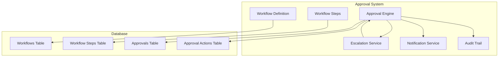
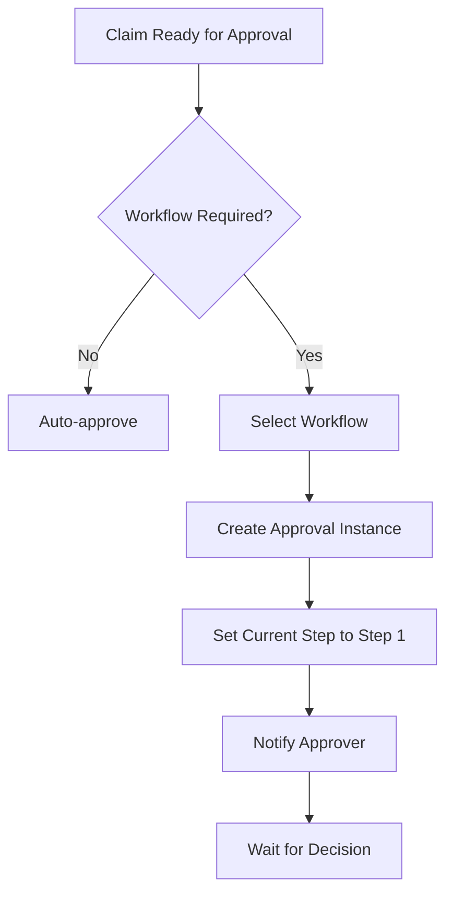
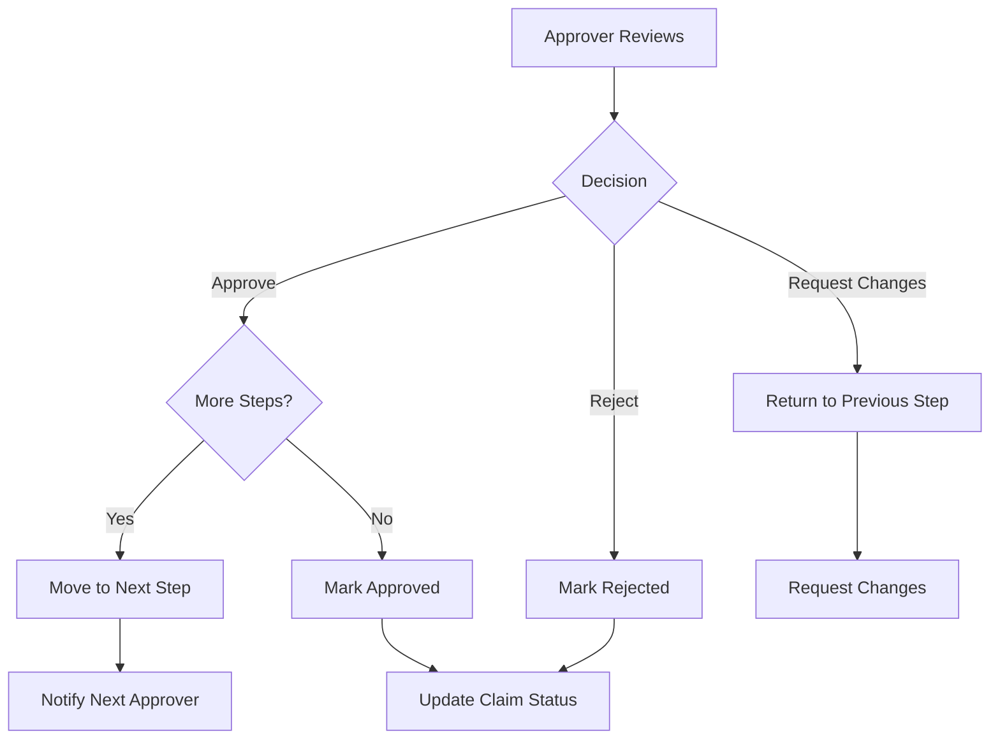
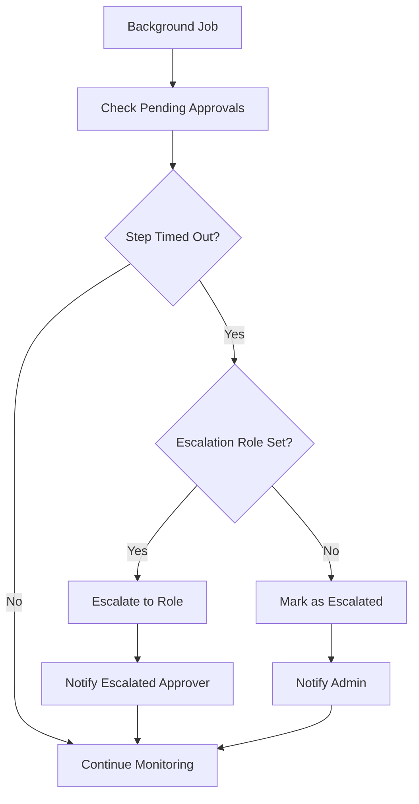

# MedClaim Workflows & Approval System Documentation

## Table of Contents
- [Approval System Overview](#approval-system-overview)
- [Workflow Architecture](#workflow-architecture)
- [Workflow Components](#workflow-components)
- [Workflow Types](#workflow-types)
- [Approval Process](#approval-process)
- [Escalation Logic](#escalation-logic)
- [Notifications](#notifications)
- [Configuration](#configuration)

---

## Approval System Overview

MedClaim includes a flexible approval workflow system that enables organizations to define multi-step approval processes for claims, appeals, and other critical operations. The system supports role-based approvals, timeouts, automatic escalation, and comprehensive audit trails.

### Key Features

- **Multi-Step Workflows**: Define approval processes with multiple sequential steps
- **Role-Based Access**: Assign specific roles to each approval step
- **Timeout Management**: Automatic escalation when approvals timeout
- **Flexible Configuration**: Create custom workflows for different scenarios
- **Audit Trail**: Complete history of all approval actions
- **Real-Time Notifications**: Email and in-app notifications for approvers

### Use Cases

- **High-Value Claims**: Manager approval for claims above certain dollar amounts
- **Appeal Submissions**: Legal team review before appeal submission
- **Policy Exceptions**: Compliance approval for policy deviations
- **Provider Changes**: Approval for provider network changes

---

## Workflow Architecture

### System Architecture



### Data Model

**Workflows Table**:
```sql
CREATE TABLE workflows (
    id UUID PRIMARY KEY,
    name TEXT NOT NULL,
    description TEXT,
    is_active BOOLEAN DEFAULT true,
    created_by UUID REFERENCES users(id),
    created_at TIMESTAMP DEFAULT NOW(),
    updated_at TIMESTAMP DEFAULT NOW()
);
```

**Workflow Steps Table**:
```sql
CREATE TABLE workflow_steps (
    id UUID PRIMARY KEY,
    workflow_id UUID REFERENCES workflows(id) ON DELETE CASCADE,
    step_order INTEGER NOT NULL,
    required_role TEXT NOT NULL,
    timeout_hours INTEGER DEFAULT 24,
    escalation_to_role TEXT,
    created_at TIMESTAMP DEFAULT NOW()
);
```

**Approvals Table**:
```sql
CREATE TABLE approvals (
    id UUID PRIMARY KEY,
    claim_id UUID REFERENCES claims(id),
    workflow_id UUID REFERENCES workflows(id),
    current_step_id UUID REFERENCES workflow_steps(id),
    status TEXT NOT NULL,  -- PENDING, APPROVED, REJECTED, ESCALATED, COMPLETED
    initiated_by UUID REFERENCES users(id),
    initiated_at TIMESTAMP DEFAULT NOW(),
    completed_at TIMESTAMP
);
```

**Approval Actions Table**:
```sql
CREATE TABLE approval_actions (
    id UUID PRIMARY KEY,
    approval_id UUID REFERENCES approvals(id),
    step_id UUID REFERENCES workflow_steps(id),
    approver_id UUID REFERENCES users(id),
    action TEXT NOT NULL,  -- APPROVE, REJECT, REQUEST_CHANGES
    notes TEXT,
    created_at TIMESTAMP DEFAULT NOW()
);
```

---

## Workflow Components

### 1. Workflow Definition

**Purpose**: Define approval workflow structure

**Attributes**:
- `name`: Workflow name
- `description`: Workflow description
- `is_active`: Whether workflow is active
- `created_by`: User who created the workflow

**Example**:
```python
{
    "id": "workflow-uuid",
    "name": "High-Value Claim Approval",
    "description": "Two-step approval for claims over $10,000",
    "is_active": true,
    "created_by": "user-uuid"
}
```

### 2. Workflow Steps

**Purpose**: Define individual approval steps

**Attributes**:
- `step_order`: Sequential order of the step
- `required_role`: Role required to approve this step
- `timeout_hours`: Hours before automatic escalation
- `escalation_to_role`: Role to escalate to on timeout

**Example**:
```python
{
    "id": "step-uuid",
    "workflow_id": "workflow-uuid",
    "step_order": 1,
    "required_role": "billing_specialist",
    "timeout_hours": 24,
    "escalation_to_role": "manager"
}
```

### 3. Approval Instance

**Purpose**: Track a specific approval process

**Attributes**:
- `claim_id`: Associated claim
- `workflow_id`: Workflow being used
- `current_step_id`: Current step in process
- `status`: Current status
- `initiated_by`: User who initiated approval
- `initiated_at`: When approval was initiated

### 4. Approval Actions

**Purpose**: Track individual approval decisions

**Attributes**:
- `approval_id`: Associated approval
- `step_id`: Step being approved
- `approver_id`: User who made decision
- `action`: APPROVE, REJECT, or REQUEST_CHANGES
- `notes`: Optional notes explaining decision

---

## Workflow Types

### 1. Standard Claim Approval

**Description**: Two-step approval for standard claims

**Steps**:
1. Billing Specialist Review (24h timeout)
2. Manager Approval (48h timeout)

**Trigger**: Claims with billed amount > $5,000

```python
{
    "name": "Standard Claim Approval",
    "steps": [
        {
            "step_order": 1,
            "required_role": "billing_specialist",
            "timeout_hours": 24,
            "escalation_to_role": "manager"
        },
        {
            "step_order": 2,
            "required_role": "manager",
            "timeout_hours": 48,
            "escalation_to_role": null
        }
    ]
}
```

### 2. High-Value Claim Approval

**Description**: Three-step approval for high-value claims

**Steps**:
1. Billing Specialist Review (24h timeout)
2. Manager Approval (48h timeout)
3. Director Approval (72h timeout)

**Trigger**: Claims with billed amount > $50,000

```python
{
    "name": "High-Value Claim Approval",
    "steps": [
        {
            "step_order": 1,
            "required_role": "billing_specialist",
            "timeout_hours": 24,
            "escalation_to_role": "manager"
        },
        {
            "step_order": 2,
            "required_role": "manager",
            "timeout_hours": 48,
            "escalation_to_role": "director"
        },
        {
            "step_order": 3,
            "required_role": "director",
            "timeout_hours": 72,
            "escalation_to_role": null
        }
    ]
}
```

### 3. Appeal Submission Approval

**Description**: Legal team review before appeal submission

**Steps**:
1. Legal Specialist Review (48h timeout)
2. Compliance Officer Approval (72h timeout)

**Trigger**: All appeal submissions

```python
{
    "name": "Appeal Submission Approval",
    "steps": [
        {
            "step_order": 1,
            "required_role": "legal_specialist",
            "timeout_hours": 48,
            "escalation_to_role": "compliance_officer"
        },
        {
            "step_order": 2,
            "required_role": "compliance_officer",
            "timeout_hours": 72,
            "escalation_to_role": null
        }
    ]
}
```

### 4. Policy Exception Approval

**Description**: Compliance approval for policy deviations

**Steps**:
1. Compliance Officer Review (24h timeout)
2. Risk Manager Approval (48h timeout)

**Trigger**: Manual initiation for policy exceptions

```python
{
    "name": "Policy Exception Approval",
    "steps": [
        {
            "step_order": 1,
            "required_role": "compliance_officer",
            "timeout_hours": 24,
            "escalation_to_role": "risk_manager"
        },
        {
            "step_order": 2,
            "required_role": "risk_manager",
            "timeout_hours": 48,
            "escalation_to_role": null
        }
    ]
}
```

---

## Approval Process

### Initiation Flow



**Implementation**:
```python
async def initiate_claim_approval(
    claim_id: str,
    workflow_id: str,
    initiated_by: str
) -> dict:
    """Initiate approval workflow for a claim."""
    # Get workflow
    workflow = await get_workflow(workflow_id)
    if not workflow:
        raise ValueError("Workflow not found")
    
    # Get first step
    steps = await get_workflow_steps(workflow_id)
    first_step = min(steps, key=lambda s: s["step_order"])
    
    # Create approval instance
    approval = await create_approval(
        claim_id=claim_id,
        workflow_id=workflow_id,
        current_step_id=first_step["id"],
        initiated_by=initiated_by
    )
    
    # Notify approver
    await notify_approver(
        approval_id=approval["id"],
        step_id=first_step["id"],
        required_role=first_step["required_role"]
    )
    
    return approval
```

### Decision Flow



**Implementation**:
```python
async def process_approval_action(
    claim_id: str,
    approver_id: str,
    action: str,
    notes: str = None
) -> dict:
    """Process approval action for a claim."""
    # Get current approval state
    approval = await get_claim_approval(claim_id)
    current_step = await get_workflow_step(approval["current_step_id"])
    
    # Validate approver can act on current step
    if not can_approve(approver_id, current_step["required_role"]):
        raise PermissionError("User not authorized for this step")
    
    # Record action
    await create_approval_action(
        approval_id=approval["id"],
        step_id=current_step["id"],
        approver_id=approver_id,
        action=action,
        notes=notes
    )
    
    # Process action
    if action == "approve":
        # Move to next step or complete
        next_step = await get_next_step(
            approval["workflow_id"],
            current_step["step_order"]
        )
        
        if next_step:
            # Move to next step
            await update_approval_step(
                approval["id"],
                next_step["id"]
            )
            await notify_approver(
                approval["id"],
                next_step["id"],
                next_step["required_role"]
            )
        else:
            # Complete approval
            await complete_approval(approval["id"])
            await update_claim_status(
                claim_id,
                "APPROVED"
            )
    
    elif action == "reject":
        # Reject claim
        await reject_approval(approval["id"])
        await update_claim_status(
            claim_id,
            "REJECTED",
            rejection_reason=notes
        )
    
    elif action == "request_changes":
        # Request changes and return to previous step
        previous_step = await get_previous_step(
            approval["workflow_id"],
            current_step["step_order"]
        )
        
        if previous_step:
            await update_approval_step(
                approval["id"],
                previous_step["id"]
            )
            await notify_approver(
                approval["id"],
                previous_step["id"],
                previous_step["required_role"]
            )
        
        await update_claim_status(
            claim_id,
            "CHANGES_REQUESTED",
            change_request=notes
        )
    
    return await get_claim_approval(claim_id)
```

---

## Escalation Logic

### Timeout Detection



**Implementation**:
```python
async def check_timeouts():
    """Check for timed-out approvals and trigger escalation."""
    pending_approvals = await get_pending_approvals()
    
    for approval in pending_approvals:
        current_step = await get_workflow_step(approval["current_step_id"])
        
        # Check if step has timed out
        if has_timed_out(approval["initiated_at"], current_step["timeout_hours"]):
            if current_step["escalation_to_role"]:
                # Escalate to specified role
                await escalate_approval(
                    approval["id"],
                    current_step["escalation_to_role"]
                )
            else:
                # Mark as escalated (no escalation role)
                await mark_escalated(approval["id"])
```

### Escalation Process

```python
async def escalate_approval(approval_id: str, escalation_role: str):
    """Escalate approval to specified role."""
    approval = await get_approval(approval_id)
    current_step = await get_workflow_step(approval["current_step_id"])
    
    # Find user with escalation role
    escalators = await get_users_by_role(escalation_role)
    
    if not escalators:
        # No users with escalation role, escalate to admin
        escalators = await get_users_by_role("admin")
    
    # Assign to first available escalator
    escalator = escalators[0]
    
    # Update approval with escalation note
    await create_approval_action(
        approval_id=approval_id,
        step_id=current_step["id"],
        approver_id=escalator["id"],
        action="escalate",
        notes=f"Escalated from {current_step['required_role']} due to timeout"
    )
    
    # Notify escalator
    await notify_escalation(
        approval_id=approval_id,
        escalator_id=escalator["id"],
        original_role=current_step["required_role"]
    )
```

---

## Notifications

### Notification Types

**Approval Request**:
- Sent when approval is initiated
- Includes claim details and approval requirements
- Sent to approver via email and in-app notification

**Approval Reminder**:
- Sent periodically before timeout
- Includes time remaining
- Sent to approver via email

**Escalation Notification**:
- Sent when approval is escalated
- Includes escalation reason
- Sent to escalated approver and admin

**Completion Notification**:
- Sent when approval is completed
- Includes final decision
- Sent to initiator and all approvers

### Notification Channels

**Email**:
- Using Resend API
- HTML email templates
- Configurable sender addresses

**In-App**:
- Real-time notifications via Supabase Realtime
- Notification center in dashboard
- Badge counts and alerts

**Slack** (Future):
- Slack webhook integration
- Channel notifications
- Direct messages

### Email Templates

**Approval Request Email**:
```html
Subject: Approval Required: Claim {{claim_id}}

<p>You have been assigned to approve claim {{claim_id}}.</p>

<p><strong>Claim Details:</strong></p>
<ul>
    <li>Patient: {{patient_name}}</li>
    <li>Payer: {{payer_name}}</li>
    <li>Billed Amount: {{billed_amount}}</li>
</ul>

<p><strong>Approval Requirements:</strong></p>
<ul>
    <li>Role: {{required_role}}</li>
    <li>Timeout: {{timeout_hours}} hours</li>
</ul>

<p><a href="{{approval_url}}">Review Claim</a></p>
```

**Escalation Email**:
```html
Subject: Approval Escalated: Claim {{claim_id}}

<p>Approval for claim {{claim_id}} has been escalated.</p>

<p><strong>Escalation Details:</strong></p>
<ul>
    <li>From: {{original_role}}</li>
    <li>To: {{escalated_role}}</li>
    <li>Reason: Timeout ({{timeout_hours}} hours)</li>
</ul>

<p><a href="{{approval_url}}">Review Claim</a></p>
```

---

## Configuration

### Workflow Configuration

**Default Workflows**:
- Standard Claim Approval
- High-Value Claim Approval
- Appeal Submission Approval

**Custom Workflows**:
- Can be created by admin users
- Configurable steps and roles
- Can be activated/deactivated

### Role Configuration

**Roles**:
- `admin`: Full system access
- `billing_specialist`: Standard claim processing
- `manager`: Approval and oversight
- `director`: High-value approvals
- `legal_specialist`: Legal review
- `compliance_officer`: Compliance review
- `risk_manager`: Risk assessment

**Role Permissions**:
```python
ROLE_PERMISSIONS = {
    "admin": ["*"],  # All permissions
    "billing_specialist": [
        "approve_standard_claims",
        "view_claims",
        "update_claims"
    ],
    "manager": [
        "approve_standard_claims",
        "approve_high_value_claims",
        "view_claims",
        "update_claims",
        "view_analytics"
    ],
    "director": [
        "approve_high_value_claims",
        "approve_very_high_value_claims",
        "view_claims",
        "update_claims",
        "view_analytics",
        "manage_users"
    ]
}
```

### Timeout Configuration

**Default Timeouts**:
- Standard approval: 24 hours
- Manager approval: 48 hours
- Director approval: 72 hours
- Legal review: 48 hours
- Compliance review: 72 hours

**Custom Timeouts**:
- Can be configured per workflow step
- Different timeouts for different roles
- Configurable escalation triggers

---

## API Integration

### Workflow Management Endpoints

**Create Workflow**:
```http
POST /api/v1/workflows
{
  "name": "Custom Approval",
  "description": "Custom approval process"
}
```

**Add Step to Workflow**:
```http
POST /api/v1/workflows/{workflow_id}/steps
{
  "step_order": 1,
  "required_role": "billing_specialist",
  "timeout_hours": 24,
  "escalation_to_role": "manager"
}
```

### Approval Endpoints

**Initiate Approval**:
```http
POST /api/v1/workflows/claims/{claim_id}/initiate
{
  "workflow_id": "workflow-uuid"
}
```

**Process Approval**:
```http
POST /api/v1/workflows/claims/{claim_id}/approve
{
  "action": "approve",
  "notes": "Approved after review"
}
```

**Get Approval Status**:
```http
GET /api/v1/workflows/claims/{claim_id}/status
```

---

## Monitoring & Analytics

### Approval Metrics

**Time to Approve**:
- Average time per step
- Average total approval time
- P50, P95, P99 approval times

**Approval Rates**:
- Approval rate by workflow
- Rejection rate by workflow
- Escalation rate by step

**Approver Performance**:
- Approvals per user
- Average approval time per user
- Rejection rate per user

### Dashboard Metrics

**Pending Approvals**:
- Total pending approvals
- Pending by workflow
- Pending by role
- Approaching timeout

**Recent Activity**:
- Recent approvals
- Recent rejections
- Recent escalations

---

## Security & Compliance

### Access Control

**Role-Based Access**:
- Users can only approve steps matching their role
- Admin can override any approval
- Audit trail of all actions

**Authentication**:
- JWT token required for all endpoints
- Token validation on each request
- Session management

### Audit Trail

**Comprehensive Logging**:
- All approval actions logged
- User identification
- Timestamp and IP address
- Decision reasoning

**Compliance Reporting**:
- Approval history reports
- Escalation reports
- Timeout reports

---

## Best Practices

### Workflow Design

**Keep Workflows Simple**:
- Limit to 3-5 steps maximum
- Clear escalation paths
- Reasonable timeouts

**Role Assignment**:
- Assign appropriate roles to steps
- Ensure role coverage
- Consider backup approvers

**Timeout Configuration**:
- Set realistic timeouts
- Consider business hours
- Allow for weekends and holidays

### Approval Process

**Clear Communication**:
- Provide context to approvers
- Include all relevant information
- Set clear expectations

**Follow-Up**:
- Send reminders before timeout
- Escalate promptly on timeout
- Notify all stakeholders on completion

---

## Conclusion

The MedClaim approval workflow system provides a flexible, configurable framework for managing multi-step approval processes. By combining role-based access, timeout management, automatic escalation, and comprehensive notifications, the system ensures efficient and compliant approval workflows.

The architecture ensures:
- Flexible workflow configuration
- Role-based access control
- Automatic timeout handling
- Comprehensive audit trails
- Real-time notifications
- Integration with claim processing

This approval system serves as a critical component for ensuring proper oversight and compliance in the claim processing pipeline.
